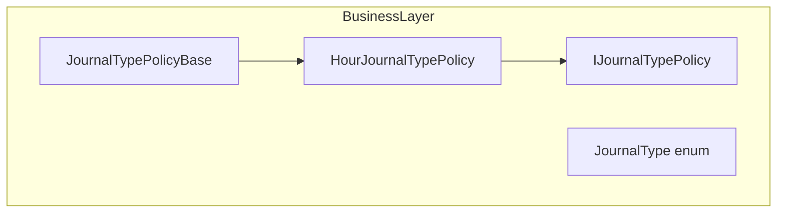
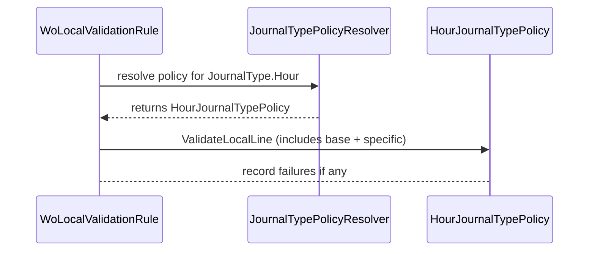

# Hour Journal Type Policy Feature Documentation

## Overview

The **HourJournalTypePolicy** enforces local, in-process validations for hour-based journal lines within work order payloads. It ensures each line in the `"WOHourLines"` section contains all mandatory fields before sending to FSCM. This promotes data integrity by catching missing or malformed entries early in the orchestration pipeline.

As part of the journaling subsystem, this policy integrates with the comprehensive work-order validation engine. It fits into the orchestration application by specializing the shared journal-type policy base for the **Hour** journal type, eliminating switch statements and supporting open closed validation logic.

## Architecture Overview



## Component Structure

### Business Layer

#### **HourJournalTypePolicy** (`src/Rpc.AIS.Accrual.Orchestrator.Application/Features/Journals/Policies/JournalPolicies/HourJournalTypePolicy.cs`)

- **Purpose & Responsibilities**

Implements hour-specific line validations by extending `JournalTypePolicyBase`.

Associates the **Hour** journal type with its payload section and rules.

- **Key Properties**- `JournalType JournalType`

Returns `JournalType.Hour`.

- `string SectionKey`

Returns `"WOHourLines"`.

- **Key Methods**- `ValidateLocalLineSpecific(Guid woGuid, string? woNumber, Guid lineGuid, JsonElement line, List<WoPayloadValidationFailure> invalidFailures)`

Checks for required fields:

- Duration (`"Duration"`)
- LineProperty (`"LineProperty"`)
- Sales price (`"UnitCost"`, `"ProjectSalesPrice"`, or `"SalesPrice"`)
- Unit identifier (`"UnitId"`)

Adds a `WoPayloadValidationFailure` for each missing field.

- `TryGetAnyNumber(JsonElement obj, out decimal value, params string[] keys)`

Helper that returns true if any of the specified keys has a numeric value.

## Data Models

#### WoPayloadValidationFailure

| Property | Type | Description |
| --- | --- | --- |
| `WorkOrderGuid` | `Guid` | Identifier of the work order. |
| `WorkOrderNumber` | `string?` | Human-readable work order number. |
| `JournalType` | `JournalType` | Type of journal (Hour in this case). |
| `WorkOrderLineGuid` | `Guid` | Identifier of the individual line. |
| `Code` | `string` | Standardized error code. |
| `Message` | `string` | Descriptive error message. |
| `Disposition` | `ValidationDisposition` | Severity or handling directive. |


## Feature Flows

### Local Validation Flow



## Integration Points

- **JournalTypePolicyResolver** resolves this policy for `JournalType.Hour`
- **WoLocalValidationRule** invokes `ValidateLocalLine` on the resolved policy.
- **JournalTypePolicyBase** provides shared quantity validation logic .

## Key Classes Reference

| Class | Location | Responsibility |
| --- | --- | --- |
| HourJournalTypePolicy | `.../JournalPolicies/HourJournalTypePolicy.cs` | Enforces hour-journal line validations. |
| JournalTypePolicyBase | `.../JournalPolicies/JournalTypePolicyBase.cs` | Shared validations for all journal types. |
| IJournalTypePolicy | `.../JournalPolicies/IJournalTypePolicy.cs` | Contract for journal-type policies. |
| JournalType | `.../Domain/JournalType.cs` | Defines supported journal types. |


## Error Handling

Validation failures are captured as `WoPayloadValidationFailure` entries. Each missing or invalid field yields a distinct failure code and message, enabling targeted error reporting and downstream filtering.

```card
{
    "title": "Key Fields Required",
    "content": "Hour journals must include Duration, LineProperty, a sales price field, and UnitId."
}
```

## Dependencies

- System.Text.Json for payload parsing
- `Rpc.AIS.Accrual.Orchestrator.Core.Domain.JournalType`
- `Rpc.AIS.Accrual.Orchestrator.Core.Domain.Validation.WoPayloadValidationFailure`
- `Rpc.AIS.Accrual.Orchestrator.Core.Domain.Validation.ValidationDisposition`
- `Rpc.AIS.Accrual.Orchestrator.Core.Services.WoPayloadJson` utilities

## Testing Considerations

Key test scenarios include:

- Missing or non-numeric **Duration** → failure code `AIS_HOUR_MISSING_DURATION`
- Empty **LineProperty** → failure code `AIS_HOUR_MISSING_LINEPROPERTY`
- Absent sales price fields → failure code `AIS_HOUR_MISSING_SALESPRICE`
- Missing **UnitId** → failure code `AIS_HOUR_MISSING_UNITID`