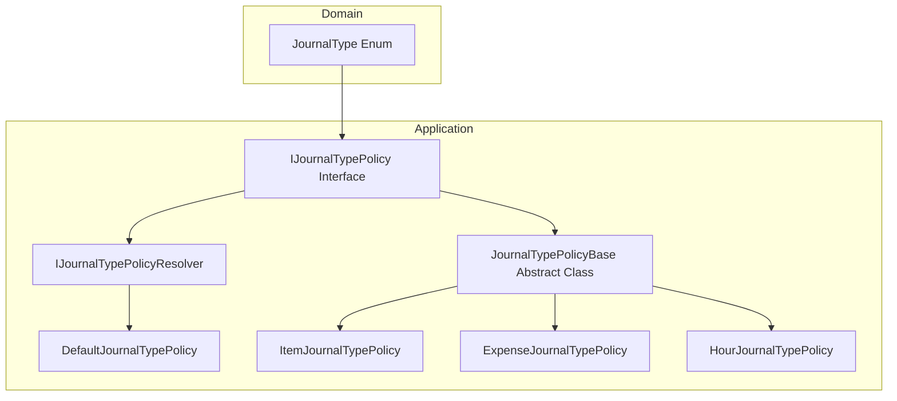

# Journal Type Policy Feature Documentation

## Overview 📋

The **IJournalTypePolicy** interface defines a contract for journal-type specific behavior within the accrual orchestrator. It exposes a **section key** (e.g., `WOItemLines`) and a **line‐level validation** method. By encapsulating validations per journal type, it adheres to the Open/Closed Principle, allowing new journal types to plug in without modifying existing logic.

This interface is implemented by concrete policies (Item, Expense, Hour) and a base class, which provides common checks (like verifying quantity). At runtime, consumers (such as the journal projector) resolve the appropriate policy and invoke validations, ensuring payload integrity before calling external FSCM endpoints.

## Architecture Overview



The diagram shows:

- **Domain layer** defines `JournalType`.
- **Application layer** provides the policy interface, base class, implementations, and a resolver.

## Component Structure 🏗️

### 1. Policy Interface

#### **IJournalTypePolicy** (`src/Rpc.AIS.Accrual.Orchestrator.Application/Features/Journals/Policies/JournalPolicies/IJournalTypePolicy.cs`)

- **Purpose:**

Defines the contract for journal-type metadata and local validations.

- **Key Properties:**- `JournalType JournalType`

Identifies the journal category (Item, Expense, Hour).

- `string SectionKey`

Payload section name for this journal type (e.g., `"WOItemLines"`).

- **Key Method:**- `void ValidateLocalLine(Guid woGuid, string? woNumber, Guid lineGuid, JsonElement line, List<WoPayloadValidationFailure> invalidFailures)`

Executes in‐process validations, appending any failures to `invalidFailures`.

```csharp
public interface IJournalTypePolicy
{
    JournalType JournalType { get; }
    string SectionKey { get; }
    void ValidateLocalLine(
        Guid woGuid,
        string? woNumber,
        Guid lineGuid,
        JsonElement line,
        List<WoPayloadValidationFailure> invalidFailures);
}
```

### 2. Base Class

#### **JournalTypePolicyBase**

- **Purpose:**

Implements `IJournalTypePolicy` and provides shared validations (e.g., ensuring `Quantity` is numeric).

- **Highlights:**- Calls abstract `ValidateLocalLineSpecific` after quantity check.
- Simplifies concrete implementations by handling common logic.

### 3. Concrete Policies

All concrete policies inherit from `JournalTypePolicyBase` and override:

| Policy Class | `JournalType` | `SectionKey` | Validates Required Fields |
| --- | --- | --- | --- |
| `ItemJournalTypePolicy` | Item | `"WOItemLines"` | `ItemId`, `LineProperty`, `Warehouse`, any of `UnitCost`/`ProjectSalesPrice`/`SalesPrice`, `UnitId` |
| `ExpenseJournalTypePolicy` | Expense | `"WOExpLines"` | `ProjectCategory`, `LineProperty`, any of `UnitCost`/`ProjectSalesPrice`/`SalesPrice`, `UnitId` |
| `HourJournalTypePolicy` | Hour | `"WOHourLines"` | `Duration`, `LineProperty`, any of `UnitCost`/`ProjectSalesPrice`/`SalesPrice`, `UnitId` |


Each adds failures of type `WoPayloadValidationFailure` for missing or invalid values.

### 4. Resolver

#### **IJournalTypePolicyResolver**

- **Purpose:**

Exposes `Resolve(JournalType)` to retrieve the matching policy implementation.

#### **JournalTypePolicyResolver**

- **Construction:**- Accepts all registered `IJournalTypePolicy` instances via DI.
- Builds a map by `JournalType`, allowing the last registration to override.
- **Fallback:**

Returns a `DefaultJournalTypePolicy` when no specific policy is registered.

- **SectionKey** is determined by journal type (`WOItemLines`, `WOExpLines`, `WOHourLines`, or `WOUnknownLines`).
- `ValidateLocalLine` is a no-op, deferring validation to higher layers.

## Integration Points 🔗

- **WoJournalProjector**

Retrieves `SectionKey` via the resolver to filter work orders by journal type.

- **FscmJournalPoster** & **FscmJournalFetchPolicyResolver**

Use `JournalType` to coordinate posting and fetching logic in infrastructure adapters.

```card
{
    "title": "Fallback Policy",
    "content": "DefaultJournalTypePolicy prevents runtime crashes by providing safe defaults when no policy is registered."
}
```

## Design Patterns

- **Open/Closed Principle:**

New journal types require only a new `IJournalTypePolicy` implementation.

- **Strategy Pattern:**

Policies encapsulate validation algorithms per journal type.

```card
{
    "title": "Extensible Policy",
    "content": "Implement new IJournalTypePolicy to support additional journal types without modifying existing code."
}
```

## Key Classes Reference

| Class | Location | Responsibility |
| --- | --- | --- |
| IJournalTypePolicy | `.../JournalPolicies/IJournalTypePolicy.cs` | Contract for journal-type metadata and validations. |
| JournalTypePolicyBase | `.../JournalPolicies/JournalTypePolicyBase.cs` | Shared validation logic and abstract hook for specific checks. |
| ItemJournalTypePolicy | `.../JournalPolicies/ItemJournalTypePolicy.cs` | Validates Item journal line payloads. |
| ExpenseJournalTypePolicy | `.../JournalPolicies/ExpenseJournalTypePolicy.cs` | Validates Expense journal line payloads. |
| HourJournalTypePolicy | `.../JournalPolicies/HourJournalTypePolicy.cs` | Validates Hour journal line payloads. |
| IJournalTypePolicyResolver | `.../JournalPolicies/IJournalTypePolicyResolver.cs` | Defines method to resolve a policy by journal type. |
| JournalTypePolicyResolver | `.../JournalPolicies/JournalTypePolicyResolver.cs` | Maps journal types to policy implementations, with fallback support. |
| DefaultJournalTypePolicy | Nested in `JournalTypePolicyResolver.cs` | No-op fallback policy to ensure safe section keys and validations. |
| JournalType | `.../Domain/JournalType.cs` | Enum defining available journal types (Item, Expense, Hour). |
| WoPayloadValidationFailure | `.../Core/Domain/Validation/WoPayloadValidationFailure.cs` | Represents a single validation error for work order payload lines. |


## Dependencies

- **System**: `Guid`, collections.
- **System.Text.Json**: `JsonElement`.
- **Rpc.AIS.Accrual.Orchestrator.Core.Domain**: `JournalType`.
- **Rpc.AIS.Accrual.Orchestrator.Core.Domain.Validation**: `WoPayloadValidationFailure`.
- **Rpc.AIS.Accrual.Orchestrator.Core.Services**: Utility for JSON payload parsing.

## Testing Considerations

- Validate that missing required fields trigger appropriate `WoPayloadValidationFailure` entries.
- Ensure `JournalTypePolicyResolver` returns fallback policy when DI registration is absent.
- Confirm shared quantity validation in `JournalTypePolicyBase` applies across all policies.

```card
{
    "title": "Quantity Validation",
    "content": "JournalTypePolicyBase ensures numeric Quantity is present for every journal line."
}
```