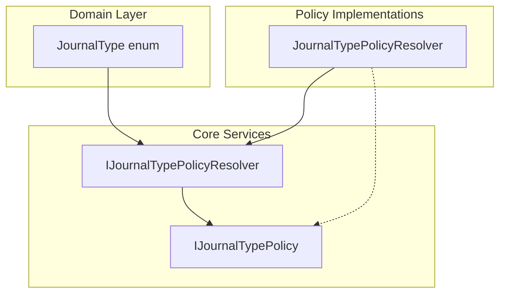

# Journal Type Policy Resolver Feature Documentation

## Overview

The **Journal Type Policy Resolver** defines a contract for mapping journal types to their specific behavior policies. It enables the application to look up metadata—such as payload section keys—and validation rules without scattering journal-type `switch` statements across the codebase.

By centralizing policy resolution, new journal types can be introduced simply by registering a new `IJournalTypePolicy`, promoting the Open/Closed principle and easing maintenance.

## Architecture Overview



## Component Structure

### 1. Core Services

#### **IJournalTypePolicyResolver** (`src/Rpc.AIS.Accrual.Orchestrator.Application/Features/Journals/Policies/JournalPolicies/IJournalTypePolicyResolver.cs`)

- **Purpose:**

Declares a resolver that, given a `JournalType`, returns the corresponding journal policy instance. This abstracts away journal-type logic from callers.

- **Method:**- `IJournalTypePolicy Resolve(JournalType journalType)`

Retrieves the registered `IJournalTypePolicy` for the specified `journalType`.

#### **IJournalTypePolicy** (`src/Rpc.AIS.Accrual.Orchestrator.Application/Features/Journals/Policies/JournalPolicies/IJournalTypePolicy.cs`)

- **Purpose:**

Encapsulates journal-type–specific metadata and line-level validation logic.

- **Properties:**- `JournalType JournalType` — The journal type this policy applies to.
- `string SectionKey` — JSON property name for this journal type’s payload section.

- **Method:**- `void ValidateLocalLine(Guid woGuid, string? woNumber, Guid lineGuid, JsonElement line, List<WoPayloadValidationFailure> invalidFailures)`

Applies in-process validations for a single journal line, adding any failures to `invalidFailures`.

### 2. Domain Layer

#### **JournalType** (`src/Rpc.AIS.Accrual.Orchestrator.Domain/Domain/JournalType.cs`)

- **Purpose:**

Enumerates supported journal types.

| Value | Integer |
| --- | --- |
| Item | 1 |
| Expense | 2 |
| Hour | 3 |


## Key Classes Reference

| Class | Location | Responsibility |
| --- | --- | --- |
| IJournalTypePolicyResolver | src/.../IJournalTypePolicyResolver.cs | Contract to resolve journal policies by type |
| IJournalTypePolicy | src/.../IJournalTypePolicy.cs | Defines journal-type metadata and validation behavior |
| JournalType | src/.../Domain/JournalType.cs | Enum listing supported journal types |
| JournalTypePolicyResolver | src/.../JournalTypePolicyResolver.cs | Default implementation building a lookup map of registered policies |


## Dependencies

> {{“Note: Each policy implementation corresponds to one of these enum values.”}}

- Rpc.AIS.Accrual.Orchestrator.Core.Domain.JournalType
- Rpc.AIS.Accrual.Orchestrator.Core.Services.JournalPolicies.IJournalTypePolicy

## Usage Example

```csharp
// Register policies in DI:
services.AddSingleton<IJournalTypePolicy, ItemJournalTypePolicy>();
services.AddSingleton<IJournalTypePolicy, ExpenseJournalTypePolicy>();
services.AddSingleton<IJournalTypePolicy, HourJournalTypePolicy>();
services.AddSingleton<IJournalTypePolicyResolver, JournalTypePolicyResolver>();

// Resolve and use:
var resolver = serviceProvider.GetRequiredService<IJournalTypePolicyResolver>();
var itemPolicy = resolver.Resolve(JournalType.Item);
Console.WriteLine(itemPolicy.SectionKey); // Outputs "WOItemLines"
```

## Dependencies

- **DI Registration:**

All `IJournalTypePolicy` implementations must be registered before the resolver.

- **Fallback Behavior:**

If no policy is registered for a type, the resolver returns a default policy with a safe `SectionKey` to prevent runtime failures.