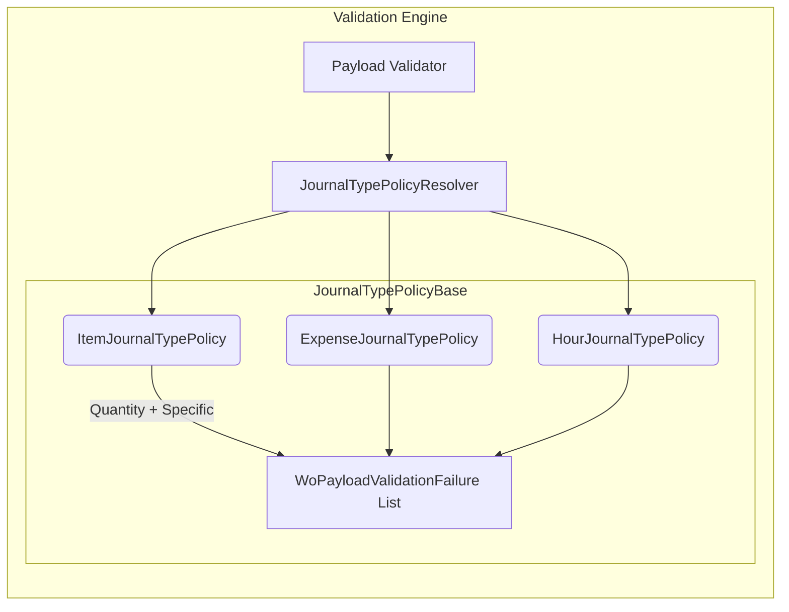
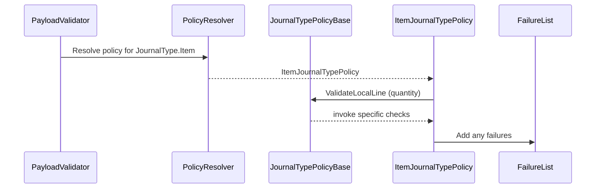

# Journal Type Policies Feature Documentation

## Overview

The **Journal Type Policies** define metadata and local validation rules for different journal types—**Item**, **Expense**, and **Hour**—within the accrual orchestrator. Each policy supplies a JSON section key (e.g., `"WOItemLines"`) and implements type-specific checks to ensure required fields are present before payload processing. This design follows the Open-Closed Principle, allowing new journal types to be added without modifying existing validation logic.

## Architecture Overview



## Component Structure

### Business Layer – Journal Policies

- **IJournalTypePolicy**: Defines the contract for journal-type metadata and local line validation.
- **JournalTypePolicyBase**: Implements shared logic (e.g., **Quantity** is required) and a template method for specific checks.
- **IJournalTypePolicyResolver**: Interface for resolving a policy by `JournalType`.
- **JournalTypePolicyResolver**: Maps registered policies; provides a safe default when none is found.
- **ItemJournalTypePolicy** ⚙️: Validates **Item** journal lines.
- **ExpenseJournalTypePolicy**: Validates **Expense** journal lines.
- **HourJournalTypePolicy**: Validates **Hour** journal lines.

### Domain Models

- **JournalType** (`enum`): `{ Item = 1, Expense = 2, Hour = 3 }`.
- **WoPayloadValidationFailure**: Captures details of a payload validation error.

---

## IJournalTypePolicy Interface

```csharp
public interface IJournalTypePolicy
{
    JournalType JournalType { get; }
    string SectionKey { get; }
    void ValidateLocalLine(
        Guid woGuid,
        string? woNumber,
        Guid lineGuid,
        JsonElement line,
        List<WoPayloadValidationFailure> invalidFailures);
}
```

- **JournalType**: Indicates the journal type this policy covers.
- **SectionKey**: JSON section name for building FSCM payloads (e.g., `"WOItemLines"`).
- **ValidateLocalLine**: Applies in-process validations for a single journal line, populating any failures.

---

## JournalTypePolicyBase Class

```csharp
public abstract class JournalTypePolicyBase : IJournalTypePolicy
{
    public abstract JournalType JournalType { get; }
    public abstract string SectionKey { get; }

    public void ValidateLocalLine(
        Guid woGuid,
        string? woNumber,
        Guid lineGuid,
        JsonElement line,
        List<WoPayloadValidationFailure> invalidFailures)
    {
        // Quantity is required for all journal types.
        if (!WoPayloadJson.TryGetNumber(line, "Quantity", out _))
        {
            invalidFailures.Add(new WoPayloadValidationFailure(
                woGuid, woNumber, JournalType, lineGuid,
                "AIS_LINE_MISSING_QUANTITY",
                "Quantity is missing or not numeric.",
                ValidationDisposition.Invalid));
        }

        ValidateLocalLineSpecific(woGuid, woNumber, lineGuid, line, invalidFailures);
    }

    protected abstract void ValidateLocalLineSpecific(
        Guid woGuid,
        string? woNumber,
        Guid lineGuid,
        JsonElement line,
        List<WoPayloadValidationFailure> invalidFailures);
}
```

- Enforces the **Quantity** field for all journals.
- Delegates **type-specific** checks to the `ValidateLocalLineSpecific` method.

---

## JournalTypePolicyResolver Class

```csharp
public sealed class JournalTypePolicyResolver : IJournalTypePolicyResolver
{
    private readonly IReadOnlyDictionary<JournalType, IJournalTypePolicy> _policies;

    public JournalTypePolicyResolver(IEnumerable<IJournalTypePolicy> policies) { … }

    public IJournalTypePolicy Resolve(JournalType journalType) { … }

    private sealed class DefaultJournalTypePolicy : IJournalTypePolicy { … }
}
```

- **Constructor**: Builds a map of `JournalType` → `IJournalTypePolicy`. Duplicates use “last wins” for DI overrides.
- **Resolve**: Returns the registered policy or a **safe default** that only provides a valid `SectionKey`.
- **DefaultJournalTypePolicy**:- Sets `SectionKey` based on `JournalType` (e.g., `JournalType.Item` → `"WOItemLines"`).
- Implements a no-op `ValidateLocalLine`.

---

## ItemJournalTypePolicy Class ⚙️

**Location:** `src/Rpc.AIS.Accrual.Orchestrator.Application/Features/Journals/Policies/JournalPolicies/ItemJournalTypePolicy.cs`

```csharp
public sealed class ItemJournalTypePolicy : JournalTypePolicyBase
{
    public override JournalType JournalType => JournalType.Item;
    public override string SectionKey => "WOItemLines";

    protected override void ValidateLocalLineSpecific(
        Guid woGuid,
        string? woNumber,
        Guid lineGuid,
        JsonElement line,
        List<WoPayloadValidationFailure> invalidFailures)
    {
        // Required for Item journals...
        // - ItemId
        // - LineProperty
        // - Warehouse
        // - UnitCost/ProjectSalesPrice
        // - UnitId

        if (string.IsNullOrWhiteSpace(WoPayloadJson.TryGetString(line, "ItemId")))
        {
            invalidFailures.Add(new WoPayloadValidationFailure(
                woGuid, woNumber, JournalType, lineGuid,
                "AIS_ITEM_MISSING_ITEMID",
                "ItemId is required for Item journals.",
                ValidationDisposition.Invalid));
        }

        // … other field checks …
    }

    private static bool TryGetAnyNumber(JsonElement obj, out decimal value, params string[] keys)
    {
        foreach (var k in keys)
        {
            if (WoPayloadJson.TryGetNumber(obj, k, out value))
                return true;
        }
        value = 0m;
        return false;
    }
}
```

### Purpose

Enforces that **Item** journal lines include all mandatory fields before orchestration proceeds.

### Key Properties

- **JournalType**: `JournalType.Item`
- **SectionKey**: `"WOItemLines"`

### Validation Rules 🛠️

| Field(s) | Error Code | Message |
| --- | --- | --- |
| `ItemId` | `AIS_ITEM_MISSING_ITEMID` | *ItemId is required for Item journals.* |
| `LineProperty` | `AIS_ITEM_MISSING_LINEPROPERTY` | *LineProperty is required for Item journals.* |
| `Warehouse` | `AIS_ITEM_MISSING_WAREHOUSE` | *Warehouse is required for Item journals.* |
| `UnitCost`/`ProjectSalesPrice`/`SalesPrice` | `AIS_ITEM_MISSING_SALESPRICE` | *UnitCost/ProjectSalesPrice is required for Item journals.* |
| `UnitId` | `AIS_ITEM_MISSING_UNITID` | *UnitId is required for Item journals.* |


---

## Helper Method: TryGetAnyNumber

```csharp
private static bool TryGetAnyNumber(
    JsonElement obj,
    out decimal value,
    params string[] keys)
{
    foreach (var k in keys)
    {
        if (WoPayloadJson.TryGetNumber(obj, k, out value))
            return true;
    }
    value = 0m;
    return false;
}
```

- Iterates through the provided `keys`.
- Returns **true** and the first numeric value found; otherwise returns **false**.

---

## Validation Flow



---

## Dependencies

- **Rpc.AIS.Accrual.Orchestrator.Core.Domain.JournalType**
- **Rpc.AIS.Accrual.Orchestrator.Core.Domain.Validation.WoPayloadValidationFailure**
- **Rpc.AIS.Accrual.Orchestrator.Core.Services.WoPayloadJson**
- **JournalTypePolicyBase**, **IJournalTypePolicy**, **IJournalTypePolicyResolver**

---

## Key Classes Reference

| Class | Location | Responsibility |
| --- | --- | --- |
| **IJournalTypePolicy** | `…/JournalPolicies/IJournalTypePolicy.cs` | Contract for journal-type metadata and validation |
| **JournalTypePolicyBase** | `…/JournalPolicies/JournalTypePolicyBase.cs` | Base logic (quantity check) and template method |
| **IJournalTypePolicyResolver** | `…/JournalPolicies/IJournalTypePolicyResolver.cs` | Interface for resolving policies by `JournalType` |
| **JournalTypePolicyResolver** | `…/JournalPolicies/JournalTypePolicyResolver.cs` | Maps and resolves registered policies; provides default |
| **ItemJournalTypePolicy** | `…/JournalPolicies/ItemJournalTypePolicy.cs` | Implements validations for **Item** journal lines |
| **ExpenseJournalTypePolicy** | `…/JournalPolicies/ExpenseJournalTypePolicy.cs` | Implements validations for **Expense** journal lines |
| **HourJournalTypePolicy** | `…/JournalPolicies/HourJournalTypePolicy.cs` | Implements validations for **Hour** journal lines |
| **JournalType** | `…/Domain/JournalType.cs` | Enum defining supported journal types (`Item`, `Expense`, `Hour`) |
