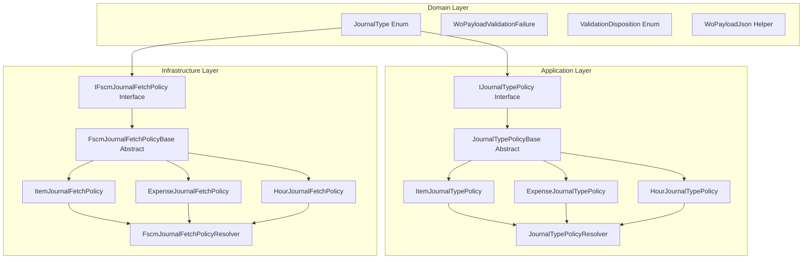

# Journal Processing Policies and FSCM Integration Feature Documentation

## Overview

This feature defines a clean, extensible mechanism for processing and validating work order journal lines and for fetching historical journal data from the FSCM system.

- **Application Layer**: Implements type-specific validation policies for Item, Expense, and Hour journals, enforcing both common and local rules.
- **Infrastructure Layer**: Encapsulates OData metadata and mapping rules to fetch historical journal entries per type, eliminating switch statements and enabling open-closed extension.

Together, these components ensure consistent payload validation, error reporting, and reliable interaction with FSCM journal endpoints.

## Architecture Overview



## Component Structure

### 1. Domain Layer

#### JournalType Enum (`src/Rpc.AIS.Accrual.Orchestrator.Core.Domain/JournalType.cs`)

- Defines supported journal types:- `Item = 1`
- `Expense = 2`
- `Hour = 3`

#### WoPayloadValidationFailure (`Core.Domain.Validation`)

- Represents a validation error on a work order line.
- Key properties:- `WorkOrderGuid`, `WorkOrderNumber`
- `JournalType`
- `LineGuid`
- `ErrorCode` (e.g., `"AIS_LINE_MISSING_QUANTITY"`)
- `Message`
- `ValidationDisposition` (e.g., `Invalid`)

#### ValidationDisposition Enum (`Core.Domain.Validation`)

- Indicates severity of a validation failure.
- Values include `Invalid`, `Warning`, etc.

#### WoPayloadJson Helper (`Core.Services`)

- Provides static methods to extract JSON fields:- `TryGetString(JsonElement, string)`
- `TryGetNumber(JsonElement, string, out decimal)`

### 2. Application Layer

#### IJournalTypePolicy (`.../Policies/JournalPolicies/IJournalTypePolicy.cs`)

- Contracts for journal-type specific behavior.
- Members:- `JournalType JournalType { get; }`
- `string SectionKey { get; }`
- `void ValidateLocalLine(Guid woGuid, string? woNumber, Guid lineGuid, JsonElement line, List<WoPayloadValidationFailure> invalidFailures)`

#### JournalTypePolicyBase (`.../JournalTypePolicyBase.cs`)

- Implements common validation logic for all journal types.
- **Common Rule**: Every line **must** include a numeric `Quantity`.
- Defines the abstract method:- `ValidateLocalLineSpecific(...)` for type-specific checks.

```csharp
public abstract class JournalTypePolicyBase : IJournalTypePolicy
{
    public abstract JournalType JournalType { get; }
    public abstract string SectionKey { get; }

    public void ValidateLocalLine(
        Guid woGuid,
        string? woNumber,
        Guid lineGuid,
        JsonElement line,
        List<WoPayloadValidationFailure> invalidFailures)
    {
        // Quantity is required for all journal types.
        if (!WoPayloadJson.TryGetNumber(line, "Quantity", out _))
        {
            invalidFailures.Add(new WoPayloadValidationFailure(
                woGuid, woNumber, JournalType, lineGuid,
                "AIS_LINE_MISSING_QUANTITY",
                "Quantity is missing or not numeric.",
                ValidationDisposition.Invalid));
        }

        ValidateLocalLineSpecific(woGuid, woNumber, lineGuid, line, invalidFailures);
    }

    protected abstract void ValidateLocalLineSpecific(
        Guid woGuid,
        string? woNumber,
        Guid lineGuid,
        JsonElement line,
        List<WoPayloadValidationFailure> invalidFailures);
}
```

#### ItemJournalTypePolicy (`.../ItemJournalTypePolicy.cs`)

- `JournalType`: `Item`
- `SectionKey`: `"WOItemLines"`
- Validates presence of:- `ItemId`
- `LineProperty`
- `Warehouse`
- Any of `UnitCost` / `ProjectSalesPrice` / `SalesPrice`
- `UnitId`

#### ExpenseJournalTypePolicy (`.../ExpenseJournalTypePolicy.cs`)

- `JournalType`: `Expense`
- `SectionKey`: `"WOExpLines"`
- Validates presence of:- `ProjectCategory`
- `LineProperty`
- Sales price fields
- `UnitId`

#### HourJournalTypePolicy (`.../HourJournalTypePolicy.cs`)

- `JournalType`: `Hour`
- `SectionKey`: `"WOHourLines"`
- Validates presence of:- Numeric `Duration`
- `LineProperty`
- Sales price fields
- `UnitId`

#### JournalTypePolicyResolver (`.../JournalTypePolicyResolver.cs`)

- Collects all `IJournalTypePolicy` implementations via DI.
- Builds a stable dictionary keyed by `JournalType`.
- `Resolve(JournalType)`: returns matching policy or a safe fallback.

| Class | Responsibility |
| --- | --- |
| `JournalTypePolicyResolver` | Maps journal types to policy implementations; provides fallback policy. |
| `DefaultJournalTypePolicy` | No-op policy with basic `SectionKey` mapping when no custom policy exists. |


### 3. Infrastructure Layer

#### IFscmJournalFetchPolicy (`.../Clients/FscmJournalPolicies/IFscmJournalFetchPolicy.cs`)

- Metadata and mapping rules for OData journal fetch.
- Members:- `JournalType JournalType { get; }`
- `string EntitySet { get; }`
- `string Select { get; }`
- `string SelectFallback { get; }`
- `decimal GetQuantity(JsonElement row)`
- `decimal? GetUnitPrice(JsonElement row)`

#### FscmJournalFetchPolicyBase (`.../FscmJournalFetchPolicyBase.cs`)

- Provides default `SelectFallback` and helper `TryGetDecimal`.
- Abstract members to override in derived classes.

#### ItemJournalFetchPolicy (`.../ItemJournalFetchPolicy.cs`)

- `JournalType`: `Item`
- `EntitySet`: `"ProjectItemJournalTrans"`
- Custom `$select` including optional fields and fallback that excludes marked problematic properties.
- Extracts `Quantity` and normalized unit price for delta comparisons.

#### ExpenseJournalFetchPolicy (`.../ExpenseJournalFetchPolicy.cs`)

- `JournalType`: `Expense`
- `EntitySet`: `"ExpenseJournalLines"`
- Custom `$select` with safe fallback removals.
- Normalizes quantity and unit price.

#### HourJournalFetchPolicy (`.../HourJournalFetchPolicy.cs`)

- `JournalType`: `Hour`
- `EntitySet`: `"JournalTrans"`
- `$select` of hours, sales price, and related fields.
- `GetQuantity` picks `Hours` or falls back to `Qty`/`Quantity`.
- `GetUnitPrice` picks `SalesPrice` or `ProjectSalesPrice`.

#### FscmJournalFetchPolicyResolver (`.../FscmJournalFetchPolicyResolver.cs`)

- Registers exactly one fetch policy per `JournalType`.
- `Resolve(JournalType)` returns policy or throws if missing.

### 4. Posting DTOs

#### FscmPostJournalEnvelope & FscmJournalPostItem (`.../FscmJournalPostDtos.cs`)

- Wraps a list of journal post items for bulk posting to FSCM.
- Serialized as:

```jsonc
{
  "JournalList": [
    {
      "Company": "COMPANY_ID",
      "JournalId": "JOURNAL_GUID",
      "JournalType": "Item"
    },
    …
  ]
}
```

## Integration Points

- **Validation Pipeline**:1. Payload arrives at Journals endpoint.
2. `JournalTypePolicyResolver` selects the correct `IJournalTypePolicy`.
3. `ValidateLocalLine` enforces common and type-specific rules, collecting failures.

- **Fetch History Pipeline**:1. Request historical entries for a given `JournalType`.
2. `FscmJournalFetchPolicyResolver` selects the correct OData metadata and mapping.
3. HTTP client builds OData query using `EntitySet` and `Select` properties.

- **Posting Pipeline**:1. After creation, extract posted journal IDs from response JSON.
2. Wrap into `FscmPostJournalEnvelope` and post all via a single batch call.

## Error Handling

- **Validation**: Uses `WoPayloadValidationFailure` with explicit error codes (`AIS_LINE_MISSING_QUANTITY`, etc.) and dispositions.
- **Fallback Policies**:- **DefaultJournalTypePolicy** prevents runtime errors when no custom policy is registered.
- **SelectFallback** on fetch policies ensures robust OData queries across environments.

## Key Classes Reference

| Class | Location | Responsibility |
| --- | --- | --- |
| `JournalType` | Core.Domain/JournalType.cs | Defines supported journal types. |
| `WoPayloadValidationFailure` | Core.Domain.Validation | Encapsulates line-level validation errors. |
| `WoPayloadJson` | Core.Services | JSON extraction helpers. |
| `IJournalTypePolicy` | Application/Features/Journals/Policies/JournalPolicies/IJournalTypePolicy.cs | Policy contract for journal-type validation. |
| `JournalTypePolicyBase` | Application/Features/Journals/Policies/JournalPolicies/JournalTypePolicyBase.cs | Base class with shared validation logic. |
| `Item/Expense/HourJournalTypePolicy` | Application/Features/Journals/Policies/JournalPolicies/*.cs | Implement type-specific validation. |
| `JournalTypePolicyResolver` | Application/Features/Journals/Policies/JournalPolicies/JournalTypePolicyResolver.cs | Resolves validation policies via DI. |
| `IFscmJournalFetchPolicy` | Infrastructure/Adapters/Fscm/Clients/FscmJournalPolicies/IFscmJournalFetchPolicy.cs | Contract for FSCM journal fetch metadata. |
| `FscmJournalFetchPolicyBase` | Infrastructure/Adapters/Fscm/Clients/FscmJournalPolicies/FscmJournalFetchPolicyBase.cs | Base helpers for OData mapping and parsing. |
| `Item/Expense/HourJournalFetchPolicy` | Infrastructure/Adapters/Fscm/Clients/FscmJournalPolicies/*.cs | Type-specific OData `$select` and field mapping. |
| `FscmJournalFetchPolicyResolver` | Infrastructure/Adapters/Fscm/Clients/FscmJournalPolicies/FscmJournalFetchPolicyResolver.cs | Maps journal types to fetch policies. |
| `FscmPostJournalEnvelope` | Infrastructure/Adapters/Fscm/Clients/Posting/FscmJournalPostDtos.cs | DTO for bulk posting journal entries. |


## Dependencies

- **.NET**: `System.Text.Json` for JSON parsing and serialization.
- **Core Packages**:- `Rpc.AIS.Accrual.Orchestrator.Core.Domain`
- `Rpc.AIS.Accrual.Orchestrator.Core.Domain.Validation`
- `Rpc.AIS.Accrual.Orchestrator.Core.Services`

## Testing Considerations

- Verify `JournalTypePolicyBase` enforces missing `Quantity` correctly.
- Test each `ValidateLocalLineSpecific` implementation with payloads missing required fields.
- Ensure `JournalTypePolicyResolver` returns the correct policy and fallback defaults.
- Confirm fetch policies generate valid OData `$select` strings and parse quantities/prices under varied JSON scenarios.