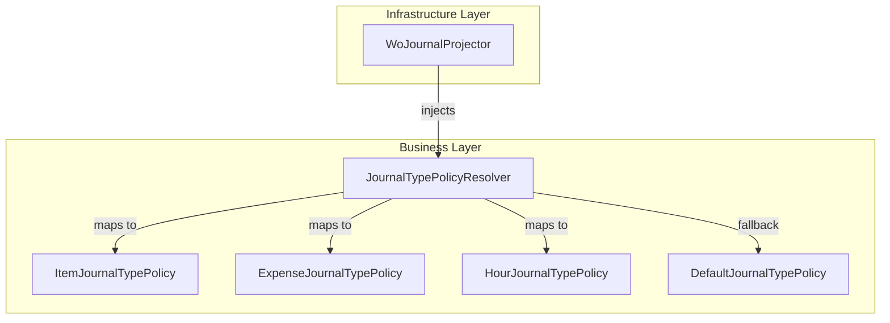

# Journal Type Policy Resolver Feature Documentation

## Overview

The **Journal Type Policy Resolver** provides a centralized mechanism to obtain journal-type specific validation rules and metadata. It aggregates all `IJournalTypePolicy` implementations registered via dependency injection and resolves the appropriate policy for a given `JournalType`.

By encapsulating journal-type logic in separate policy classes, this feature eliminates scattered `switch` statements, supports the Open/Closed Principle, and ensures a safe fallback when no explicit policy is registered. Downstream components (e.g., journal projectors and validators) rely on these policies to drive section-key selection and per-line validations.

## Architecture Overview

## Component Structure

### 2. Business Layer

#### **JournalTypePolicyResolver** (`src/Rpc.AIS.Accrual.Orchestrator.Application/Features/Journals/Policies/JournalPolicies/JournalTypePolicyResolver.cs`)

- **Purpose:**

Resolves an `IJournalTypePolicy` instance for a specified `JournalType`, allowing override via DI and providing a safe fallback.

- **Key Properties:- `_policies: IReadOnlyDictionary<JournalType, IJournalTypePolicy>` — Map of journal types to their policies.
- **Key Methods:**- `JournalTypePolicyResolver(IEnumerable<IJournalTypePolicy> policies)`- Builds the internal `_policies` dictionary. If multiple policies share a `JournalType`, the last one wins.
- Throws `ArgumentNullException` if the `policies` enumerable is null.
- `IJournalTypePolicy Resolve(JournalType journalType)`- Returns the registered policy for `journalType` or a `DefaultJournalTypePolicy` if none is found.

#### **DefaultJournalTypePolicy** (inner sealed class)

- **Purpose:**

Provides a no-op, safe fallback when no concrete policy is registered. Ensures a valid `SectionKey` so JSON projections do not crash.

- **Implemented Interface:** `IJournalTypePolicy`
- **Key Members:**- `JournalType JournalType { get; }` — The journal type passed into the resolver.
- `string SectionKey { get; }` — Maps `JournalType` to one of:- `Item` → `"WOItemLines"`
- `Expense` → `"WOExpLines"`
- `Hour` → `"WOHourLines"`
- default → `"WOUnknownLines"`
- `void ValidateLocalLine(...)` — No-op implementation; local validations are skipped.

### 4. Data Models

#### **JournalType** (`src/Rpc.AIS.Accrual.Orchestrator.Core.Domain/Domain/JournalType.cs`)

- **Type:** `enum`
- **Values:**

| Name | Value |
| --- | --- |
| Item | 1 |
| Expense | 2 |
| Hour | 3 |

#### **IJournalTypePolicy** (`src/Rpc.AIS.Accrual.Orchestrator.Application/Features/Journals/Policies/JournalPolicies/IJournalTypePolicy.cs`)

| Property | Type | Description |
| --- | --- | --- |
| JournalType | JournalType | The journal type this policy applies to. |
| SectionKey | string | JSON section key (e.g., `"WOItemLines"`). |

- **Contract for journal-type behavior.**
- **Properties:**
- **Methods:**

| Method | Signature | Description |
| --- | --- | --- |
| ValidateLocalLine | `void ValidateLocalLine(Guid woGuid, string? woNumber, Guid lineGuid, JsonElement line, List<WoPayloadValidationFailure> invalidFailures)` | Applies in-process validations for a single journal line. |

#### **IJournalTypePolicyResolver** (`src/Rpc.AIS.Accrual.Orchestrator.Application/Features/Journals/Policies/JournalPolicies/IJournalTypePolicyResolver.cs`)

- **Contract for resolving journal policies.**
- **Methods:**

| Method | Signature | Description |
| --- | --- | --- |
| Resolve | `IJournalTypePolicy Resolve(JournalType)` | Retrieves the policy for the given `JournalType`. |

### 5. API Integration

## Integration Points

> 

- **WoJournalProjector** (`Rpc.AIS.Accrual.Orchestrator.Infrastructure.Clients.Posting.WoJournalProjector`):

Injects `IJournalTypePolicyResolver` to determine which journal sections to keep and how to validate lines before posting.

## Key Classes Reference

| Class | Location | Responsibility |
| --- | --- | --- |
| JournalTypePolicyResolver | `.../JournalPolicies/JournalTypePolicyResolver.cs` | Resolves and caches journal-type policies |
| DefaultJournalTypePolicy | Inner class in `JournalTypePolicyResolver.cs` | Fallback policy providing safe `SectionKey` |
| IJournalTypePolicy | `.../JournalPolicies/IJournalTypePolicy.cs` | Defines the contract for journal-type specific policies |
| IJournalTypePolicyResolver | `.../JournalPolicies/IJournalTypePolicyResolver.cs` | Defines the contract for resolving `IJournalTypePolicy` instances |
| JournalType | `.../Core/Domain/Domain/JournalType.cs` | Enumeration of supported journal types |

## Error Handling

- **Constructor Null Check:**

Throws `ArgumentNullException` if the `policies` collection is null.

- **Resolution Fallback:**

Always returns a valid `IJournalTypePolicy`—never throws when a policy is missing, avoiding runtime failures in downstream JSON processing.

## Dependencies

- System
- System.Collections.Generic
- System.Linq
- System.Text.Json
- `Rpc.AIS.Accrual.Orchestrator.Core.Domain.JournalType`
- `Rpc.AIS.Accrual.Orchestrator.Core.Domain.Validation.WoPayloadValidationFailure`
- Implementations of `IJournalTypePolicy` (e.g., `ItemJournalTypePolicy`, `HourJournalTypePolicy`, `ExpenseJournalTypePolicy`)

## Testing Considerations

- Verify that when multiple policies for the same `JournalType` are registered, the **last** one in the enumeration overrides earlier ones.
- Confirm that `Resolve` returns:- The correct concrete policy when registered.
- A `DefaultJournalTypePolicy` with the expected `SectionKey` when no policy is registered.
- Ensure no exceptions are thrown during resolution, even if the internal dictionary is empty.