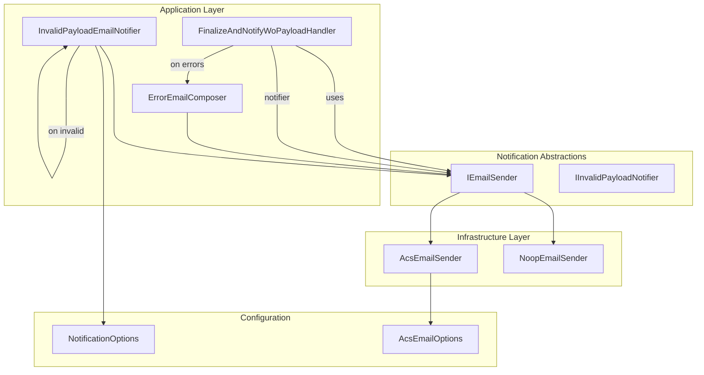
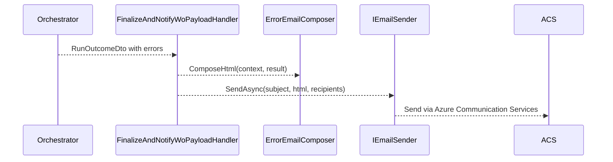
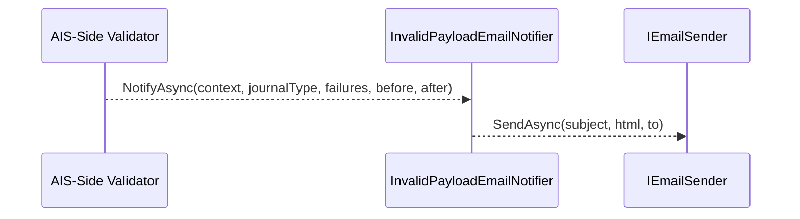

# Notifications Feature Documentation

## Overview ✉️

The Notifications feature centralizes email-based alerts for orchestration failures and payload validation issues. When the accrual orchestrator completes with errors, it emails a distribution list with detailed HTML summaries. Similarly, AIS-side payload validation failures trigger a pre-posting notification to prevent invalid records reaching FSCM.

This feature comprises abstraction interfaces, composition utilities for HTML, pluggable email sender implementations, and configuration options. It integrates with Durable Functions activities to send failure and invalid-payload emails without affecting orchestration success.

## Architecture Overview



## Component Structure

### 1. Core Abstractions

#### **IEmailSender**

Path: `src/Rpc.AIS.Accrual.Orchestrator.Core.Abstractions/IEmailSender.cs`

Defines a uniform contract for sending HTML emails using any underlying transport.

- SendAsync(subject, htmlBody, recipients, ct): sends an email without throwing on failure.

#### **IInvalidPayloadNotifier**

Path: `src/Rpc.AIS.Accrual.Orchestrator.Core.Abstractions/IInvalidPayloadNotifier.cs`

Notifies about invalid work orders detected during AIS-side validation.

- NotifyAsync(context, journalType, failures, before, after, ct)

### 2. Application Services

#### **ErrorEmailComposer**

Path: `src/Rpc.AIS.Accrual.Orchestrator.Application/Features/Notifications/Services/ErrorEmailComposer.cs`

Generates the HTML body for orchestration failure emails.

Key methods:

- ComposeHtml(RunContext context, PostResult result): builds a styled HTML document summarizing- Invalid WOs (parsed via `PostErrorMessageParser`)
- Other errors in a compact table
- BuildInvalidWoRows(errors): extracts work-order rows or falls back to raw message
- TrimForEmail(s, max): truncates long messages for email readability

```csharp
var html = ErrorEmailComposer.ComposeHtml(runCtx, aggregatedPostResult);
```

### 3. Infrastructure Services

#### **AcsEmailSender**

Path: `src/Rpc.AIS.Accrual.Orchestrator.Infrastructure/Notifications/AcsEmailSender.cs`

Sends emails via Azure Communication Services in a production-safe manner:

- Honors `CancellationToken`
- Normalizes and validates recipients
- Skips send when disabled or misconfigured
- Logs but does not throw on failure

#### **NoopEmailSender**

Path: `src/Rpc.AIS.Accrual.Orchestrator.Infrastructure/Notifications/NoopEmailSender.cs`

Writes email details to the console. Used when ACS is disabled or in local/test scenarios .

#### **InvalidPayloadEmailNotifier**

Path: `src/Rpc.AIS.Accrual.Orchestrator.Infrastructure/Notifications/InvalidPayloadEmailNotifier.cs`

Sends AIS-side payload validation failure summaries before any posting attempt .

- Retrieves recipients via `NotificationOptions.GetInvalidPayloadRecipients()`
- Logs failures or missing configuration
- Builds an HTML table grouping failures by work order

### 4. Configuration Models

| Class | Path | Key Properties |
| --- | --- | --- |
| **NotificationOptions** | `src/Rpc.AIS.Accrual.Orchestrator.Core.Options/NotificationOptions.cs` | ErrorDistributionList, ErrorDistributionListArray, InvalidPayloadDistributionList, GetRecipients() |
| **AcsEmailOptions** | `src/Rpc.AIS.Accrual.Orchestrator.Infrastructure/Options/AcsEmailOptions.cs` | Enabled, ConnectionString, FromAddress, FromDisplayName, WaitUntilCompleted |


## Data Models

#### **InvalidWoRow**

A private record in **ErrorEmailComposer** carrying one invalid-WO table row.

| Property | Type | Description |
| --- | --- | --- |
| **WoNumber** | string | The work order number |
| **WorkOrderGuid** | string | GUID of the work order |
| **InfoMessage** | string | Brief validation info |
| **Errors** | string | Pipe-separated error messages |


## Feature Flows

### 1. Orchestration Failure Notification



### 2. Invalid Payload Notification



## Integration Points

- **FinalizeAndNotifyWoPayloadHandler** in the Functions layer invokes **ErrorEmailComposer** and **IEmailSender** to dispatch failure notifications.
- **AIS validation pipeline** uses **InvalidPayloadEmailNotifier** to alert on pre-posting failures.

## Error Handling

- **AcsEmailSender** catches `RequestFailedException` and general `Exception`, logging errors without propagating them, ensuring notification issues don’t break orchestration .
- **InvalidPayloadEmailNotifier** guards against null context, empty failures, and missing distribution lists, logging warnings accordingly .

## Dependencies

- Azure.Communication.Email (EmailClient)
- Microsoft.Extensions.Logging
- `Rpc.AIS.Accrual.Orchestrator.Core.Domain` for `RunContext`, `PostResult`, `PostError`
- `System.Net`, `System.Text`

## Testing Considerations

- Validate HTML contains correct tables when:- No errors
- Only invalid-WO errors
- Mixed other errors
- Test behavior when:- ACS is disabled (`Enabled=false`)
- No recipients configured
- FromAddress missing
- Ensure `NoopEmailSender` logs expected console output without throwing.

---

This documentation covers all components, configurations, data models, and flows within the Notifications feature as provided by the uploaded source files.