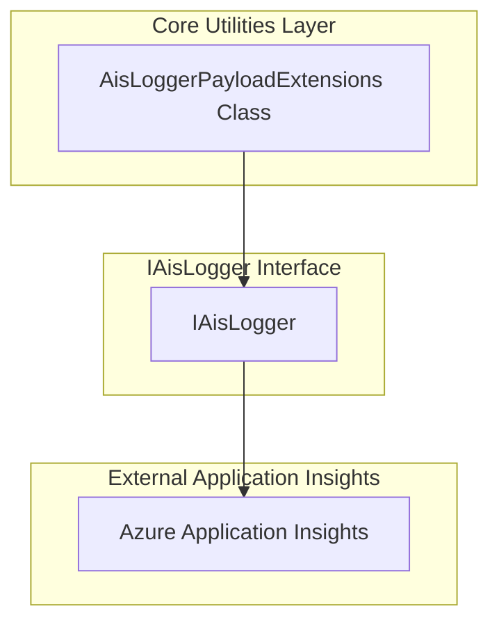
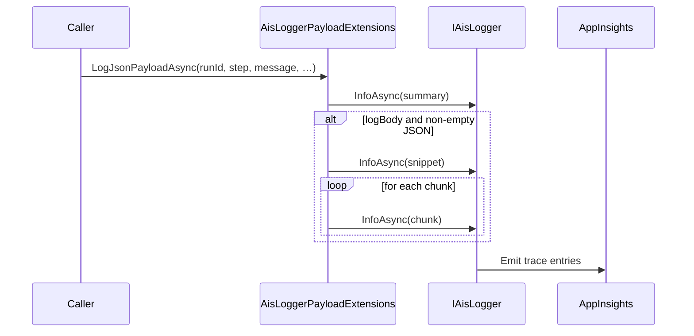

# AisLoggerPayloadExtensions Feature Documentation

## Overview

The **AisLoggerPayloadExtensions** class provides production-safe helpers for logging large JSON payloads via the `IAisLogger` abstraction. It ensures every payload is accompanied by a concise summary—its SHA256 fingerprint and length—while optionally emitting a snippet and chunked body logs to avoid trace truncation in Application Insights.

By centralizing payload-logging concerns, this utility:

- 🔒 Generates a stable cryptographic hash for tamper detection and deduplication.
- 📝 Limits logged content to configurable snippet and chunk sizes, preventing oversized traces.
- Integrates seamlessly with any `IAisLogger` implementation used across the orchestrator.

This extension enhances observability without risking performance or data loss in high-volume scenarios.

## Architecture Overview



- **Core Utilities Layer**

Houses shared helpers like `AisLoggerPayloadExtensions`.

- **Logging Abstraction**

`IAisLogger` defines async logging methods (Info, Warn, Error).

- **External Application Insights**

Concrete `IAisLogger` implementations emit telemetry to Azure.

## Component Structure

### Business Layer

#### **AisLoggerPayloadExtensions**

*Path:* `src/Rpc.AIS.Accrual.Orchestrator.Application/Features/Shared/Utilities/AisLoggerPayloadExtensions.cs`

- **Purpose & Responsibilities**- Extend any `IAisLogger` to handle large JSON payloads safely.
- Always log a compact summary (length + SHA256).
- Optionally log a fixed‐size snippet and chunked body segments.
- **Dependencies**- `Rpc.AIS.Accrual.Orchestrator.Core.Abstractions.IAisLogger`
- `System.Security.Cryptography`
- `System.Text.Json`
- `System.Text`
- `System.Threading`
- `System.Threading.Tasks`

#### Key Methods

| Method | Signature | Description | Returns |
| --- | --- | --- | --- |
| LogJsonPayloadAsync | ```csharp<br>public static Task LogJsonPayloadAsync( this IAisLogger logger,<br>    string runId,<br>    string step,<br>    string message,<br>    string payloadType,<br>    string workOrderGuid,<br>    string? workOrderNumber,<br>    string json,<br>    bool logBody,<br>    int snippetChars,<br>    int chunkChars,<br>    CancellationToken ct )``` | Logs a summary (length + SHA256), then—if enabled—a snippet and full payload in chunks. | `Task` |
| Sha256Hex | ```csharp<br>private static string Sha256Hex(string s)``` | Computes and returns the SHA256 hash of the input as a hexadecimal string. | `string` |


## Feature Flow

### 1. JSON Payload Logging Flow



1. **Caller** invokes the extension.
2. **Extension** logs a small summary (safe size).
3. If body logging is enabled:- Emits a snippet (first  characters).
- Splits the remainder into chunks and logs each.
4. **IAisLogger** implementation forwards all entries to Application Insights.

## Integration Points

- **IAisLogger** implementations (e.g., `AppInsightsAisLogger`) automatically gain payload-logging capabilities.
- Commonly used by telemetry shapers and orchestrator steps that need to record request/response bodies.

## Key Classes Reference

| Class | Location | Responsibility |
| --- | --- | --- |
| AisLoggerPayloadExtensions | `.../Features/Shared/Utilities/AisLoggerPayloadExtensions.cs` | Extension methods to log JSON payloads with SHA256, snippets, and chunked bodies. |
| IAisLogger | `.../Ports/Common/Abstractions/IAisLogger.cs` | Defines asynchronous Info/Warn/Error logging contracts for the orchestrator. |


## Error Handling

- Throws **ArgumentNullException** if `logger` is null.
- Treats a null `json` parameter as empty (`string.Empty`), avoiding null‐reference issues.
- Exceptions from underlying `InfoAsync` calls propagate to the caller.

```csharp
if (logger is null)
    throw new ArgumentNullException(nameof(logger));
if (json is null)
    json = string.Empty;
```

## Dependencies

- **.NET Libraries**- System.Security.Cryptography
- System.Text.Json
- System.Text
- System.Threading, System.Threading.Tasks
- **Project Abstractions**- `Rpc.AIS.Accrual.Orchestrator.Core.Abstractions.IAisLogger`

## Testing Considerations

- Verify that **summary logging** always occurs, regardless of `logBody`.
- Test **snippet generation** for payloads shorter, equal, and longer than `snippetChars`.
- Confirm **chunking logic**:- `chunkChars <= 0` results in no chunk logs.
- Correct `ChunkCount`, `ChunkIndex`, and segment lengths for various payload sizes.
- Ensure **SHA256 hash** output matches known test vectors for sample strings.