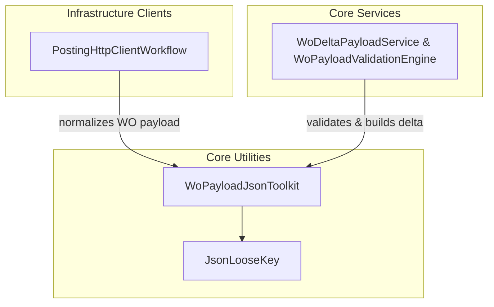

# WoPayloadJsonToolkit Utility Documentation

## Overview

Shared between Infrastructure clients and Core services, **WoPayloadJsonToolkit** provides routines to normalize and inspect Work Order (WO) payload JSON.

It ensures a canonical envelope shape (`"_request.WOList"`) and removes null journal sections to prevent schema errors.

Additionally, it detects which journal types (Item, Expense, Hour) are present based on non-empty `JournalLines` arrays.

## Architecture Overview



## Component Structure

### **WoPayloadJsonToolkit**

`src/Rpc.AIS.Accrual.Orchestrator.Application/Features/Shared/Utilities/WoPayloadJsonToolkit.cs`

- **Purpose:**- Normalize varied WO payload envelopes to the `{"_request":{"WOList": […]}}` shape.
- Remove explicitly null journal sections (`WOExpLines`, `WOHourLines`, `WOItemLines`).
- Detect which journal types contain data.

- **Key Constants:**

| Constant | Value | Description |
| --- | --- | --- |
| `RequestKey` | `"_request"` | Root property for request object. |
| `WoListKey` | `"WOList"` | Property name for work order list. |
| `JournalLinesKey` | `"JournalLines"` | Array of journal line items. |


- **Dependencies:**- System.Text.Json
- System.Text.Json.Nodes
- **JsonLooseKey**: Loose-match JSON key helper for case/format tolerance
- **Domain.JournalType**: Enumeration (`Item`, `Expense`, `Hour`)

#### Public Methods

| Method | Signature | Description | Returns |
| --- | --- | --- | --- |
| `NormalizeWoPayloadToWoListKey` | `static string NormalizeWoPayloadToWoListKey(string woPayloadJson)` | Converts variants like `"request"/"woList"` to `"_request"/"WOList"`, clones arrays, removes null sections. | Normalized, compact JSON string |
| `DetectJournalTypesPresent` | `static List<Domain.JournalType> DetectJournalTypesPresent(string normalizedWoPayloadJson, string woItemKey, string woExpKey, string woHourKey)` | Parses the normalized payload, checks non-empty `JournalLines` under each section key. | Ordered list of detected journal types |


#### Private Helpers

- **RemoveNullSectionsFromWoList**

Iterates each work order and removes any section property whose value is explicitly null.

- **RemoveNullPropertyLoose**

Removes a property if its loose-matched key value is null.

- **HasNonEmptyJournalLines**

Checks if a given section object contains a non-empty `JournalLines` array.

---

## Method Details

### NormalizeWoPayloadToWoListKey

Normalizes incoming JSON to ensure:

1. Root has `"_request"` object.
2. `"_request"` contains a `"WOList"` array.
3. Legacy keys (`"request"`, `"wo list"`, `"woList"`, or loose variants) are renamed.
4. Null journal sections are removed.

```csharp
// Example usage
var json = @"
{
  ""request"": {
    ""woList"": [
      { ""WOExpLines"": null, ""WOHourLines"": { ""JournalLines"": [] } }
    ]
  }
}";
var normalized = WoPayloadJsonToolkit.NormalizeWoPayloadToWoListKey(json);
Console.WriteLine(normalized);
```

### DetectJournalTypesPresent

Scans each work order in a normalized payload and adds `JournalType.Item`, `JournalType.Expense`, or `JournalType.Hour` if the corresponding section’s `JournalLines` array has length > 0.

Exceptions during parsing are swallowed to favor tolerance.

```csharp
var types = WoPayloadJsonToolkit.DetectJournalTypesPresent(
    normalizedJson,
    woItemKey: "WOItemLines",
    woExpKey: "WOExpLines",
    woHourKey: "WOHourLines"
// Returns e.g. [JournalType.Item, JournalType.Hour]
);
```

---

## Error Handling

- **Normalization** returns the original JSON if it lacks expected structure (`_request` or `WOList`).
- **Detection** uses `try { … } catch {}` to return an empty list on any parse error, preserving robustness.

---

## Key Classes Reference

| Class | Location | Responsibility |
| --- | --- | --- |
| `WoPayloadJsonToolkit` | `.../Features/Shared/Utilities/WoPayloadJsonToolkit.cs` | JSON normalization & journal-type detection for WO payloads. |
| `JsonLooseKey` | `.../Features/Shared/Utilities/JsonLooseKey.cs` | Case- and format-insensitive JSON key matching. |


---

## Dependencies

- **System.Text.Json** & **System.Text.Json.Nodes** for JSON parsing/manipulation.
- **JsonLooseKey** for tolerant key lookups .
- **Domain.JournalType** enumeration for journal type classification.