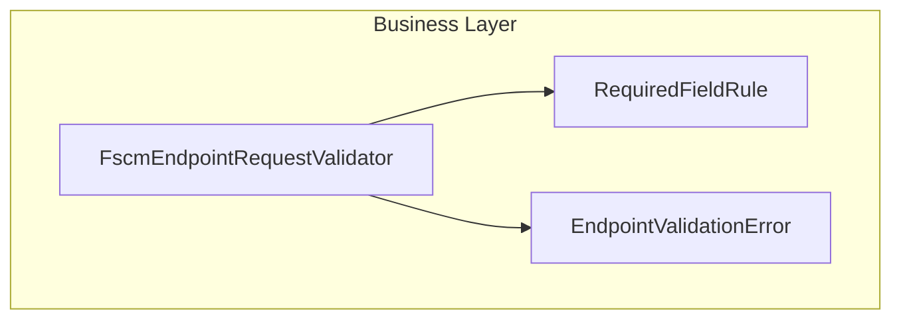

# FSCM Endpoint Request Validation Feature Documentation

## Overview

The FSCM Endpoint Request Validation feature provides a reusable, static validation mechanism for requests destined to FSCM (Financial Supply Chain Management) endpoints. It ensures that all mandatory fields in a request object are present and meet basic non-null or non-empty criteria before the application sends data to external FSCM services. This validation step helps avoid runtime errors and ensures clear error reporting in upstream workflows.

By centralizing validation rules and error generation, this feature simplifies maintenance of request contracts, enforces consistency across multiple FSCM endpoint integrations, and surfaces missing or malformed data early in the processing pipeline.

## Architecture Overview



## Component Structure

### Business Layer

#### **FscmEndpointRequestValidator** (`src/Rpc.AIS.Accrual.Orchestrator.Application/Features/Validation/Services/Validation/FscmEndpointRequestValidator.cs`)

- **Purpose**

Provides static methods to validate request objects against a set of required-field rules tied to a specific FSCM endpoint.

- **Key Methods**- `Validate<TRequest>(FscmEndpointType endpoint, TRequest? request, params RequiredFieldRule<TRequest>[] rules)`
- `Required<TRequest>(string fieldName, Func<TRequest, string?> getValue, string errorCode, string message)`
- `RequiredGuid<TRequest>(string fieldName, Func<TRequest, Guid> getValue, string errorCode, string message)`

### Data Models

#### **RequiredFieldRule<TRequest>**

- **Location**

Nested in `FscmEndpointRequestValidator.cs`

- **Responsibility**

Encapsulates a single validation rule for a request field.

- **Properties**

| Property | Type | Description |
| --- | --- | --- |
| FieldName | string | Name of the field being validated |
| IsSatisfied | Func<TRequest, bool> | Predicate that returns true when the field is valid |
| ErrorCode | string? | Override code for the validation error |
| Message | string? | Override message for the validation error |


#### **EndpointValidationError**

- **Location**

Nested in `FscmEndpointRequestValidator.cs`

- **Responsibility**

Represents a single validation error, including a code and human-readable message.

- **Properties**

| Property | Type | Description |
| --- | --- | --- |
| Code | string | Machine-readable error identifier |
| Message | string | Description of the validation failure |


## Method Details

| Method | Description | Parameters | Returns |
| --- | --- | --- | --- |
| `Validate<TRequest>(FscmEndpointType endpoint, TRequest? request, params RequiredFieldRule<TRequest>[] rules)` | Applies the given **required-field rules** to a request instance. Returns all detected errors. | `endpoint`: FSCM endpoint type for error-code prefix<br>`request`: The object to validate<br>`rules`: Array of field rules to enforce | `List<EndpointValidationError>` |
| `Required<TRequest>(string fieldName, Func<TRequest, string?> getValue, string errorCode, string message)` | Factory for a **string-based** required-field rule. | `fieldName`: Logical name of the field<br>`getValue`: Selector for the field's value<br>`errorCode`: Custom code<br>`message`: Custom message | `RequiredFieldRule<TRequest>` |
| `RequiredGuid<TRequest>(string fieldName, Func<TRequest, Guid> getValue, string errorCode, string message)` | Factory for a **Guid-based** required-field rule (non-empty Guid). | `fieldName`: Logical name of the field<br>`getValue`: Selector for the Guid value<br>`errorCode`: Custom code<br>`message`: Custom message | `RequiredFieldRule<TRequest>` |


## Validation Flow

```mermaid
flowchart TD
    Start[Start Validation] --> CheckNull{Is request null?}
    CheckNull -- Yes --> AddNullError[Add error "Request is null."] --> End
    CheckNull -- No --> LoopRules[Iterate all rules]
    LoopRules --> RuleSatisfied{Rule.IsSatisfied(request)?}
    RuleSatisfied -- No --> AddError[Create EndpointValidationError] --> LoopRules
    RuleSatisfied -- Yes --> LoopRules
    LoopRules --> End[Return error list]
```

1. **Null Check**: Immediately return a single error if the request object is `null`.
2. **Rule Iteration**: For each `RequiredFieldRule`, invoke its predicate.
3. **Error Accumulation**: Collect errors with generated or custom codes and messages.
4. **Result**: Return the list of all validation errors (empty if none).

## Usage Example

```csharp
using Rpc.AIS.Accrual.Orchestrator.Core.Domain;
using Rpc.AIS.Accrual.Orchestrator.Core.Services.Validation;

// Define a request type
public class SubProjectCreateRequest
{
    public string DataAreaId { get; set; }
    public Guid ParentProjectId { get; set; }
}

// Validate a request before sending
var request = new SubProjectCreateRequest { DataAreaId = "", ParentProjectId = Guid.Empty };
var errors = FscmEndpointRequestValidator.Validate(
    FscmEndpointType.SubProjectCreate,
    request,
    FscmEndpointRequestValidator.Required<SubProjectCreateRequest>(
        fieldName: "DataAreaId",
        getValue: r => r.DataAreaId,
        errorCode: "AIS_SUBPROJECTCREATE_MISSING_COMPANY",
        message: "DataAreaId is mandatory."),
    FscmEndpointRequestValidator.RequiredGuid<SubProjectCreateRequest>(
        fieldName: "ParentProjectId",
        getValue: r => r.ParentProjectId,
        errorCode: "AIS_SUBPROJECTCREATE_MISSING_PARENT_PROJECT",
        message: "ParentProjectId is mandatory.")
);

// errors will contain two EndpointValidationError entries
```

## Key Classes Reference

| Class | Location | Responsibility |
| --- | --- | --- |
| FscmEndpointRequestValidator | `.../Services/Validation/FscmEndpointRequestValidator.cs` | Core static validator for FSCM endpoint requests |
| RequiredFieldRule<TRequest> | Nested in `FscmEndpointRequestValidator.cs` | Defines a single required-field validation rule |
| EndpointValidationError | Nested in `FscmEndpointRequestValidator.cs` | Represents a validation error with code and message |


## Error Handling

- **Null Requests**: Generates a single error with code `AIS_{Endpoint}_NULL_REQUEST`.
- **Missing Fields**: For each unsatisfied rule, generates `AIS_{Endpoint}_MISSING_{FIELDNAME}` (or uses custom code) with a clear message.

## Dependencies

- **Rpc.AIS.Accrual.Orchestrator.Core.Domain.FscmEndpointType**
- **System** namespaces for generics and core types

## Testing Considerations

- Verify `Validate` returns one error for a `null` request.
- Test custom and default error codes/messages for missing values.
- Ensure no errors when all required fields satisfy their predicates.