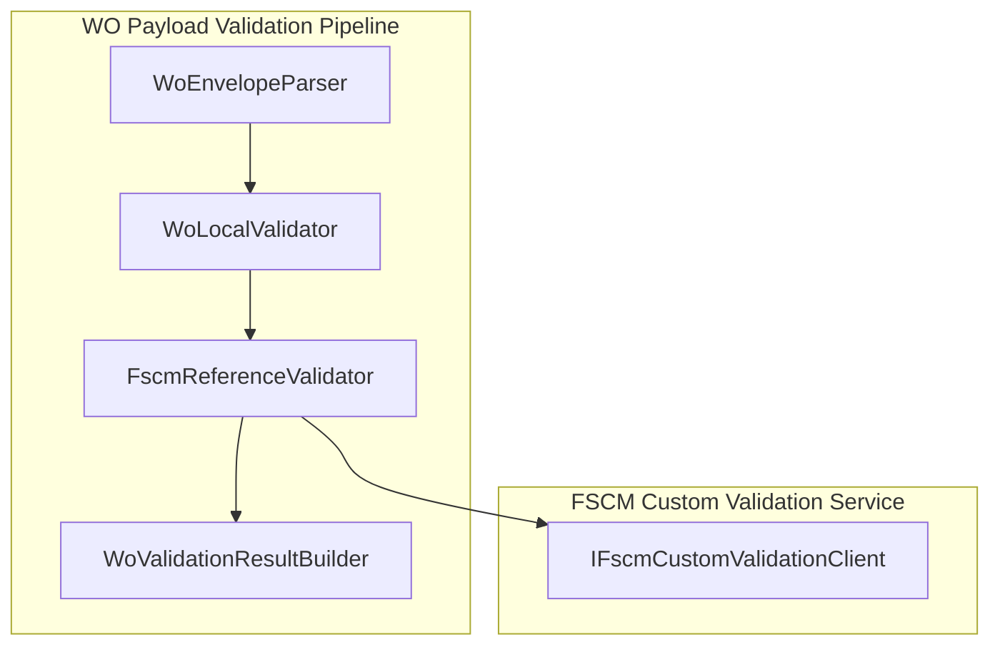
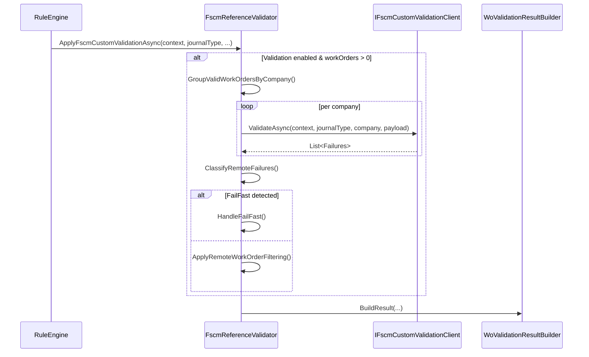

# FscmReferenceValidator Service Documentation

## Overview

The **FscmReferenceValidator** performs optional, FSCM-backed reference validation on filtered work orders. It runs after local AIS contract checks and can mark lines or entire work orders as **retryable**, **invalid**, or **fail-fast**, based on custom FSCM validation rules. This ensures that only payloads passing both local and remote validation are posted to FSCM, enhancing data integrity and reducing failed journal postings .

## Architecture Overview



## Service Responsibilities 🛠️

### FscmReferenceValidator (`src/.../FscmReferenceValidator.cs`)

- **Primary role**: Invoke FSCM custom validation endpoint grouping by company.
- **Outcome**: Classify remote failures into invalid or retryable, handle fail-fast, and filter work orders accordingly .

## Public API

| Method | Description | Return Type |
| --- | --- | --- |
| `ApplyFscmCustomValidationAsync` | Runs remote validation if enabled, classifies failures, applies fail-fast or work-order filtering. | `Task` |


```csharp
public async Task ApplyFscmCustomValidationAsync(
    RunContext context,
    JournalType journalType,
    List<WoPayloadValidationFailure> invalidFailures,
    List<WoPayloadValidationFailure> retryableFailures,
    List<FilteredWorkOrder> validWorkOrders,
    List<FilteredWorkOrder> retryableWorkOrders,
    Stopwatch stopwatch,
    CancellationToken ct)
```

 .

## Private Helpers

| Helper | Purpose |
| --- | --- |
| `ShouldRunFscmCustomValidation` | Checks if custom validation is enabled and work orders exist. |
| `GroupValidWorkOrdersByCompany` | Groups work orders by the `"Company"` JSON property for batched validation. |
| `ExecuteRemoteCompanyValidationsAsync` | Invokes `IFscmCustomValidationClient.ValidateAsync` per company payload. |
| `ClassifyRemoteFailures` | Splits remote failures into **invalid** or **retryable** lists based on `Disposition`. |
| `ContainsFailFast` | Detects any `ValidationDisposition.FailFast` to stop the pipeline immediately. |
| `HandleFailFast` | Logs and clears all valid and retryable work orders, preserving failures. |
| `ApplyRemoteWorkOrderFiltering` | Removes or moves work orders to retryable based on remote failure dispositions. |


## Dependencies

- **ILogger<FscmReferenceValidator>**: For structured logging.
- **PayloadValidationOptions**: Flags controlling:- `EnableFscmCustomEndpointValidation`
- `FailClosedOnFscmCustomValidationError`
- **IFscmCustomValidationClient**: Client abstraction to call FSCM custom validation endpoint.
- **WoPayloadJsonHelpers & WoPayloadJsonBuilder**: JSON helpers for extraction and payload reconstruction.
- **Domain Types**:- `RunContext`
- `JournalType`
- `WoPayloadValidationFailure`
- `FilteredWorkOrder`
- `ValidationDisposition`

## Integration Points

- **Rule Pipeline**

Injected into `WoFscmCustomValidationRule` (an `IWoPayloadRule`) and executed after local validation .

- **Custom Validation Client**

Implemented by `FscmCustomValidationClient` in Infrastructure, which translates HTTP responses into `WoPayloadValidationFailure` .

## Sequence of Operations



## Key Classes Reference

| Class | Location | Responsibility |
| --- | --- | --- |
| FscmReferenceValidator | `Features/Validation/Services/WoPayloadValidationPipeline/FscmReferenceValidator.cs` | Orchestrates FSCM custom validation and work-order filtering. |
| IFscmReferenceValidator | `Core/Abstractions/IFscmReferenceValidator.cs` | Defines contract for FSCM-backed reference validation. |
| IFscmCustomValidationClient | `Core/Abstractions/IFscmCustomValidationClient.cs` | Abstraction for remote custom validation endpoint call. |
| PayloadValidationOptions | `Core/Options/PayloadValidationOptions.cs` | Controls validation behavior (enable/disable, fail-closed policy). |


## Card: Important Note

```card
{
    "title": "Fail-Fast Behavior",
    "content": "Any `ValidationDisposition.FailFast` from FSCM triggers immediate termination of the validation pipeline, clearing all valid/retryable work orders."
}
```

---

By combining local and remote validation, **FscmReferenceValidator** ensures robust payload integrity before posting to FSCM, minimizing failed journal postings and enabling controlled retries.