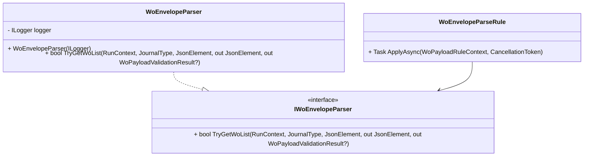

# WO Envelope Parsing Component Documentation

## Overview

The **WoEnvelopeParser** is responsible for extracting the `WOList` JSON array from the incoming work order payload. It handles multiple envelope shapes, ensuring the pipeline always receives a valid array of work orders or a well-defined failure result. This component enables early validation of the JSON envelope before any business‐ or line‐level checks occur.

By detecting and reporting missing or malformed envelopes, the parser prevents downstream errors and drives consistent failure handling. It integrates into the work order validation pipeline via the `WoEnvelopeParseRule`, contributing to a fail‐fast approach when the payload structure is invalid.

## Architecture Overview



- **IWoEnvelopeParser**: Defines the contract for envelope parsing.
- **WoEnvelopeParser**: Concrete implementation using `System.Text.Json`.
- **WoEnvelopeParseRule**: Invokes the parser at the start of the validation pipeline.

## Class: WoEnvelopeParser

**Path:** `src/Rpc.AIS.Accrual.Orchestrator.Application/Features/Validation/Services/WoPayloadValidationPipeline/WoEnvelopeParser.cs`

### Responsibilities

- Detect the JSON envelope structure (`_request`, `request`, or bare `WOList`).
- Extract the `WOList` property as a `JsonElement` array.
- Produce a `WoPayloadValidationResult` on envelope‐level failures.
- Log warnings when the envelope is invalid.

### Dependencies

| Dependency | Purpose |
| --- | --- |
| Microsoft.Extensions.Logging.ILogger<WoEnvelopeParser> | Log warning messages when parsing fails |
| Rpc.AIS.Accrual.Orchestrator.Core.Domain.RunContext | Provides `RunId` and `CorrelationId` for logging |
| Rpc.AIS.Accrual.Orchestrator.Core.Domain.JournalType | Indicates the journal type in failures |
| System.Text.Json.JsonElement | Represents the parsed JSON document |
| WoPayloadValidationFailure | Encapsulates individual validation failures |
| WoPayloadValidationResult | Aggregates failure list and filtered payload JSON |


## Method: TryGetWoList

```csharp
public bool TryGetWoList(
    RunContext context,
    JournalType journalType,
    JsonElement root,
    out JsonElement woList,
    out WoPayloadValidationResult? failureResult)
```

**Description:**

Attempts to locate and validate the `WOList` array within the JSON envelope.

### Parameters

| Name | Type | Description |
| --- | --- | --- |
| context | `RunContext` | Provides correlation IDs for logging. |
| journalType | `JournalType` | Identifies the type of journal being processed. |
| root | `JsonElement` | The root element of the parsed JSON document. |
| woList (out) | `JsonElement` | The extracted `WOList` array if parsing succeeds. |
| failureResult (out) | `WoPayloadValidationResult?` | A complete failure result when parsing fails; otherwise `null`. |


### Return Value

- `true` if a valid `WOList` array is found.
- `false` if the envelope is missing or malformed; `failureResult` is populated.

### Processing Steps

1. **Initialize outputs**

```csharp
   woList = default;
   failureResult = null;
```

1. **Detect envelope shape**- Looks for one of:- `{ "_request": { "WOList": [...] } }`
- `{ "request":  { "WOList": [...] } }`
- `{ "WOList": [...] }` directly at root.

1. **Handle missing envelope**- Logs warning with code **`AIS_PAYLOAD_MISSING_REQUEST`**
- Builds `failureResult` with an empty payload and single failure
- Returns `false`

1. **Extract ****`WOList`**** property**

```csharp
   if (!request.TryGetProperty("WOList", out woList) 
       || woList.ValueKind != JsonValueKind.Array)
```

- If missing or not an array:- Logs warning with code **`AIS_PAYLOAD_MISSING_WOLIST`**
- Builds `failureResult`
- Returns `false`

1. **Success**- Returns `true` and sets `woList` to the array instance

### Failure Result Construction

Each failure scenario produces a `WoPayloadValidationResult` initialized as:

```csharp
new WoPayloadValidationResult(
    filteredPayloadJson: "{}",
    failures: new[] { failure },
    workOrdersBefore: 0,
    workOrdersAfter: 0,
    retryablePayloadJson: "{}",
    retryableFailures: Array.Empty<WoPayloadValidationFailure>(),
    retryableWorkOrdersAfter: 0
)
```

Where `failure` is a `WoPayloadValidationFailure` containing:

| Failure Code | Message | Disposition |
| --- | --- | --- |
| AIS_PAYLOAD_MISSING_REQUEST | Payload missing _request (or request) object / WOList. | Invalid |
| AIS_PAYLOAD_MISSING_WOLIST | Payload missing WOList array. | Invalid |


Logs include `RunId`, `CorrelationId`, and `JournalType` for traceability.

## Related Components

- **WoEnvelopeParseRule** (`Features/Validation/Services/WoPayloadValidationRules/WoEnvelopeParseRule.cs`):

Invokes `TryGetWoList` at the start of the pipeline. It halts further validation on failure and propagates `failureResult`.

- **IWoEnvelopeParser** (`Ports/Common/Abstractions/IWoEnvelopeParser.cs`):

The interface defining the `TryGetWoList` contract.

## Code Example: Integration in Pipeline

```csharp
public Task ApplyAsync(WoPayloadRuleContext ctx, CancellationToken ct)
{
    if (ctx.Document is null)
    {
        ctx.Result = WoPayloadValidationDefaults.EmptyResult();
        ctx.StopProcessing = true;
        return Task.CompletedTask;
    }

    if (!_parser.TryGetWoList(
            ctx.RunContext,
            ctx.JournalType,
            ctx.Document.RootElement,
            out var woList,
            out var failure))
    {
        ctx.Result = failure;
        ctx.StopProcessing = true;
        return Task.CompletedTask;
    }

    ctx.WoList = woList;
    return Task.CompletedTask;
}
```

## Testing Considerations

- **Valid Envelope Shapes**- `_request` wrapper
- `request` wrapper
- Bare `WOList` at root

- **Failure Cases**- Missing both `_request` and `request`, and no `WOList`
- Present envelope but missing `WOList` or non‐array `WOList`

- **Logging Verification**- Ensure warnings include correct `RunId`, `CorrelationId`, and `JournalType`

- **Result Object**- `failureResult` must contain an empty filtered payload (`"{}"`) and appropriate failure details.

## Key Classes Reference

| Class | Location | Responsibility |
| --- | --- | --- |
| WoEnvelopeParser | `.../WoEnvelopeParser.cs` | Extracts the `WOList` array from incoming JSON payload. |
| IWoEnvelopeParser | `.../IWoEnvelopeParser.cs` | Interface for envelope parsing |
| WoEnvelopeParseRule | `.../WoEnvelopeParseRule.cs` | Pipeline rule that invokes `WoEnvelopeParser` |
| WoPayloadValidationResult | `.../WoPayloadValidationResult.cs` | Holds the outcome of payload validation |
| WoPayloadValidationFailure | `.../WoPayloadValidationFailure.cs` | Represents a single validation failure |
