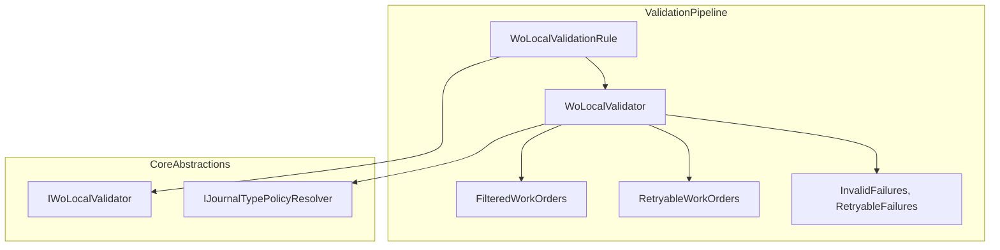
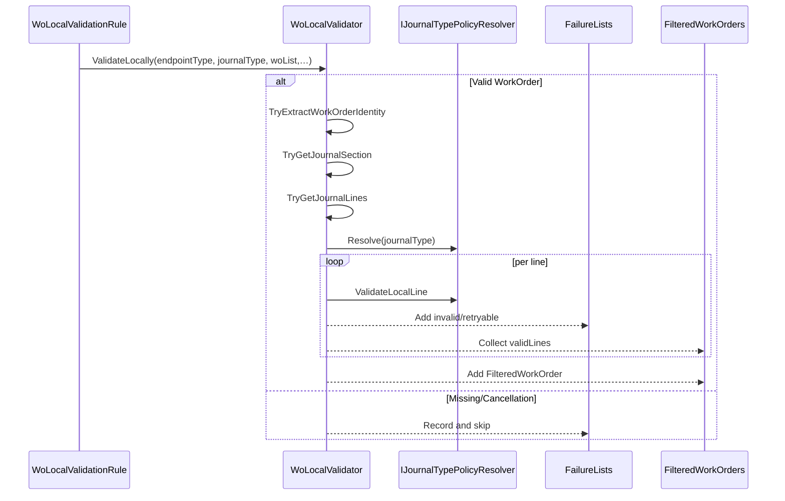

# Work Order Local Validation Feature Documentation

## Overview

**Work Order Local Validation** performs AIS-side validation of Work Order payloads before any remote FSCM calls. It ensures that each work order and its journal lines contain required identifiers, dates, and quantities. Invalid or retryable lines are collected into failure lists, and valid lines are packaged into filtered payloads. This prevents bad data from reaching FSCM endpoints and reduces remote call failures.

This feature integrates into the orchestration pipeline via `WoLocalValidationRule`. It relies on journal-type policies (via `IJournalTypePolicyResolver`) and is governed by `PayloadValidationOptions`. When `DropWholeWorkOrderOnAnyInvalidLine` is enabled, any invalid line excludes its entire work order from the postable payload.

## Architecture Overview



## Component Structure

### Business Layer

#### **WoLocalValidator** (`src/Rpc.AIS.Accrual.Orchestrator.Application/Features/Validation/Services/WoPayloadValidationPipeline/WoLocalValidator.cs`)

- **Purpose**: Performs synchronous, local validation and filtering of JSON work orders.
- **Dependencies**:- 
- 
- **Responsibilities**:- Extract work order GUID and number.
- Locate journal section (`WOItemLines`, `WOExpLines`, `WOHourLines`).
- Enumerate and validate each journal line.
- Enforce required fields: GUIDs, dates, quantities/durations.
- Apply journal-type specific rules (`policy.ValidateLocalLine`).
- Populate `invalidFailures`, `retryableFailures`, `validWorkOrders`, and `retryableWorkOrders`.

```csharp
public void ValidateLocally(
    FscmEndpointType endpointType,
    JournalType journalType,
    JsonElement woList,
    List<WoPayloadValidationFailure> invalidFailures,
    List<WoPayloadValidationFailure> retryableFailures,
    List<FilteredWorkOrder> validWorkOrders,
    List<FilteredWorkOrder> retryableWorkOrders,
    CancellationToken ct)
{
    foreach (var wo in woList.EnumerateArray())
    {
        if (ct.IsCancellationRequested) break;

        if (!TryExtractWorkOrderIdentity(...)) continue;
        var policy = _journalPolicyResolver.Resolve(journalType);
        var sectionKey = policy.SectionKey or default;
        if (!TryGetJournalSection(...)) continue;
        if (!TryGetJournalLines(...)) continue;
        ValidateWorkOrderLines(...);
    }
}
```

#### **IWoLocalValidator** (`src/Rpc.AIS.Accrual.Orchestrator.Application/Ports/Common/Abstractions/IWoLocalValidator.cs`)

- **Contract** for local payload validation in the pipeline.

| Method | Signature |
| --- | --- |
| `ValidateLocally` | `(FscmEndpointType endpoint, JournalType journalType, JsonElement woList, List<WoPayloadValidationFailure> invalidFailures, List<WoPayloadValidationFailure> retryableFailures, List<FilteredWorkOrder> validWorkOrders, List<FilteredWorkOrder> retryableWorkOrders, CancellationToken ct)` |


#### **IJournalTypePolicyResolver** (`Rpc.AIS.Accrual.Orchestrator.Core.Abstractions`)

- **Resolves** an `IJournalTypePolicy` instance for a given `JournalType`.
- **Used** to apply journal-specific validation rules.

#### **PayloadValidationOptions** (`Rpc.AIS.Accrual.Orchestrator.Core.Options/PayloadValidationOptions.cs`)

- **Controls** AIS-side validation behavior.

| Property | Type | Default | Description |
| --- | --- | --- | --- |
| `DropWholeWorkOrderOnAnyInvalidLine` | bool | true | When true, any invalid line causes the entire work order to be dropped. |
| `EnableFscmCustomEndpointValidation` | bool | false | Enable FSCM remote validation after local checks. |
| `FailClosedOnFscmCustomValidationError` | bool | true | On remote validation errors, fail-closed instead of treating as retryable. |
| `RetryMaxAttempts` | int | 3 | Maximum retry attempts for retryable failures. |
| `RetryDelaysMinutes` | int[] | [5,15,30] | Delay schedule in minutes for retry attempts. |


### Domain Models

#### **WoPayloadValidationFailure**

| Property | Type | Description |
| --- | --- | --- |
| `WorkOrderGuid` | `Guid` | GUID of the affected work order. |
| `WorkOrderNumber` | `string?` | Optional identifier string for the work order. |
| `JournalType` | `JournalType` | The journal type (Item, Expense, Hour). |
| `WorkOrderLineGuid` | `Guid?` | GUID of the affected journal line, if applicable. |
| `Code` | `string` | Error code, e.g., `AIS_LINE_MISSING_GUID`. |
| `Message` | `string` | Human-readable description of the failure. |
| `Disposition` | `ValidationDisposition` | Classification: `Invalid`, `Retryable`, `FailFast`, or `Valid`. |


#### **FilteredWorkOrder**

| Property | Type | Description |
| --- | --- | --- |
| `WorkOrder` | `JsonElement` | The original work order JSON object. |
| `SectionKey` | `string` | The JSON key under which lines were found. |
| `Lines` | `List<JsonElement>` | The subset of valid or retryable journal lines. |


## Feature Flow

### Local Validation Sequence



## Integration Points

- **WoLocalValidationRule** uses `IWoLocalValidator` to invoke this feature in the async rule pipeline.
- **FscmReferenceValidator** may run afterward to apply remote validation.
- **IJournalTypePolicyResolver** supplies journal-specific rules to this validator.

## Key Classes Reference

| Class | Location | Responsibility |
| --- | --- | --- |
| **WoLocalValidator** | `.../Features/Validation/Services/WoPayloadValidationPipeline/WoLocalValidator.cs` | Local AIS-side JSON validation and filtering. |
| **IWoLocalValidator** | `.../Ports/Common/Abstractions/IWoLocalValidator.cs` | Interface defining local validation behavior. |
| **WoLocalValidationRule** | `.../Features/Validation/Services/WoPayloadValidationRules/WoLocalValidationRule.cs` | Integrates `WoLocalValidator` into the rule pipeline. |
| **IJournalTypePolicyResolver** | `Rpc.AIS.Accrual.Orchestrator.Core.Abstractions` | Resolves journal-type validation policies. |
| **PayloadValidationOptions** | `Rpc.AIS.Accrual.Orchestrator.Core.Options/PayloadValidationOptions.cs` | Configures drop behavior and retry settings. |


## Error Handling

- **Missing GUID/section/lines**: recorded as `Invalid` failures with specific codes.
- **Invalid date/quantity**: recorded per line and may cause whole WO drop.
- **Retryable conditions**: may be collected in `retryableFailures`.
- **CancellationToken**: stops processing without exception if requested.

## Dependencies

- `System.Text.Json` for JSON parsing.
- `System.Text.RegularExpressions` for FSCM date parsing.
- `Microsoft.Extensions.Options` for options injection.
- `Rpc.AIS.Accrual.Orchestrator.Core.Abstractions` for interfaces.
- `Rpc.AIS.Accrual.Orchestrator.Core.Options` for configuration.
- `Rpc.AIS.Accrual.Orchestrator.Core.Services.JournalPolicies` for policy logic.

## Testing Considerations

- Simulate missing or malformed `WorkOrderGUID`.
- Omit `WOItemLines`/`WOExpLines`/`WOHourLines` to trigger section failures.
- Provide invalid date strings for both FSCM and ISO formats.
- Test zero and negative quantities/durations.
- Validate behavior when `DropWholeWorkOrderOnAnyInvalidLine` is toggled.
- Ensure cancellation via `CancellationToken` aborts processing promptly.