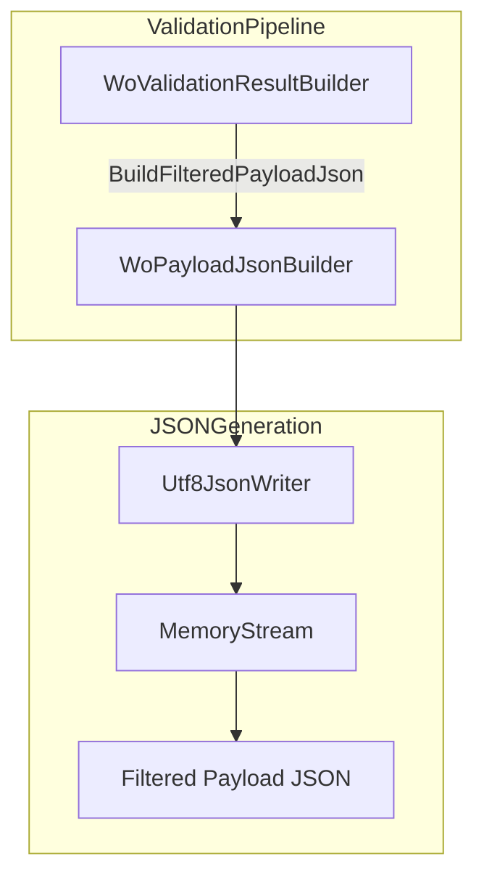
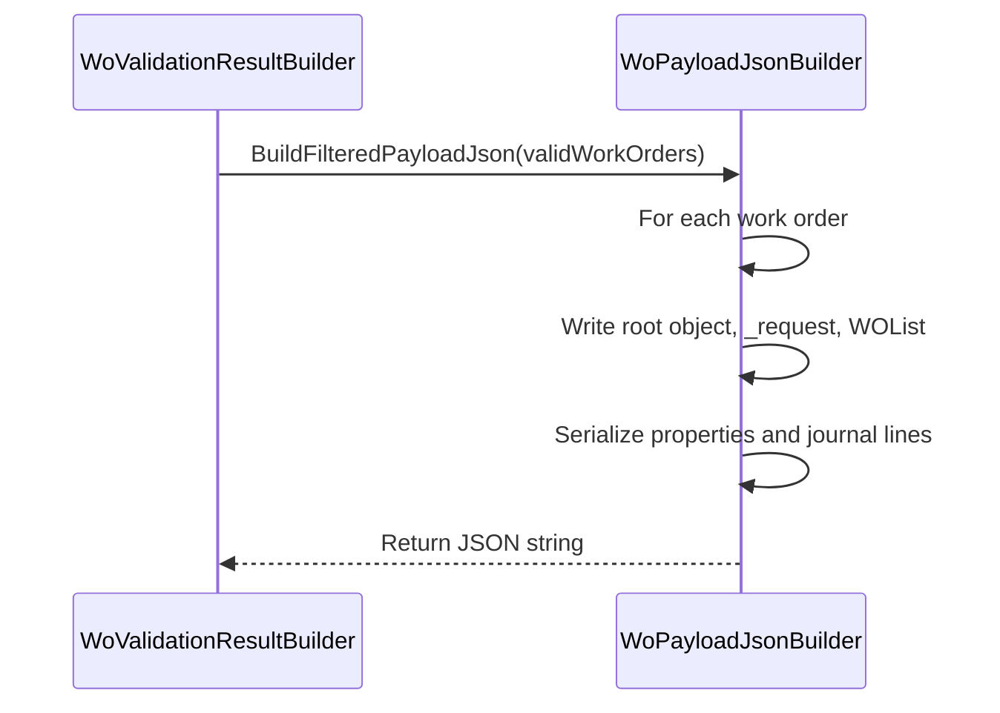

# WoPayloadJsonBuilder Feature Documentation

## Overview

The **WoPayloadJsonBuilder** is a utility component in the Work Order (WO) validation pipeline. It takes a collection of `FilteredWorkOrder` instances—each representing a validated work order with its journal lines—and constructs a JSON string conforming to the contract expected by downstream services. By serializing only the essential fields and journal lines, it ensures that invalid or retryable work orders are excluded from the primary payload, improving reliability and reducing data volume.

This builder plays a crucial role in the business layer by:

- Enforcing configuration correctness (throws if a `SectionKey` is missing).
- Producing a compact, canonical payload under the `_request.WOList` envelope.
- Supporting retry logic by enabling a separate payload for retryable orders.

## Architecture Overview

## Component Structure

### Business Layer

#### **WoPayloadJsonBuilder**

- **Purpose:**

Serializes validated work orders into a JSON payload under the `_request.WOList` envelope.

- **Responsibilities:**- Skips any work order whose `JsonElement` is not an object.
- Validates that each `FilteredWorkOrder.SectionKey` is non-empty, throwing `InvalidOperationException` if misconfigured.
- Emits all top-level properties except the journal section.
- Writes a nested object for the journal section, including all metadata except `JournalLines`, then writes the `JournalLines` array.
- Returns the final JSON string.

**Key Method**

| Method | Signature | Description |
| --- | --- | --- |
| BuildFilteredPayloadJson | `internal static string BuildFilteredPayloadJson(IReadOnlyList<FilteredWorkOrder> workOrders)` | Generates the `_request.WOList` JSON payload from filtered orders |

## Data Models

#### **FilteredWorkOrder**

A record encapsulating a work order JSON object, its journal section key, and the list of journal lines selected for posting.

| Property | Type | Description |
| --- | --- | --- |
| WorkOrder | `JsonElement` | The full JSON object of the work order. |
| SectionKey | `string` | The journal section name (e.g., `WOExpLines`). |
| Lines | `IReadOnlyList<JsonElement>` | Array of journal line elements to include. |

## Feature Flow

## Integration Points

- **WoValidationResultBuilder** invokes `BuildFilteredPayloadJson` twice: once for valid work orders and once for retryable ones, composing the final `WoPayloadValidationResult`  .
- **FscmReferenceValidator** groups valid orders by company and calls `BuildFilteredPayloadJson` to create per-company payloads for external validation .

## Error Handling

- The builder throws `InvalidOperationException` when `FilteredWorkOrder.SectionKey` is null or empty, indicating a missing or misconfigured journal policy.

## Dependencies

- **System.Text.Json** APIs: `Utf8JsonWriter`, `JsonElement`.
- **FilteredWorkOrder** model from the Core Domain Validation namespace.

## Key Classes Reference

| Class | Location | Responsibility |
| --- | --- | --- |
| WoPayloadJsonBuilder | `.../WoPayloadValidationPipeline/WoPayloadJsonBuilder.cs` | Builds the filtered WO payload JSON under `_request.WOList`. |
| FilteredWorkOrder | `.../Core/Domain/Validation/FilteredWorkOrder.cs` | Encapsulates a work order JSON element with section key and lines. |
| WoValidationResultBuilder | `.../WoPayloadValidationPipeline/WoValidationResultBuilder.cs` | Coordinates JSON building and result logging in the validation flow. |

## Testing Considerations

- Verify that the JSON structure matches the expected envelope and array nesting for various `FilteredWorkOrder` inputs.
- Test scenarios where a `FilteredWorkOrder` has no journal lines, or contains unexpected JSON kinds.
- Ensure the exception is raised when `SectionKey` is missing or empty.