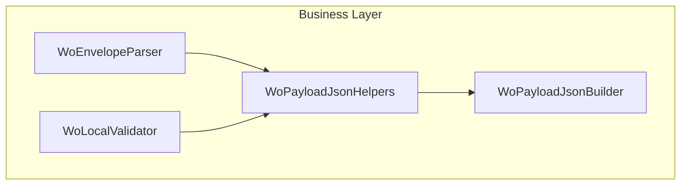

# WoPayloadJsonHelpers Feature Documentation

## Overview

The **WoPayloadJsonHelpers** class provides a centralized set of JSON parsing utilities used during work-order (WO) payload validation.

By encapsulating common property extraction and conversion logic, it prevents duplication across validators and builders.

These helpers support consistent handling of strings, GUIDs, numbers, and dates in various formats.

## Architecture Overview



This flow shows how parsing helpers fit into the WO validation pipeline:

- **WoEnvelopeParser** extracts the raw WOList.
- **WoLocalValidator** applies local rules.
- **WoPayloadJsonHelpers** assists both with JSON value extraction.
- **WoPayloadJsonBuilder** composes filtered payloads.

## Component Structure

### Utility Layer

#### **WoPayloadJsonHelpers** (`src/Rpc.AIS.Accrual.Orchestrator.Application/Features/Validation/Services/WoPayloadValidationPipeline/WoPayloadJsonHelpers.cs`)

A static helper class containing methods to safely extract and convert JSON elements when validating WO payloads.

- **Purpose and Responsibilities**- Ensure safe access to JSON properties without repetitive code.
- Normalize and parse GUID, number, and date values.
- Support FSCM-style and ISO date formats.

- **Dependencies**- System.Text.Json
- System.Globalization
- System.Text.RegularExpressions

- **Key Methods**

| Method | Signature | Description |
| --- | --- | --- |
| TryGetString | `internal static string? TryGetString(JsonElement obj, string key)` | Returns the property as a non-empty string; returns `null` if missing, null-valued, or whitespace. |
| TryGetGuid | `internal static Guid? TryGetGuid(JsonElement obj, string key)` | Calls `TryGetString`, trims surrounding braces, and parses a GUID; returns `null` on failure. |
| TryGetNumber | `internal static bool TryGetNumber(JsonElement obj, string key, out decimal value)` | Extracts a decimal from a JSON number or numeric string; returns `true` on success. |
| TryGetNonEmptyString | `internal static bool TryGetNonEmptyString(JsonElement obj, string name, out string value)` | Retrieves a non-empty JSON string property; returns `false` if absent or empty. |
| TryGetDecimal | `public static bool TryGetDecimal(JsonElement obj, string name, out decimal value)` | Similar to `TryGetNumber` but for decimal types; uses invariant culture for parsing. |
| TryParseFscmOrIsoDate | `public static bool TryParseFscmOrIsoDate(string raw, out DateTime utc)` | Parses dates in `/Date(…)\/` format or ISO-8601 strings into a UTC `DateTime`; supports both patterns. |


##### Code Example: Parsing a GUID Property

```csharp
JsonElement line = /* some JSON object */;
Guid? lineGuid = WoPayloadJsonHelpers.TryGetGuid(line, "WorkOrderLineGUID");
if (lineGuid is null)
{
    // Handle missing or invalid GUID
}
```

##### Code Example: Date Parsing

```csharp
if (WoPayloadJsonHelpers.TryParseFscmOrIsoDate(rawDateString, out var utcDate))
{
    // Use utcDate for further validation
}
else
{
    // Report invalid date format
}
```

## Key Classes Reference

| Class | Location | Responsibility |
| --- | --- | --- |
| WoPayloadJsonHelpers | `src/Rpc.AIS.Accrual.Orchestrator.Application/Features/Validation/Services/WoPayloadValidationPipeline/WoPayloadJsonHelpers.cs` | JSON parsing helpers for work-order payload validation. |


## Dependencies

- **System.Text.Json**: Work with `JsonElement` and JSON parsing APIs.
- **System.Globalization**: Handle culture-invariant number and date parsing.
- **System.Text.RegularExpressions**: Match FSCM `/Date(…)\/` patterns.

## Testing Considerations

- Verify `TryGetString` returns `null` for missing, null, or whitespace values.
- Confirm `TryGetGuid` correctly trims braces and rejects invalid GUIDs.
- Test `TryGetNumber` with numeric JSON, numeric strings, and invalid formats.
- Ensure `TryParseFscmOrIsoDate` handles both `/Date(…)\/` and ISO-8601, including timezone and invalid inputs.