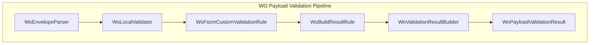

# Wo Validation Result Builder Feature Documentation

## Overview

The **WoValidationResultBuilder** is the final stage in the Work Order (WO) payload validation pipeline. It assembles the outcome of AIS-side validations—local schema checks and optional FSCM custom validations—into a unified result. This result includes:

- A filtered payload JSON containing only postable work orders.
- A separate payload for retryable work orders.
- Lists of validation failures and retryable failures.
- Counts of work orders before and after filtering.

By encapsulating logging, JSON construction, and result instantiation, this builder centralizes result preparation and telemetry for downstream processing.

## Architecture Overview



This flowchart illustrates how the builder integrates into the pipeline:

1. **Envelope Parser** extracts the `WOList`.
2. **Local Validator** applies AIS‐side checks.
3. **FSCM Custom Validation Rule** invokes remote validations if enabled.
4. **Build Result Rule** triggers the builder.
5. **Result Builder** constructs the final `WoPayloadValidationResult`.

## Component Structure

### WoValidationResultBuilder ⚙️

**Path:** `src/Rpc.AIS.Accrual.Orchestrator.Application/Features/Validation/Services/WoPayloadValidationPipeline/WoValidationResultBuilder.cs`

#### Purpose and Responsibilities

- Aggregate valid and retryable work orders into JSON payloads.
- Stop the stopwatch and log a summary of validation metrics.
- Instantiate a `WoPayloadValidationResult` with filtered payloads, failure lists, and counts.

#### Dependencies

- `ILogger<WoValidationResultBuilder>`: logs summary telemetry.
- `PayloadValidationOptions`: feature flags (`EnableFscmCustomEndpointValidation`, `DropWholeWorkOrderOnAnyInvalidLine`).
- Helper: `WoPayloadJsonBuilder` constructs JSON from `FilteredWorkOrder` lists.

#### Key Methods

| Method | Description |
| --- | --- |
| `public WoValidationResultBuilder(ILogger<WoValidationResultBuilder> logger, IOptions<PayloadValidationOptions> options)` | Validates injected dependencies; defaults options when missing. |
| `public WoPayloadValidationResult BuildResult(RunContext context, JournalType journalType, int workOrdersBefore, List<FilteredWorkOrder> validWorkOrders, List<FilteredWorkOrder> retryableWorkOrders, List<WoPayloadValidationFailure> invalidFailures, List<WoPayloadValidationFailure> retryableFailures, Stopwatch stopwatch)` |


1. Counts valid and retryable WOs.
2. Builds filtered JSON payloads.
3. Stops stopwatch and logs summary.
4. Returns a new `WoPayloadValidationResult`. |

| `private void LogSummary(RunContext context, JournalType journalType, int beforeCount, int validAfter, int retryAfter, int invalidCount, int retryableCount, long elapsedMs)` | Logs an information entry with all validation metrics and option flags. |
| --- | --- |


#### BuildResult Example

```csharp
public WoPayloadValidationResult BuildResult(
    RunContext context,
    JournalType journalType,
    int workOrdersBefore,
    List<FilteredWorkOrder> validWorkOrders,
    List<FilteredWorkOrder> retryableWorkOrders,
    List<WoPayloadValidationFailure> invalidFailures,
    List<WoPayloadValidationFailure> retryableFailures,
    Stopwatch stopwatch)
{
    var validAfter = validWorkOrders.Count;
    var retryAfter = retryableWorkOrders.Count;

    // Construct JSON payloads
    var filteredJson = WoPayloadJsonBuilder.BuildFilteredPayloadJson(validWorkOrders);
    var retryJson    = WoPayloadJsonBuilder.BuildFilteredPayloadJson(retryableWorkOrders);

    stopwatch.Stop();

    LogSummary(
        context, journalType,
        workOrdersBefore, validAfter, retryAfter,
        invalidFailures.Count, retryableFailures.Count,
        stopwatch.ElapsedMilliseconds);

    return new WoPayloadValidationResult(
        filteredJson,
        invalidFailures,
        workOrdersBefore,
        validAfter,
        retryJson,
        retryableFailures,
        retryAfter);
}
```

## Data Models

### WoPayloadValidationResult

Represents the overall validation outcome for a WO payload.

| Property | Type | Description |
| --- | --- | --- |
| `FilteredPayloadJson` | `string` | JSON root object with `_request.WOList` of **valid** work orders. |
| `Failures` | `IReadOnlyList<WoPayloadValidationFailure>` | All **invalid** failures encountered (schema or custom). |
| `WorkOrdersBefore` | `int` | Count of work orders in the original payload. |
| `WorkOrdersAfter` | `int` | Count of work orders in `FilteredPayloadJson`. |
| `RetryablePayloadJson` | `string` | JSON root object with `_request.WOList` of **retryable** work orders. |
| `RetryableFailures` | `IReadOnlyList<WoPayloadValidationFailure>` | Failures marked retryable. |
| `RetryableWorkOrdersAfter` | `int` | Count of work orders in `RetryablePayloadJson`. |
| `HasFailures` | `bool` | True if any invalid failures exist. |
| `HasRetryables` | `bool` | True if retryable work orders or failures exist. |
| `HasFailFast` | `bool` | True if any failure has disposition `FailFast`. |


## Dependencies

- **Logging:** Microsoft.Extensions.Logging
- **Options:** Microsoft.Extensions.Options for `PayloadValidationOptions`
- **Domain Types:**- `RunContext`
- `JournalType`
- `FilteredWorkOrder`
- `WoPayloadValidationFailure`
- `WoPayloadValidationResult`

## Error Handling

- **Constructor** throws `ArgumentNullException` if `logger` is `null`.
- **JSON Builder** throws `InvalidOperationException` if a work order’s `SectionKey` is missing (handled upstream by policy).

## Key Classes Reference

| Class | Location | Responsibility |
| --- | --- | --- |
| WoValidationResultBuilder | Application/Features/Validation/Services/WoPayloadValidationPipeline/WoValidationResultBuilder.cs | Builds the final validation result and logs summary. |
| WoBuildResultRule | Application/Features/Validation/Services/WoPayloadValidationRules/WoBuildResultRule.cs | Invokes `IWoValidationResultBuilder.BuildResult`. |
| IWoValidationResultBuilder | Application/Ports/Common/Abstractions/IWoValidationResultBuilder.cs | Defines contract for building validation results. |
| WoPayloadJsonBuilder | Core/Services/WoPayloadValidationPipeline/WoPayloadJsonBuilder.cs | Serializes `FilteredWorkOrder` lists into JSON. |
| WoPayloadValidationResult | Domain/Domain/Validation/WoPayloadValidationResult.cs | Data model for validation outcomes. |


## Testing Considerations

- Validate that `BuildResult` correctly counts and separates valid vs retryable orders.
- Simulate various combinations of failures to ensure `HasFailures`, `HasRetryables`, and `HasFailFast` behave as expected.
- Measure that `LogSummary` includes all relevant metrics and flag values.