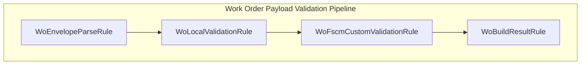
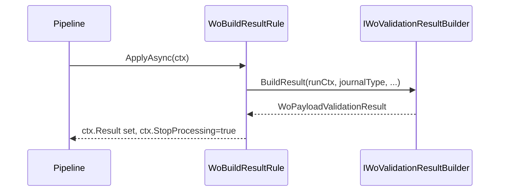

# WoBuildResultRule Feature Documentation

## Overview

The **WoBuildResultRule** serves as the final step in the Work Order payload validation pipeline. It delegates the construction of the `WoPayloadValidationResult` to a builder service, consolidating valid, retryable, and failed work orders into a single result object. Once executed, it short-circuits any further validation rules by setting a stop flag, ensuring the pipeline terminates gracefully with a ready-to-use result.

## Architecture Overview



This flowchart illustrates the four sequential rules that process a JSON payload:

- **Parse envelope**
- **Perform local AIS-side checks**
- **Invoke optional FSCM custom validation**
- **Build and output the final result**

## Component Structure

### WoBuildResultRule (`src/Rpc.AIS.Accrual.Orchestrator.Core.Services.WoPayloadValidationRules/WoBuildResultRule.cs`)

- **Purpose**: Finalizes validation by building the result and halting further rule execution.
- **Implements**: `IWoPayloadRule`
- **Constructor**

```csharp
  public WoBuildResultRule(IWoValidationResultBuilder builder) => _builder = builder;
```

- Injects the **IWoValidationResultBuilder**.

```csharp
  public Task ApplyAsync(WoPayloadRuleContext ctx, CancellationToken ct)
  {
      ctx.Result = _builder.BuildResult(
          ctx.RunContext,
          ctx.JournalType,
          ctx.WorkOrdersBefore,
          ctx.ValidWorkOrders,
          ctx.RetryableWorkOrders,
          ctx.InvalidFailures,
          ctx.RetryableFailures,
          ctx.Stopwatch);
      ctx.StopProcessing = true;
      return Task.CompletedTask;
  }
```

- Invokes the builder to produce a `WoPayloadValidationResult`.
- Sets `ctx.StopProcessing` to `true` to cease pipeline execution.

### Related Interfaces

#### IWoPayloadRule (`src/Rpc.AIS.Accrual.Orchestrator.Core.Abstractions/IWoPayloadRule.cs`)

- Defines a pluggable validation step in the pipeline.
- Method: `Task ApplyAsync(WoPayloadRuleContext ctx, CancellationToken ct)`
- Rules may set `ctx.Result` and `ctx.StopProcessing` to short-circuit.

#### IWoValidationResultBuilder (`src/Rpc.AIS.Accrual.Orchestrator.Core.Abstractions/IWoValidationResultBuilder.cs`)

- Responsible for assembling the final `WoPayloadValidationResult`.
- Method signature:

```csharp
  WoPayloadValidationResult BuildResult(
      RunContext context,
      JournalType journalType,
      int workOrdersBefore,
      List<FilteredWorkOrder> validWorkOrders,
      List<FilteredWorkOrder> retryableWorkOrders,
      List<WoPayloadValidationFailure> invalidFailures,
      List<WoPayloadValidationFailure> retryableFailures,
      Stopwatch stopwatch);
```

## Feature Flows

### Validation Completion Flow



1. The pipeline invokes `ApplyAsync` on **WoBuildResultRule**.
2. **WoBuildResultRule** calls the builder to construct the result.
3. The resulting object is stored in `ctx.Result`.
4. The pipeline halts further rule execution.

## Integration Points

- **Dependency Injection**

Registered as an `IWoPayloadRule` alongside other rules:

```csharp
  services.AddSingleton<IWoPayloadRule, WoBuildResultRule>();
```

- **Builder Implementation**

Paired with `WoValidationResultBuilder` to fulfill the `IWoValidationResultBuilder` contract.

## Key Classes Reference

| Class | Location | Responsibility |
| --- | --- | --- |
| WoBuildResultRule | src/.../WoBuildResultRule.cs | Finalizes validation by building the result and stopping the pipeline |
| IWoPayloadRule | src/.../IWoPayloadRule.cs | Defines the contract for a validation rule |
| IWoValidationResultBuilder | src/.../IWoValidationResultBuilder.cs | Builds the consolidated `WoPayloadValidationResult` |


## Dependencies

- **Rpc.AIS.Accrual.Orchestrator.Core.Abstractions**- `IWoPayloadRule`
- `IWoValidationResultBuilder`

## Testing Considerations

- **Builder Invocation**: Ensure the injected builder receives the correct context parameters.
- **Pipeline Short-Circuit**: Verify that `ctx.StopProcessing` is set to `true` after execution.
- **Result Integrity**: Confirm that `ctx.Result` matches expectations given various valid/retryable/invalid scenarios.