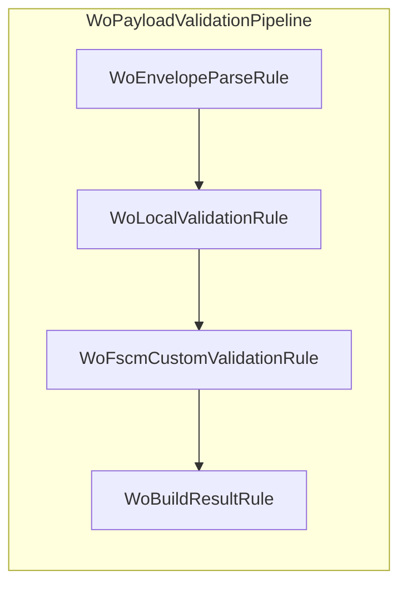

# Work Order Envelope Parse Rule Feature Documentation

## Overview

The Work Order Envelope Parse Rule initializes the payload validation pipeline by extracting the `WOList` array from the incoming JSON envelope. It ensures the payload conforms to one of the supported envelope shapes before any line-level validations occur.

By short-circuiting on a missing document or malformed envelope, it prevents downstream rules from running against invalid data. This enhances robustness by catching envelope-level errors early and returning a structured failure result.

As the first step in the AIS Accrual Orchestrator’s validation pipeline, it lays the foundation for subsequent local and FSCM validations, ultimately producing a filtered payload or an error summary.

## Architecture Overview



## Component Structure

### Business Layer

#### 🔍 **WoEnvelopeParseRule** (`src/Rpc.AIS.Accrual.Orchestrator.Application/Features/Validation/Services/WoPayloadValidationRules/WoEnvelopeParseRule.cs`)

- **Purpose and Responsibilities**- Parses the JSON envelope to locate the `WOList` element.
- Halts the validation pipeline and returns a failure result if the document is null or the envelope is malformed.
- **Key Dependencies**- `IWoEnvelopeParser` for actual JSON extraction logic
- `WoPayloadValidationDefaults` to produce an empty validation result when needed
- **Key Method**

| Method | Description |
| --- | --- |
| `ApplyAsync` | Applies the rule: sets `ctx.WoList`, or on failure assigns `ctx.Result` and stops parsing. |


```csharp
public Task ApplyAsync(WoPayloadRuleContext ctx, CancellationToken ct)
{
    if (ctx.Document is null)
    {
        ctx.Result = WoPayloadValidationDefaults.EmptyResult();
        ctx.StopProcessing = true;
        return Task.CompletedTask;
    }

    if (!_parser.TryGetWoList(
            ctx.RunContext,
            ctx.JournalType,
            ctx.Document.RootElement,
            out var woList,
            out var failure))
    {
        ctx.Result = failure ?? WoPayloadValidationDefaults.EmptyResult();
        ctx.StopProcessing = true;
        return Task.CompletedTask;
    }

    ctx.WoList = woList;
    return Task.CompletedTask;
}
```

## Integration Points

- **`IWoEnvelopeParser`**: Encapsulates the JSON-shape logic to extract `WOList` from multiple envelope formats .
- **`WoPayloadRuleContext`**: Receives the parsed `WOList` for use by subsequent validation rules.
- **`WoPayloadValidationDefaults.EmptyResult()`**: Supplies a safe, empty `WoPayloadValidationResult` when no valid document is available .

## Key Classes Reference

| Class | Location | Responsibility |
| --- | --- | --- |
| `WoEnvelopeParseRule` | `.../WoEnvelopeParseRule.cs` | Parses envelope to extract `WOList` or returns failure result. |
| `IWoEnvelopeParser` | `.../IWoEnvelopeParser.cs` | Contract for parsing JSON envelope shapes. |
| `WoPayloadValidationResult` | `.../Domain/Validation/WoPayloadValidationResult.cs` | Represents outcome of validation, including filtered payload and failures. |
| `WoPayloadValidationDefaults` | `.../Domain/Validation/WoPayloadValidationDefaults.cs` | Provides static factory for empty validation results. |
| `WoPayloadRuleContext` | `.../Abstractions/WoPayloadRuleContext.cs` | Mutable context shared by all payload validation rules. |


## Error Handling

- **Null Document**: Immediately returns `EmptyResult` and stops processing.
- **Malformed Envelope**: Delegates to `_parser.TryGetWoList`; if it returns `false`, assigns the provided failure result (or a default) and halts the pipeline .

```csharp
if (ctx.Document is null)
{
    ctx.Result = WoPayloadValidationDefaults.EmptyResult();
    ctx.StopProcessing = true;
    return Task.CompletedTask;
}
```

```csharp
if (!_parser.TryGetWoList(..., out var woList, out var failure))
{
    ctx.Result = failure ?? WoPayloadValidationDefaults.EmptyResult();
    ctx.StopProcessing = true;
    return Task.CompletedTask;
}
```

## Dependencies

- **Rpc.AIS.Accrual.Orchestrator.Core.Abstractions** (defines `IWoPayloadRule`, `IWoEnvelopeParser`, etc.)
- **Rpc.AIS.Accrual.Orchestrator.Core.Domain.Validation** (defines `WoPayloadValidationResult`, `WoPayloadValidationFailure`, `ValidationDisposition`)
- **Rpc.AIS.Accrual.Orchestrator.Core.Services** (provides shared JSON helpers)

## Testing Considerations

Though no tests are present in this folder, unit tests should cover:

- `ApplyAsync` with `ctx.Document` null.
- `ApplyAsync` when `_parser.TryGetWoList` returns `false` with and without a `failure` result.
- Successful parsing scenario populating `ctx.WoList` without stopping.

---

This documentation reflects all classes, methods, and behaviors directly present in the source context without introducing external assumptions or recommendations.