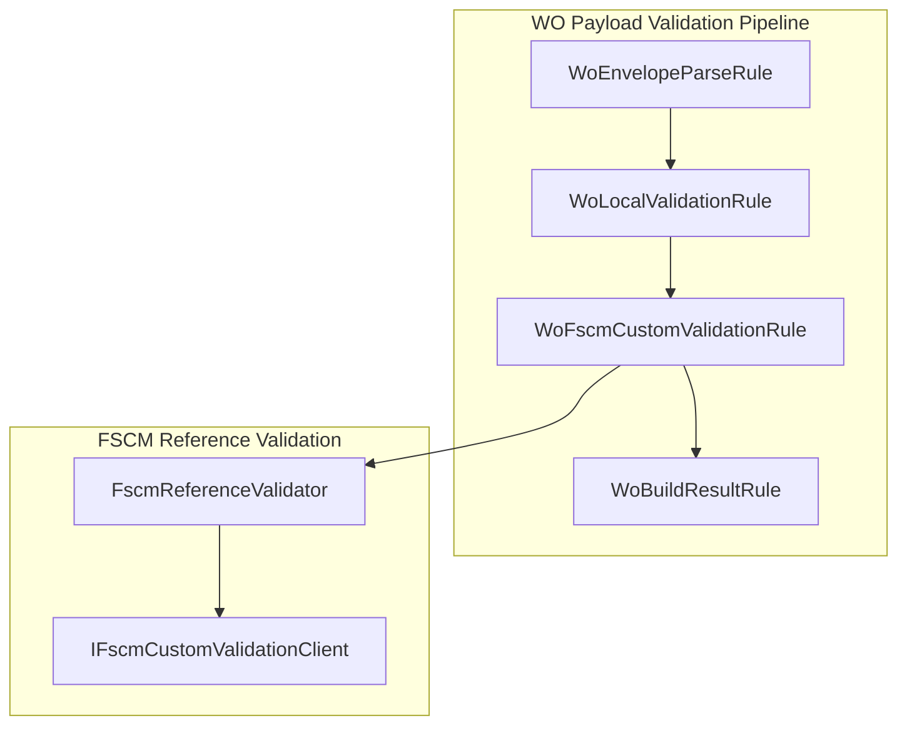
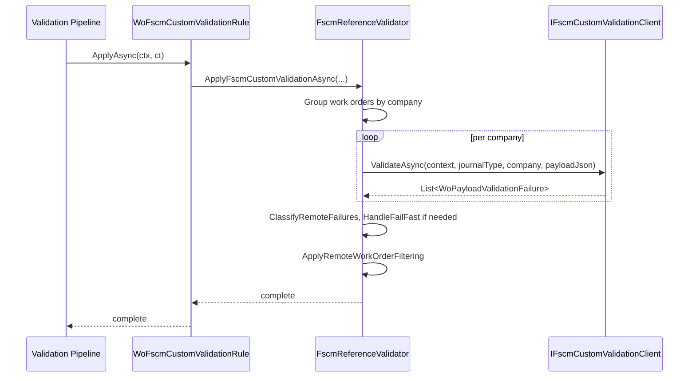

# WoFscmCustomValidationRule Feature Documentation

## Overview

The **FSCM Custom Validation** rule integrates into the work‐order payload validation pipeline to execute optional, FSCM‐backed reference checks. After local, AIS‐side validation completes, this rule delegates to a reference validator that can:

- Group valid work orders by company
- Call a custom FSCM validation endpoint for each group
- Classify and apply remote failures (invalid, retryable, or fail‐fast)

This ensures that business data constraints enforced by FSCM are respected before payload submission. By centralizing remote validation in a dedicated rule, the pipeline remains modular and configurable.

## Architecture Overview



## Component Structure

### 1. Validation Rules Layer

#### **WoFscmCustomValidationRule** (`src/Rpc.AIS.Accrual.Orchestrator.Application/Features/Validation/Services/WoPayloadValidationRules/WoFscmCustomValidationRule.cs`)

- **Purpose:**

Orchestrates the remote, FSCM‐based reference validation step in the `IWoPayloadRule` pipeline.

- **Dependencies:**- `IFscmReferenceValidator` (injected)
- **Key Method:**

```csharp
  public async Task ApplyAsync(WoPayloadRuleContext ctx, CancellationToken ct)
```

- **Description:** Invokes `_validator.ApplyFscmCustomValidationAsync(...)` with the current run context, journal type, accumulated failures, filtered work orders, and stopwatch.

### 2. Reference Validation Layer

#### **IFscmReferenceValidator** (`Rpc.AIS.Accrual.Orchestrator.Core.Abstractions`)

| Method | Signature | Description |
| --- | --- | --- |
| ApplyFscmCustomValidationAsync | `Task ApplyFscmCustomValidationAsync(RunContext context, JournalType journalType, List<WoPayloadValidationFailure> invalidFailures, List<WoPayloadValidationFailure> retryableFailures, List<FilteredWorkOrder> validWorkOrders, List<FilteredWorkOrder> retryableWorkOrders, Stopwatch stopwatch, CancellationToken ct)` | Defines the contract for executing FSCM‐backed validations and classifying results. |


#### **FscmReferenceValidator** (`src/Rpc.AIS.Accrual.Orchestrator.Application/Features/Validation/Services/WoPayloadValidationPipeline/FscmReferenceValidator.cs`)

- **Purpose:**

Implements `IFscmReferenceValidator` to run optional custom validation against an FSCM endpoint.

- **Responsibilities:**- **ShouldRunFscmCustomValidation**: Checks if remote validation is enabled and if there are valid work orders.
- **GroupValidWorkOrdersByCompany**: Partitions work orders by their `Company` field.
- **ExecuteRemoteCompanyValidationsAsync**: Calls `IFscmCustomValidationClient.ValidateAsync` per company group.
- **ClassifyRemoteFailures**: Splits returned failures into invalid vs retryable.
- **ContainsFailFast / HandleFailFast**: Detects “fail-fast” dispositions and aborts processing.
- **ApplyRemoteWorkOrderFiltering**: Removes or reclassifies work orders based on remote failure dispositions.

## Feature Flow

### FSCM Custom Validation Execution



## Key Classes Reference

| Class | Location | Responsibility |
| --- | --- | --- |
| WoFscmCustomValidationRule | src/Rpc.AIS.Accrual.Orchestrator.Application/Features/Validation/Services/WoPayloadValidationRules/WoFscmCustomValidationRule.cs | Triggers FSCM custom validation step in the payload rule pipeline |
| IFscmReferenceValidator | Rpc.AIS.Accrual.Orchestrator.Core.Abstractions | Defines API for FSCM‐backed reference validation |
| FscmReferenceValidator | src/Rpc.AIS.Accrual.Orchestrator.Application/Features/Validation/Services/WoPayloadValidationPipeline/FscmReferenceValidator.cs | Implements grouping, remote calls, and classification of validation failures |


## Dependencies

- **Rpc.AIS.Accrual.Orchestrator.Core.Abstractions**- `IWoPayloadRule` – pipeline rule interface
- `IFscmReferenceValidator` – reference validator contract
- **WoPayloadRuleContext** (from pipeline)
- **System.Threading** / **System.Threading.Tasks** for asynchronous execution

## Testing Considerations

- Verify that `ApplyAsync` invokes `IFscmReferenceValidator.ApplyFscmCustomValidationAsync` with correct parameters.
- Simulate both enabled and disabled remote validation (via `PayloadValidationOptions.EnableFscmCustomEndpointValidation` in `FscmReferenceValidator`).
- Test behavior when:- No valid work orders exist (should short‐circuit).
- The remote client returns empty failures.
- Fail-fast failures occur (pipeline stops and clears valid lists).
- Mixed invalid vs retryable failures are returned.