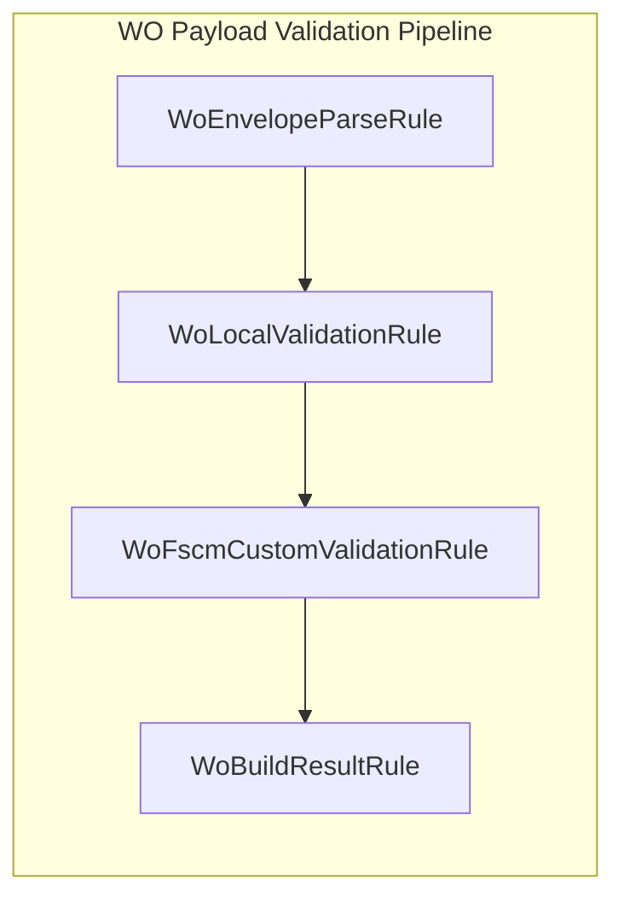

# Local Payload Validation Rule (WoLocalValidationRule) Documentation

## Overview

The **WoLocalValidationRule** class integrates local AIS-side validation into the asynchronous payload validation pipeline. It executes before any FSCM calls, ensuring each work order meets schema and business rules locally. This rule bridges the synchronous `IWoLocalValidator` interface to the async `IWoPayloadRule` pipeline contract.

## Architecture Overview 🏗️



The pipeline registers rules in DI and executes them in the order shown.

## Class Structure 🔍

### Declaration

```csharp
public sealed class WoLocalValidationRule : IWoPayloadRule
```

- Implements **IWoPayloadRule**, a pluggable rule contract for work order payload validation.

### Responsibilities

- **Context Validation**: Throws if `ctx` is null.
- **Short-Circuit**: Skips execution if `ctx.StopProcessing` is true.
- **Shape Check**: Runs only when `ctx.WoList` is a JSON array.
- **Delegation**: Calls `_localValidator.ValidateLocally` to perform detailed local checks.

### Members

| Member | Signature | Description |
| --- | --- | --- |
| Constructor | `WoLocalValidationRule(IWoLocalValidator localValidator)` | Injects the local validator; throws if null. |
| ApplyAsync | `Task ApplyAsync(WoPayloadRuleContext ctx, CancellationToken ct)` | Executes preconditions then invokes sync local validation. |


## Dependencies

- **IWoLocalValidator**

Performs the actual synchronous validation and filtering of work orders without remote calls.

- **IWoPayloadRule**

Defines the asynchronous rule contract for each pipeline step.

- **WoPayloadRuleContext**

Carries payload data, failure lists, and filtered work orders through the validation pipeline.

## Usage Example

```csharp
// DI registration in Startup.cs or equivalent
services.AddSingleton<IWoPayloadRule, WoLocalValidationRule>();
```

At runtime, the validation engine invokes `ApplyAsync`. If the context meets preconditions, it delegates to `IWoLocalValidator.ValidateLocally` to filter and classify work orders.

## Related Components

- **WoEnvelopeParseRule**

Extracts the `WOList` JSON array from the raw document.

- **WoLocalValidator**

Implements `IWoLocalValidator` to perform field-level and policy-based checks locally.

- **WoFscmCustomValidationRule**

Calls FSCM for custom endpoint validation after local rules pass.

- **WoBuildResultRule**

Constructs the final `WoPayloadValidationResult` summarizing valid, retryable, and invalid work orders.

## Error Handling

- The constructor throws `ArgumentNullException` if `localValidator` is null.
- `ApplyAsync` throws `ArgumentNullException` if `ctx` is null.
- The method never propagates exceptions during normal execution; it uses the `StopProcessing` flag and skips invalid shapes.

This documentation reflects all relevant public interfaces and behaviors of **WoLocalValidationRule** as defined in the provided source.