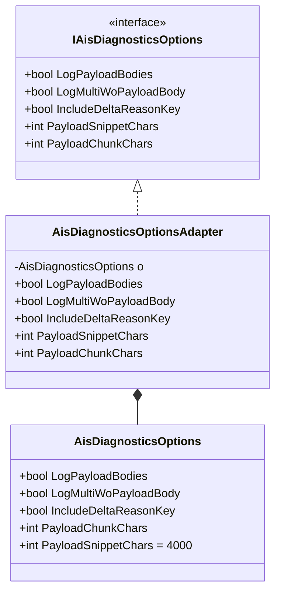

# AIS Diagnostics Options Feature Documentation

## Overview 📝

The **AIS Diagnostics Options** feature encapsulates configuration settings for logging and diagnostics in the AIS Accrual Orchestrator. It allows fine-grained control over payload logging behavior, including whether to log full payloads, split payloads into chunks, or include diagnostic keys.

By centralizing these settings in a dedicated options class, the application can:

- Toggle detailed logging in production or debug environments.
- Prevent logging of sensitive payloads when necessary.
- Configure payload snippet and chunk sizes to avoid excessively large logs.

This feature integrates into the application’s startup and dependency-injection pipeline, supplying `IAisDiagnosticsOptions` to components that perform logging or message tracing.

## Component Structure ⚙️

### Core Options Component

#### **AisDiagnosticsOptions** (`src/Rpc.AIS.Accrual.Orchestrator.Application/Options/AisDiagnosticsOptions.cs`)

- **Purpose:** Holds raw configuration values for AIS diagnostics.
- **Usage:** Bound from application settings (e.g., `appsettings.json`) and injected into services via an adapter.
- **Key Properties:**

| Property | Type | Default | Description |
| --- | --- | --- | --- |
| LogPayloadBodies | bool | `false` | Log entire payload bodies for requests and responses. |
| LogMultiWoPayloadBody | bool | `false` | Log multi-way operations without full payload bodies. |
| IncludeDeltaReasonKey | bool | `false` | Append delta reason key to diagnostic output. |
| PayloadChunkChars | int | `0` | Maximum characters per payload chunk when splitting. |
| PayloadSnippetChars | int | `4000` | Characters to include in an initial payload snippet. |


```csharp
public sealed class AisDiagnosticsOptions
{
    public bool LogPayloadBodies { get; init; }
    public bool LogMultiWoPayloadBody { get; init; }
    public bool IncludeDeltaReasonKey { get; init; }
    public int PayloadChunkChars { get; init; }
    public int PayloadSnippetChars { get; init; } = 4000;
}
```

### Abstraction Layer

#### **IAisDiagnosticsOptions** (`src/Rpc.AIS.Accrual.Orchestrator.Application/Ports/Common/Abstractions/IAisDiagnosticsOptions.cs`)

- **Purpose:** Defines the contract for diagnostic settings, enabling loose coupling.
- **Members:**

| Member | Type | Description |
| --- | --- | --- |
| LogPayloadBodies | bool | See `AisDiagnosticsOptions.LogPayloadBodies`. |
| LogMultiWoPayloadBody | bool | See `AisDiagnosticsOptions.LogMultiWoPayloadBody`. |
| IncludeDeltaReasonKey | bool | See `AisDiagnosticsOptions.IncludeDeltaReasonKey`. |
| PayloadSnippetChars | int | See `AisDiagnosticsOptions.PayloadSnippetChars`. |
| PayloadChunkChars | int | See `AisDiagnosticsOptions.PayloadChunkChars`. |


```csharp
public interface IAisDiagnosticsOptions
{
    bool LogPayloadBodies { get; }
    bool LogMultiWoPayloadBody { get; }
    bool IncludeDeltaReasonKey { get; }
    int PayloadSnippetChars { get; }
    int PayloadChunkChars { get; }
}
```

### Adapter

#### **AisDiagnosticsOptionsAdapter** (`src/Rpc.AIS.Accrual.Orchestrator.Application/Options/AisDiagnosticsOptionsAdapter.cs`)

- **Purpose:** Adapts the raw `AisDiagnosticsOptions` to the `IAisDiagnosticsOptions` interface.
- **Behavior:** Throws `ArgumentNullException` if the underlying options are `null`. Exposes each property via an interface implementation.

```csharp
public sealed class AisDiagnosticsOptionsAdapter : IAisDiagnosticsOptions
{
    private readonly AisDiagnosticsOptions _o;
    public AisDiagnosticsOptionsAdapter(AisDiagnosticsOptions o)
        => _o = o ?? throw new ArgumentNullException(nameof(o));

    public bool LogPayloadBodies => _o.LogPayloadBodies;
    public bool LogMultiWoPayloadBody => _o.LogMultiWoPayloadBody;
    public bool IncludeDeltaReasonKey => _o.IncludeDeltaReasonKey;
    public int PayloadSnippetChars => _o.PayloadSnippetChars;
    public int PayloadChunkChars => _o.PayloadChunkChars;
}
```

- **Key Mappings:**- `LogPayloadBodies` → `_o.LogPayloadBodies`
- `LogMultiWoPayloadBody` → `_o.LogMultiWoPayloadBody`
- `IncludeDeltaReasonKey` → `_o.IncludeDeltaReasonKey`
- `PayloadSnippetChars` → `_o.PayloadSnippetChars`
- `PayloadChunkChars` → `_o.PayloadChunkChars`

### Test Double

#### **FakeAisDiagnosticsOptions** (`tests/Rpc.AIS.Accrual.Orchestrator.Tests/TestDoubles/FakeAisDiagnosticsOptions.cs`)

- **Purpose:** Provides a configurable stub for unit tests, implementing `IAisDiagnosticsOptions`.
- **Default Values:**

| Property | Type | Default |
| --- | --- | --- |
| LogPayloadBodies | bool | `false` |
| LogMultiWoPayloadBody | bool | `false` |
| IncludeDeltaReasonKey | bool | `false` |
| PayloadSnippetChars | int | `512` |
| PayloadChunkChars | int | `4096` |


```csharp
public sealed class FakeAisDiagnosticsOptions : IAisDiagnosticsOptions
{
    public bool LogPayloadBodies { get; init; } = false;
    public bool LogMultiWoPayloadBody { get; init; } = false;
    public bool IncludeDeltaReasonKey { get; init; } = false;
    public int PayloadSnippetChars { get; init; } = 512;
    public int PayloadChunkChars { get; init; } = 4096;
}
```

## Class Diagram



## Key Classes Reference

| Class | Location | Responsibility |
| --- | --- | --- |
| AisDiagnosticsOptions | src/Rpc.AIS.Accrual.Orchestrator.Application/Options/AisDiagnosticsOptions.cs | Holds raw diagnostics settings. |
| IAisDiagnosticsOptions | src/Rpc.AIS.Accrual.Orchestrator.Application/Ports/Common/Abstractions/IAisDiagnosticsOptions.cs | Defines diagnostics options contract. |
| AisDiagnosticsOptionsAdapter | src/Rpc.AIS.Accrual.Orchestrator.Application/Options/AisDiagnosticsOptionsAdapter.cs | Maps raw options to interface implementation. |
| FakeAisDiagnosticsOptions | tests/Rpc.AIS.Accrual.Orchestrator.Tests/TestDoubles/FakeAisDiagnosticsOptions.cs | Test stub for diagnostics options. |


## Dependencies

- .NET 6+ (C# 10) for `init`-only properties.
- Microsoft.Extensions.Configuration binding (implied) to populate `AisDiagnosticsOptions` from configuration sources.
- Dependency injection to register `AisDiagnosticsOptionsAdapter` as `IAisDiagnosticsOptions`.

## Testing Considerations

- Use `FakeAisDiagnosticsOptions` to control logging behavior in unit tests.
- Validate that services consuming `IAisDiagnosticsOptions` react to flag changes.
- Test boundary values for `PayloadSnippetChars` and `PayloadChunkChars`.

```card
{
    "title": "Default Snippet Size",
    "content": "PayloadSnippetChars defaults to 4000 characters if not explicitly configured."
}
```