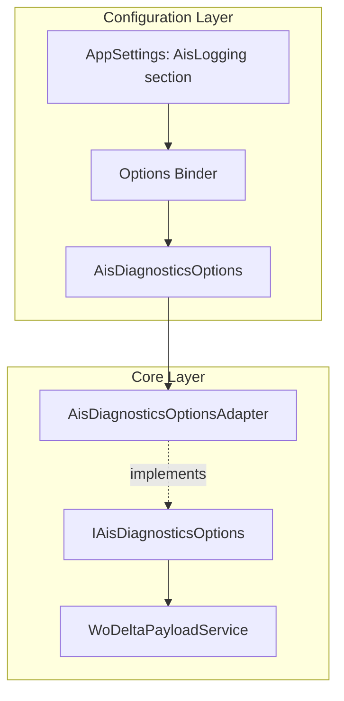

# AIS Diagnostics Options Adapter Feature Documentation

## Overview

The AIS Diagnostics Options Adapter feature centralizes how diagnostic logging settings are exposed to core services. It reads configuration from the `AisLogging` section in appsettings, binds it to a concrete options class, and adapts that class to a well-defined interface. This promotes loose coupling, testability, and consistent behavior across payload logging, snippet sizing, and chunking.

By abstracting the concrete `AisDiagnosticsOptions` behind `IAisDiagnosticsOptions`, core components—such as the WoDelta payload service—depend on the interface rather than a specific implementation. Consumers can adjust logging behavior via configuration or replace the adapter in tests with a fake implementation.

## Architecture Overview



This flow shows configuration values flowing into the `AisDiagnosticsOptions` model, wrapped by `AisDiagnosticsOptionsAdapter`, and then exposed via `IAisDiagnosticsOptions` for core consumers like `WoDeltaPayloadService`.

## Component Structure

### 1. Abstraction

#### **IAisDiagnosticsOptions** (`src/Rpc.AIS.Accrual.Orchestrator.Application/Ports/Common/Abstractions/IAisDiagnosticsOptions.cs`)

- Defines required diagnostics settings for AIS logging and payload handling.
- Properties:- `bool LogPayloadBodies`
- `bool LogMultiWoPayloadBody`
- `bool IncludeDeltaReasonKey`
- `int PayloadSnippetChars`
- `int PayloadChunkChars`

### 2. Options Model

#### **AisDiagnosticsOptions** (`src/Rpc.AIS.Accrual.Orchestrator.Application/Options/AisDiagnosticsOptions.cs`)

- Bindable POCO capturing AIS diagnostics configuration.
- Default values:- `PayloadSnippetChars = 4000`
- Properties:- `bool LogPayloadBodies`
- `bool LogMultiWoPayloadBody`
- `bool IncludeDeltaReasonKey`
- `int PayloadChunkChars`
- `int PayloadSnippetChars`

### 3. Adapter

#### **AisDiagnosticsOptionsAdapter** (`src/Rpc.AIS.Accrual.Orchestrator.Application/Options/AisDiagnosticsOptionsAdapter.cs`)

- Bridges the concrete options model to the `IAisDiagnosticsOptions` interface.
- Constructor throws if supplied `AisDiagnosticsOptions` is null.
- Forwards each interface property to the underlying options instance:

```csharp
  public bool LogPayloadBodies => _o.LogPayloadBodies;
  public bool LogMultiWoPayloadBody => _o.LogMultiWoPayloadBody;
  public bool IncludeDeltaReasonKey => _o.IncludeDeltaReasonKey;
  public int PayloadSnippetChars => _o.PayloadSnippetChars;
  public int PayloadChunkChars => _o.PayloadChunkChars;
```

### 4. Dependency Injection

In startup configuration, the options and adapter are registered:

```csharp
services.AddOptions<AisDiagnosticsOptions>()
        .Bind(cfg.GetSection("AisLogging"))
        .ValidateOnStart();
services.AddSingleton(sp => sp.GetRequiredService<IOptions<AisDiagnosticsOptions>>().Value);
services.AddSingleton<IAisDiagnosticsOptions>(sp => sp.GetRequiredService<AisDiagnosticsOptionsAdapter>());
```

## Key Classes Reference

| Class | Location | Responsibility |
| --- | --- | --- |
| IAisDiagnosticsOptions | Ports/Common/Abstractions/IAisDiagnosticsOptions.cs | Interface for diagnostics settings |
| AisDiagnosticsOptions | Application/Options/AisDiagnosticsOptions.cs | Bindable configuration model |
| AisDiagnosticsOptionsAdapter | Application/Options/AisDiagnosticsOptionsAdapter.cs | Adapter implementing the diagnostics interface |


## Testing Considerations

- **FakeAisDiagnosticsOptions**: A test double implementing `IAisDiagnosticsOptions` with configurable defaults (e.g., `PayloadSnippetChars = 512`, `PayloadChunkChars = 4096`), enabling isolation of logging behavior in unit tests.

## Dependencies

- Microsoft.Extensions.Options for configuration binding.
- Core services (e.g., `WoDeltaPayloadService`, `PostingWorkflowFactory`) consume `IAisDiagnosticsOptions` to control payload logging.

This documentation captures the purpose, structure, and integration of the AIS Diagnostics Options Adapter within the broader application.