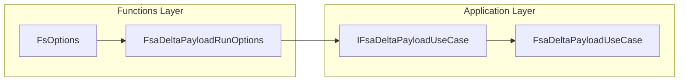

# FsaDeltaPayloadRunOptions Feature Documentation

## Overview

The `FsaDeltaPayloadRunOptions` class encapsulates the minimal runtime configuration required by the FSA delta payload build use case. It isolates payload-specific settings—specifically, a work-order filter—from infrastructure concerns. Functions-layer code maps its `FsOptions` into this class, which the application layer then consumes to drive both full-fetch and single-order flows.

Use cases:

- **FullFetch**: applies a `WorkOrderFilter` to limit which open work orders are ingested.
- **SingleAnyStatus**: carries the same filter when building a payload for a specific work order, regardless of its status.

## Architecture Overview



This flow shows how the Functions boundary transforms `FsOptions` into core `FsaDeltaPayloadRunOptions`, which then drives the delta-payload use case in the application layer.

## Component Structure

### 1. Options

#### **FsaDeltaPayloadRunOptions** (`src/Rpc.AIS.Accrual.Orchestrator.Application/Options/FsaDeltaPayloadRunOptions.cs`)

- **Purpose**

Provides the minimal set of runtime options required by the FSA delta payload use case.

- **Responsibilities**- Carry a filter expression for selecting work orders during a full fetch.
- Be immutable once constructed, ensuring consistent behavior throughout a run.

##### Properties

| Property | Type | Description |
| --- | --- | --- |
| `WorkOrderFilter` | `string?` | 🚧 A filter expression applied when querying work orders (e.g., in FullFetch mode). |


##### Source Code

```csharp
namespace Rpc.AIS.Accrual.Orchestrator.Core.Options;

/// <summary>
/// Minimal run-time options required by the delta payload build use case.
/// Mapped from Infrastructure FsOptions at the Functions boundary.
/// </summary>
public sealed class FsaDeltaPayloadRunOptions
{
    public string? WorkOrderFilter { get; init; }
}
```

## Integration Points

- **Functions Layer**- **`FsaDeltaPayloadOrchestrator.BuildFullFetchAsync`**

Maps `FsOptions.WorkOrderFilter` into a new `FsaDeltaPayloadRunOptions` instance.

- **`FsaDeltaPayloadOrchestrator.BuildSingleWorkOrderAnyStatusAsync`**

Performs the same mapping, even when building a payload for a closed or cancelled work order.

- **Application Layer**- **`IFsaDeltaPayloadUseCase.BuildFullFetchAsync`** and

**`BuildSingleWorkOrderAnyStatusAsync`**

Accept a `FsaDeltaPayloadRunOptions` parameter to drive filtering logic.

## Key Classes Reference

| Class | Location | Responsibility |
| --- | --- | --- |
| **FsaDeltaPayloadRunOptions** | `src/Rpc.AIS.Accrual.Orchestrator.Application/Options/FsaDeltaPayloadRunOptions.cs` | Holds runtime options (e.g., `WorkOrderFilter`) for the delta payload use case. |


## Dependencies

- **None** within the core application itself.
- Populated by **`FsOptions`** from the Infrastructure/Functions boundary.

## Testing Considerations

- **Null Filter**

Ensure that when `WorkOrderFilter` is `null` or empty, the use case does not apply any additional filtering.

- **Valid Filter**

Confirm that non-empty filter strings propagate correctly into the data-fetch calls.

- **Immutability**

Verify that `WorkOrderFilter` cannot be modified after initialization (via `init` only).