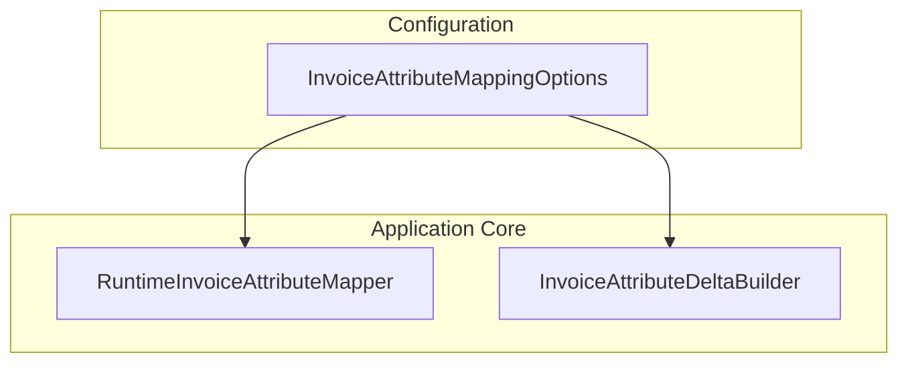

# Invoice Attribute Mapping Options

## Overview

The **InvoiceAttributeMappingOptions** class centralizes the mapping between FSA (Dataverse) invoice attribute logical names and FSCM invoice attribute names. Loaded once at application startup via configuration or environment variables, this mapping enables:

- **Flexibility**: Administrators can update attribute name mappings without code changes.
- **Decoupling**: Business logic and external API contracts remain separate from environment-specific naming.
- **Robustness**: Case-insensitive key lookup ensures reliable mapping even if incoming attribute casing varies.

These options feed into runtime services (such as the `RuntimeInvoiceAttributeMapper` and `InvoiceAttributeDeltaBuilder`) to translate and reconcile invoice attributes during orchestration.

## Architecture Overview



## Component Structure

### InvoiceAttributeMappingOptions

`src/Rpc.AIS.Accrual.Orchestrator.Application/Options/InvoiceAttributeMappingOptions.cs`

- **Purpose**

Binds at startup to provide a lookup from FSA attribute keys to FSCM invoice attribute names.

- **Key Property**

| Property | Type | Description |
| --- | --- | --- |
| FsToFscm | Dictionary<string, string> | Maps FSA attribute logical names (e.g., `rpc_wellname`) to FSCM invoice attribute names. Lookup is case-insensitive. |


- **Initialization**

```csharp
  public Dictionary<string, string> FsToFscm { get; set; }
    = new(StringComparer.OrdinalIgnoreCase);
```

## Usage Example

```csharp
using Microsoft.Extensions.Options;
using Rpc.AIS.Accrual.Orchestrator.Core.Options;

public class InvoiceService
{
    private readonly IReadOnlyDictionary<string, string> _mapping;

    public InvoiceService(IOptions<InvoiceAttributeMappingOptions> opts)
    {
        _mapping = opts.Value.FsToFscm;
    }

    public void PreparePayload(IDictionary<string, string> fsAttributes)
    {
        var pairs = new List<InvoiceAttributePair>();
        foreach (var kv in fsAttributes)
        {
            if (_mapping.TryGetValue(kv.Key, out var fscmName))
            {
                pairs.Add(new InvoiceAttributePair(fscmName, kv.Value));
            }
        }
        // send pairs to FSCM...
    }
}
```

## Dependencies

- **System**: Uses `Dictionary<string,string>` and `StringComparer`.
- **Configuration Binding**: Registered and validated via `IOptions<InvoiceAttributeMappingOptions>` in the DI container.

## Integration Points

- **RuntimeInvoiceAttributeMapper** (`.../RuntimeInvoiceAttributeMapper.cs`)

Generates a runtime mapping result by combining this configured map with FSCM definitions.

- **InvoiceAttributeDeltaBuilder** (`.../InvoiceAttributeDeltaBuilder.cs`)

Builds the list of attribute updates (`InvoiceAttributePair`) by comparing FSA values with FSCM snapshots using the key-to-name map.

## Key Classes Reference

| Class | Location | Responsibility |
| --- | --- | --- |
| InvoiceAttributeMappingOptions | `.../Options/InvoiceAttributeMappingOptions.cs` | Holds configuration for mapping FSA attribute keys to FSCM invoice attribute names. |
| RuntimeInvoiceAttributeMapper | `.../Services/InvoiceAttributes/RuntimeInvoiceAttributeMapper.cs` | Builds mapping results at runtime using configured map and active FSCM definitions. |
| InvoiceAttributeDeltaBuilder | `.../Services/InvoiceAttributes/InvoiceAttributeDeltaBuilder.cs` | Determines which attributes have changed and need updating in FSCM based on configured key mappings. |


## Testing Considerations

- **Configuration Binding Test**

Verify that `FsToFscm` binds correctly from JSON or environment sources.

- **Case-Insensitive Lookup**

Test that keys differing only by casing still resolve to the same FSCM name.

- **Empty or Missing Mapping**

Ensure services handle an empty dictionary without errors, skipping unmapped attributes gracefully.