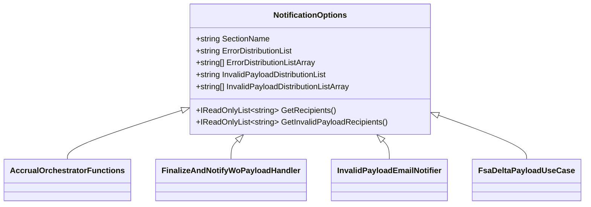

# NotificationOptions Feature Documentation

## Overview

The **NotificationOptions** class centralizes configuration for email notification distribution lists in the Accrual Orchestrator. It binds to the `Notifications` section of application settings and exposes both modern (string-based) and legacy (array-based) list representations. Two methods parse and return deduplicated, trimmed recipient lists for general errors and invalid-payload validation failures.

## ⚙️ Configuration

These options map to the **Notifications** configuration section:

| Constant / Property | Type | Description |
| --- | --- | --- |
| `SectionName` | `const string` | Name of the configuration section: `"Notifications"`. |
| `ErrorDistributionList` | `string` | Recommended single string of recipients; separates on `;`, `,`, or whitespace. |
| `ErrorDistributionListArray` | `string[]` | Legacy array support; used if array binding is required in some environments. |
| `InvalidPayloadDistributionList` | `string` | New string-based DL for invalid-payload validation failures. |
| `InvalidPayloadDistributionListArray` | `string[]` | Legacy array fallback for invalid-payload recipients. |


## 📝 Properties

```csharp
public const string SectionName = "Notifications";                                              
public string ErrorDistributionList { get; init; } = string.Empty;                               
public string[] ErrorDistributionListArray { get; init; } = Array.Empty<string>();              
public string InvalidPayloadDistributionList { get; init; } = string.Empty;                      
public string[] InvalidPayloadDistributionListArray { get; init; } = Array.Empty<string>();      
private static readonly char[] RecipientSeparators = new[] { ';', ',', ' ' };                    
```

- **SectionName** defines the JSON/app-settings section key.
- **ErrorDistributionList** and **InvalidPayloadDistributionList** hold delimited email addresses.
- **…Array** variants support legacy array binding.

## 🔧 Methods

| Method | Returns | Purpose |
| --- | --- | --- |
| `GetRecipients()` | `IReadOnlyList<string>` | Parses general error DL from `ErrorDistributionList` or falls back to `ErrorDistributionListArray`. |
| `GetInvalidPayloadRecipients()` | `IReadOnlyList<string>` | Parses invalid-payload DL from `InvalidPayloadDistributionList`, array fallback, then falls back to general. |


### GetRecipients()

1. **String-based**: If `ErrorDistributionList` is non-empty, split on `;`, `,`, or space; trim; remove empties; dedupe (case-insensitive).
2. **Array-based**: If `ErrorDistributionListArray` has elements, trim non-empty entries; dedupe.
3. **Empty**: Return an empty list.

### GetInvalidPayloadRecipients()

1. **String-based**: Split and process `InvalidPayloadDistributionList` as above.
2. **Array-based**: Trim and dedupe entries in `InvalidPayloadDistributionListArray`.
3. **Fallback**: Return result of `GetRecipients()`.

## 🚀 Usage & Integration

**NotificationOptions** is injected and consumed by multiple components to determine email recipients:

- **AccrualOrchestratorFunctions** retrieves general error recipients to send fatal-run notifications.
- **FinalizeAndNotifyWoPayloadHandler** uses `GetRecipients()` for post-processing error summaries.
- **InvalidPayloadEmailNotifier** calls `GetInvalidPayloadRecipients()` to notify AIS-side validation failures.
- **FsaDeltaPayloadUseCase** injects **NotificationOptions** to dispatch summary emails after delta payload processing.

## 📊 Class Diagram



## 💡 Example Configuration

```json
{
  "Notifications": {
    "ErrorDistributionList": "ops@company.com;alerts@company.com",
    "ErrorDistributionListArray": [
      "legacy1@company.com",
      "legacy2@company.com"
    ],
    "InvalidPayloadDistributionList": "dev-team@company.com",
    "InvalidPayloadDistributionListArray": [
      "legacy-dev@company.com"
    ]
  }
}
```

Using this setup, `GetRecipients()` and `GetInvalidPayloadRecipients()` will return normalized, deduplicated lists of email addresses for downstream services and handlers.