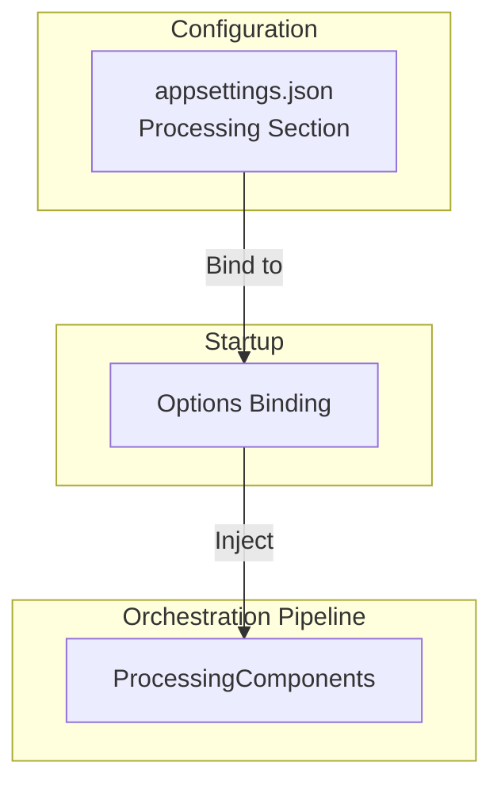

# ⚙️ Processing Options Feature Documentation

## Overview

The **Processing Options** feature centralizes configuration for the orchestration pipeline in the AIS Accrual Orchestrator. It enables fine-tuning of:

- **Processing Mode**: selects between staging via an external poller or in-memory durable processing.
- **Batching**: controls batch sizes by record count and byte footprint.
- **Concurrency & Resilience**: configures parallelism and retry policies for durable posting.

These options are bound at startup from the `Processing` configuration section and injected into core processing components to optimize throughput and error handling.

## Configuration Binding

ProcessingOptions are loaded from `Processing` section in application settings. Below is a typical registration in `Program.cs`:

```csharp
services.AddOptions<ProcessingOptions>()
    .Bind(configuration.GetSection(ProcessingOptions.SectionName))
    .ValidateOnStart();

services.AddSingleton(
    sp => sp.GetRequiredService<IOptions<ProcessingOptions>>().Value
);
```

- `SectionName` constant (`"Processing"`) ties the class to its config section.
- `ValidateOnStart()` ensures required values pass any built-in validation before the app runs.

## ProcessingMode Enum

Defines the two supported modes for orchestrator processing:

| Name | Value | Description |
| --- | --- | --- |
| PollerStaging | 1 | Offloads staging to an external poller component (e.g. Azure Function). |
| InMemoryDurable | 2 | Uses an in-process durable queue and retry logic (default). |


```csharp
public enum ProcessingMode
{
    PollerStaging = 1,
    InMemoryDurable = 2
}
```

## ProcessingOptions Class

Holds all parameters that drive batching, concurrency, and retry behavior in the orchestrator.

```csharp
public sealed class ProcessingOptions
{
    public const string SectionName = "Processing";

    public ProcessingMode Mode { get; init; } = ProcessingMode.InMemoryDurable;
    public int MaxRecordsPerBatch { get; init; } = 50;
    public int TargetBatchBytes { get; init; } = 1_000_000;
    public int MaxParallelBatches { get; init; } = 3;

    public int DurablePostRetryAttempts { get; init; } = 5;
    public int DurablePostRetryFirstIntervalSeconds { get; init; } = 5;
    public double DurablePostRetryBackoffCoefficient { get; init; } = 2.0;
    public int DurablePostRetryMaxIntervalSeconds { get; init; } = 300;
}
```

### Properties Reference

| Property | Type | Default | Description |
| --- | --- | --- | --- |
| `Mode` | `ProcessingMode` | InMemoryDurable | Selects processing mode |
| `MaxRecordsPerBatch` | `int` | 50 | Upper limit on records per batch |
| `TargetBatchBytes` | `int` | 1,000,000 | Approximate byte-size target for each batch |
| `MaxParallelBatches` | `int` | 3 | Number of batches to process concurrently |
| `DurablePostRetryAttempts` | `int` | 5 | Number of retry attempts on durable post failure |
| `DurablePostRetryFirstIntervalSeconds` | `int` | 5 | Delay before first retry (in seconds) |
| `DurablePostRetryBackoffCoefficient` | `double` | 2.0 | Multiplier applied to backoff interval each retry |
| `DurablePostRetryMaxIntervalSeconds` | `int` | 300 | Maximum backoff interval permitted (in seconds) |


## Architecture Overview



- **Configuration**: `Processing` section holds all tuning values.
- **Startup**: binds into `ProcessingOptions` and registers its singleton instance.
- **Pipeline**: core components consume these options to drive batching and retry logic.

## Key Classes Reference

| Class | Location | Responsibility |
| --- | --- | --- |
| `ProcessingMode` | src/Rpc.AIS.Accrual.Orchestrator.Application/Options/ProcessingOptions.cs | Enum defining available processing modes |
| `ProcessingOptions` | src/Rpc.AIS.Accrual.Orchestrator.Application/Options/ProcessingOptions.cs | Options holder for processing configuration |
