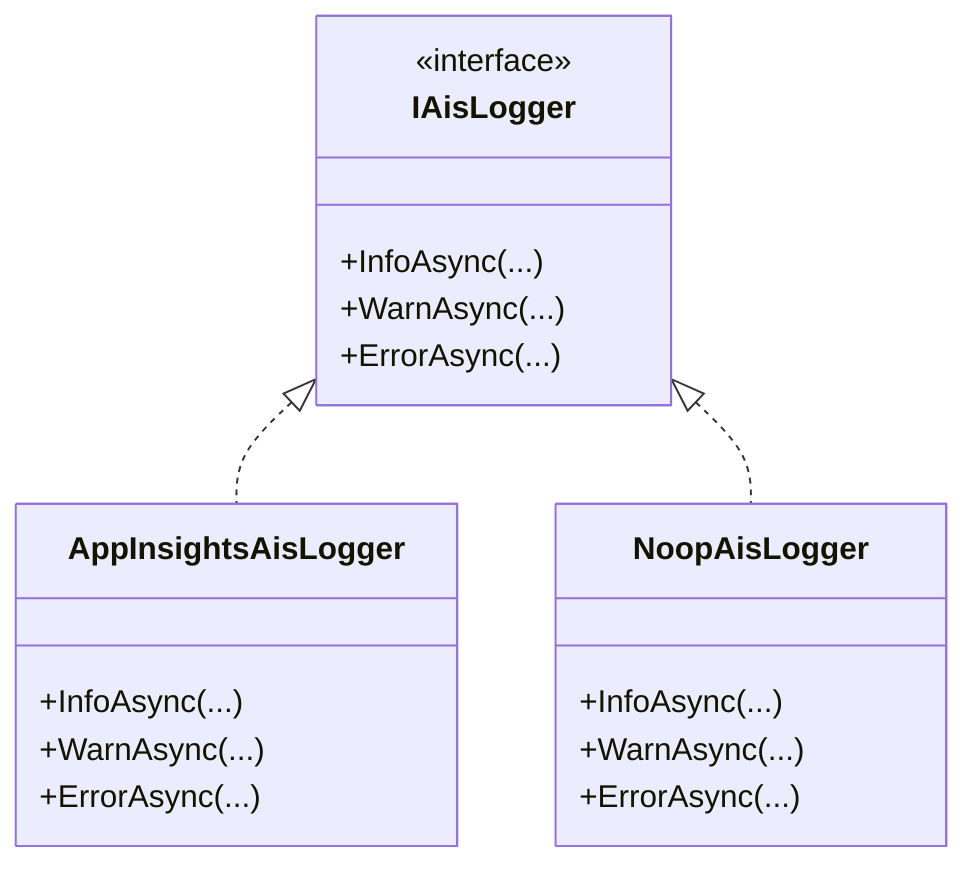

# IAisLogger Abstraction

## Overview

The **IAisLogger** interface defines a uniform, asynchronous logging contract for the Accrual Orchestrator. It encapsulates structured tracing of informational, warning, and error events with essential context such as , , and optional payload data. By abstracting the logging mechanism, this interface enables:

- Consistent log formatting across functions, activities, and clients
- Swappable implementations (e.g., production vs. test doubles)
- Easy integration with Application Insights via `ILogger<T>`

This abstraction underpins both production telemetry and test isolation within the broader orchestration pipeline.

## Structure

### Interface Definition

```csharp
namespace Rpc.AIS.Accrual.Orchestrator.Core.Abstractions;

/// <summary>
/// Defines i ais logger behavior.
/// </summary>
public interface IAisLogger
{
    Task InfoAsync(string runId, string step, string message, object? data, CancellationToken ct);
    Task WarnAsync(string runId, string step, string message, object? data, CancellationToken ct);
    Task ErrorAsync(string runId, string step, string message, Exception? ex, object? data, CancellationToken ct);
}
```

The interface declares three asynchronous methods to log **Info**, **Warn**, and **Error** events with:

// Citation:

### Method Details

| Method | Purpose | Parameters | Returns |
| --- | --- | --- | --- |
| **InfoAsync** | Write an informational trace | `runId` (string): unique execution ID |


`step` (string): logical phase name

`message` (string): descriptive text

`data` (object?): optional structured context

`ct` (CancellationToken) | Task    |

| **WarnAsync** | Emit a warning-level log | Same parameters as InfoAsync | Task |
| --- | --- | --- | --- |
| **ErrorAsync** | Record an error along with exception | `runId`, `step`, `message` |


`ex` (Exception?): exception to capture stack and message

`data` (object?): extra context

`ct` (CancellationToken)                                                            | Task    |

## Implementations

### AppInsightsAisLogger 🚀

- **Location:** 
- **Role:** Routes structured logs to `ILogger<AppInsightsAisLogger>`. In Azure Functions, these flow into Application Insights.
- **Behavior:** Calls `LogInformation`, `LogWarning`, or `LogError` with a template including `{Step}`, `{RunId}`, `{Message}`, and `{@Data}`, then returns `Task.CompletedTask`.

```csharp
public sealed class AppInsightsAisLogger : IAisLogger
{
    private readonly ILogger<AppInsightsAisLogger> _logger;

    public AppInsightsAisLogger(ILogger<AppInsightsAisLogger> logger)
    {
        _logger = logger ?? throw new ArgumentNullException(nameof(logger));
    }

    public Task InfoAsync(string runId, string step, string message, object? data, CancellationToken ct)
    {
        _logger.LogInformation("{Step} | RunId={RunId} | {Message} | {@Data}", step, runId, message, data);
        return Task.CompletedTask;
    }

    public Task WarnAsync(string runId, string step, string message, object? data, CancellationToken ct)
    {
        _logger.LogWarning("{Step} | RunId={RunId} | {Message} | {@Data}", step, runId, message, data);
        return Task.CompletedTask;
    }

    public Task ErrorAsync(string runId, string step, string message, Exception? ex, object? data, CancellationToken ct)
    {
        _logger.LogError(ex, "{Step} | RunId={RunId} | {Message} | {@Data}", step, runId, message, data);
        return Task.CompletedTask;
    }
}
```

// Citation:

### NoopAisLogger 🔇

- **Location:** 
- **Role:** A no-op stub for unit tests; suppresses all logging calls.
- **Behavior:** Each method immediately returns a completed `Task`.

```csharp
internal sealed class NoopAisLogger : IAisLogger
{
    public Task InfoAsync(string runId, string step, string message, object? data, CancellationToken ct)
        => Task.CompletedTask;

    public Task WarnAsync(string runId, string step, string message, object? data, CancellationToken ct)
        => Task.CompletedTask;

    public Task ErrorAsync(string runId, string step, string message, Exception? ex, object? data, CancellationToken ct)
        => Task.CompletedTask;
}
```

// Citation:

## Class Diagram



## Usage Example

Wrap calls in a logging scope to include contextual dimensions:

```csharp
using var scope = LogScopes.BeginFunctionScope(logger, ctx);
await aisLogger.InfoAsync(ctx.RunId, "Initialize", "Starting orchestration", null, ct);
```

## Related Components

- **LogScopes**: Builds structured logging scopes with consistent keys.
- **AisLoggerPayloadExtensions**: Extension methods to safely log large JSON payloads (includes SHA-256 + snippet logic).
- **IAisDiagnosticsOptions**: Configuration flags for payload logging behavior (snippet size, chunk size, etc.).

## Key Classes Reference

| Class | Location | Responsibility |
| --- | --- | --- |
| **IAisLogger** | Application/Ports/Common/Abstractions/IAisLogger.cs | Defines AIS logging contract |
| **AppInsightsAisLogger** | Infrastructure/Logging/AppInsightsAisLogger.cs | Production logger implementation |
| **NoopAisLogger** | tests/TestDoubles/NoopAisLogger.cs | Test double for suppressing logs |
| **LogScopes** | Infrastructure/Logging/LogScopes.cs | Creates logging context scopes |
| **AisLoggerPayloadExtensions** | Application/Utilities/AisLoggerPayloadExtensions.cs | Helpers for logging JSON payloads safely |
