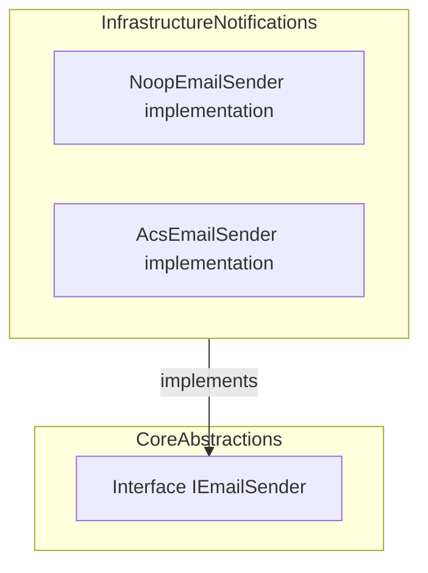

# 📧 Email Sender Feature Documentation

## Overview

The **IEmailSender** interface defines a contract for sending email messages within the AIS Orchestrator application. It abstracts email delivery so that different implementations (e.g., no-op, Azure Communication Services) can be swapped via dependency injection. This decoupling enables flexibility for environments such as local development, testing, and production.

By depending on `IEmailSender`, notification and orchestration components can send alerts and error reports without knowing the underlying email transport. This promotes a clean architecture and simplifies unit testing by allowing mock or no-op implementations.

## Architecture Overview



## Component Structure

### 1. Abstraction Layer

#### **IEmailSender** (`src/Rpc.AIS.Accrual.Orchestrator.Application/Ports/Common/Abstractions/IEmailSender.cs`)

- **Purpose**: Defines asynchronous email sending behavior for the orchestration system.
- **Responsibilities**:- Specify method signature for sending an email with subject, HTML body, recipients, and cancellation support.

**Method Summary**

| Method | Description | Return Type |
| --- | --- | --- |
| **SendAsync** | Sends an email message asynchronously with given parameters. | `Task` |


```csharp
namespace Rpc.AIS.Accrual.Orchestrator.Core.Abstractions;

/// <summary>
/// Defines i email sender behavior.
/// </summary>
public interface IEmailSender
{
    Task SendAsync(string subject, string htmlBody, IReadOnlyList<string> to, CancellationToken ct);
}
```

### 2. Infrastructure Layer 🏗️

#### **NoopEmailSender** (`src/Rpc.AIS.Accrual.Orchestrator.Infrastructure/Notifications/NoopEmailSender.cs`)

- **Purpose**: Placeholder implementation for environments where email sending is not required.
- **Behavior**:- Logs email metadata (recipients, subject, body length) to the console.
- Never throws; always completes immediately.

```csharp
public sealed class NoopEmailSender : IEmailSender
{
    public Task SendAsync(string subject, string htmlBody, IReadOnlyList<string> to, CancellationToken ct)
    {
        Console.WriteLine($"EMAIL (noop) TO={string.Join(';', to)} SUBJECT={subject} BODYLEN={htmlBody?.Length ?? 0}");
        return Task.CompletedTask;
    }
}
```

#### **AcsEmailSender** (`src/Rpc.AIS.Accrual.Orchestrator.Infrastructure/Notifications/AcsEmailSender.cs`)

- **Purpose**: Sends emails via Azure Communication Services (ACS).
- **Behavior**:- Checks configuration flags (enabled, from address).
- Normalizes and validates recipient list.
- Respects `CancellationToken`.
- Logs information, warnings, and errors.
- Catches ACS-specific (`RequestFailedException`) and general exceptions to avoid failing the orchestration.

```csharp
public sealed class AcsEmailSender : IEmailSender
{
    private readonly EmailClient _client;
    private readonly AcsEmailOptions _opt;
    private readonly ILogger<AcsEmailSender> _logger;

    public async Task SendAsync(string subject, string htmlBody, IReadOnlyList<string> to, CancellationToken ct)
    {
        // ... validate options, build EmailMessage ...
        try
        {
            var op = await _client.SendAsync(waitUntil, message, ct);
            _logger.LogInformation("ACS email send accepted. OperationId={OperationId}", op.Id);
        }
        catch (RequestFailedException ex)
        {
            _logger.LogError(ex, "ACS email send failed. Code={Code}, Status={Status}", ex.ErrorCode, ex.Status);
        }
        catch (Exception ex)
        {
            _logger.LogError(ex, "ACS email send failed (unexpected exception).");
        }
    }
}
```

## Design Patterns

- **Strategy Pattern**: `IEmailSender` defines a family of email-sending algorithms. Consumers remain agnostic to the chosen implementation.

```card
{
    "title": "Swappable Implementations",
    "content": "Use dependency injection to provide different IEmailSender implementations per environment."
}
```

## Integration Points

- **InvalidPayloadEmailNotifier** (`src/Rpc.AIS.Accrual.Orchestrator.Infrastructure/Notifications/InvalidPayloadEmailNotifier.cs`)

Uses `IEmailSender` to dispatch email notifications for payload validation failures.

- **Error email features** employ `IEmailSender` to alert on orchestration or posting errors.

## Key Classes Reference

| Class | Location | Responsibility |
| --- | --- | --- |
| **IEmailSender** | src/Rpc.AIS.Accrual.Orchestrator.Application/Ports/Common/Abstractions/IEmailSender.cs | Contract for sending email messages asynchronously. |
| **NoopEmailSender** | src/Rpc.AIS.Accrual.Orchestrator.Infrastructure/Notifications/NoopEmailSender.cs | No-op implementation that logs email metadata to the console. |
| **AcsEmailSender** | src/Rpc.AIS.Accrual.Orchestrator.Infrastructure/Notifications/AcsEmailSender.cs | ACS-based implementation with validation, logging, and error handling. |


## Error Handling

- **Cancellation**: `AcsEmailSender` invokes `ct.ThrowIfCancellationRequested()`.
- **ACS Errors**: Catches `RequestFailedException` to log error details without bubbling.
- **Fallback**: General exceptions are logged to prevent orchestration failure.

## Dependencies

- **Core Abstractions**:- System.Threading
- System.Threading.Tasks
- System.Collections.Generic
- **Infrastructure**:- Azure.Communication.Email
- Microsoft.Extensions.Logging
- Rpc.AIS.Accrual.Orchestrator.Infrastructure.Options (for `AcsEmailOptions`)

## Testing Considerations

- Inject **NoopEmailSender** in tests to avoid external calls.
- Mock **EmailClient** and configure **AcsEmailOptions** to verify `AcsEmailSender` logic (enable flags, recipient validation, exception handling).