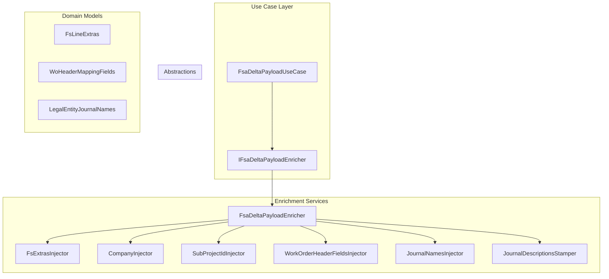

# FSA Delta Payload Enricher Abstraction Documentation

## Overview

The **IFsaDeltaPayloadEnricher** interface defines a contract for enriching outbound delta payload JSON with Field Service–specific fields. It enables injecting company, subproject, line-level extras, header mappings, journal names, and recomputed journal descriptions. Implementations of this interface are invoked by the delta payload use case to ensure the final JSON meets FSCM requirements .

## Architecture Overview



## Component Structure

### 1. Core.Abstractions Layer

#### **IFsaDeltaPayloadEnricher**

*Path:* `src/Rpc.AIS.Accrual.Orchestrator.Application/Ports/Common/Abstractions/IFsaDeltaPayloadEnricher.cs`

- **Purpose:** Defines enrichment operations on a JSON payload.
- **Responsibility:** Inject FS-specific fields and stamp journal descriptions.

**Methods Summary**

| Method | Description | Returns |
| --- | --- | --- |
| InjectFsExtrasAndLogPerWoSummary | Enriches JSON with currency, resource, warehouse, site, line-number, and operations-date. Logs a per-workorder summary with run and corr IDs. | string |
| InjectCompanyIntoPayload | Injects the company name into each work order entry based on a workOrderId→companyName map. | string |
| InjectSubProjectIdIntoPayload | Injects subproject IDs into each work order entry using a workOrderId→subProjectId map. | string |
| InjectWorkOrderHeaderFieldsIntoPayload | Injects mapping-only header fields (e.g. taxability, location) fetched from Dataverse into WOList entries. | string |
| InjectJournalNamesIntoPayload | Adds journal names at the header level for item, expense, and hour lines based on legal entity settings. | string |
| StampJournalDescriptionsIntoPayload | Recomputes and stamps JournalDescription and JournalLineDescription using final header values. `action` must be one of Post, Reverse, Recreate, Cancel. | string |


### 2. Enrichment Service Implementations

Implementers of **IFsaDeltaPayloadEnricher** compose specialized injectors:

- **FsaDeltaPayloadEnricher**

Aggregates injectors and delegates each enrichment concern.

- **Injectors in Core.Services.FsaDeltaPayload.Enrichment**- `FsExtrasInjector`
- `CompanyInjector`
- `SubProjectIdInjector`
- `WorkOrderHeaderFieldsInjector`
- `JournalNamesInjector`
- `JournalDescriptionsStamper`

## Integration Points

- **FsaDeltaPayloadUseCase** calls each enrich method in sequence.
- **DefaultFsaDeltaPayloadEnrichmentPipeline** orders and executes pipeline steps, each invoking one interface method.
- Registered in DI as `IFsaDeltaPayloadEnricher → FsaDeltaPayloadEnricher` .

## Key Classes Reference

| Class | Location | Responsibility |
| --- | --- | --- |
| IFsaDeltaPayloadEnricher | `.../Ports/Common/Abstractions/IFsaDeltaPayloadEnricher.cs` | Defines enrichment operations on outbound JSON payload. |
| FsaDeltaPayloadEnricher | `Core/Services/FsaDeltaPayload/FsaDeltaPayloadEnricher.cs` | Orchestrates calls to specialized injectors and logs per-WO stats. |
| FsExtrasInjector | `Core/Services/FsaDeltaPayload/Enrichment/FsExtrasInjector.cs` | Injects line-level extras and logs statistics. |
| CompanyInjector | `Core/Services/FsaDeltaPayload/Enrichment/CompanyInjector.cs` | Injects company names into payload. |
| SubProjectIdInjector | `Core/Services/FsaDeltaPayload/Enrichment/SubProjectIdInjector.cs` | Injects subproject IDs into payload. |
| WorkOrderHeaderFieldsInjector | `Core/Services/FsaDeltaPayload/Enrichment/WorkOrderHeaderFieldsInjector.cs` | Injects additional header-only fields. |
| JournalNamesInjector | `Core/Services/FsaDeltaPayload/Enrichment/JournalNamesInjector.cs` | Adds journal names at header level for each line type. |
| JournalDescriptionsStamper | `Core/Services/FsaDeltaPayload/Enrichment/JournalDescriptionsStamper.cs` | Recomputes and stamps journal descriptions based on final header values and action. |


## Dependencies

- **System**: `Collections.Generic`, `Text.Json`
- **Rpc.AIS.Accrual.Orchestrator.Core.Domain**: Domain models like `FsLineExtras`, `WoHeaderMappingFields`, `LegalEntityJournalNames`.
- **Rpc.AIS.Accrual.Orchestrator.Core.Services.FsaDeltaPayload**: JSON utilities and helper types.

```card
{
    "title": "Action Parameter Constraints",
    "content": "The 'action' argument for StampJournalDescriptions must be one of Post, Reverse, Recreate, or Cancel."
}
```

## Testing Considerations

- Verify each inject method preserves unaffected JSON segments.
- Assert proper logging for `InjectFsExtrasAndLogPerWoSummary`.
- Test idempotency: running enrichment twice should not duplicate fields.