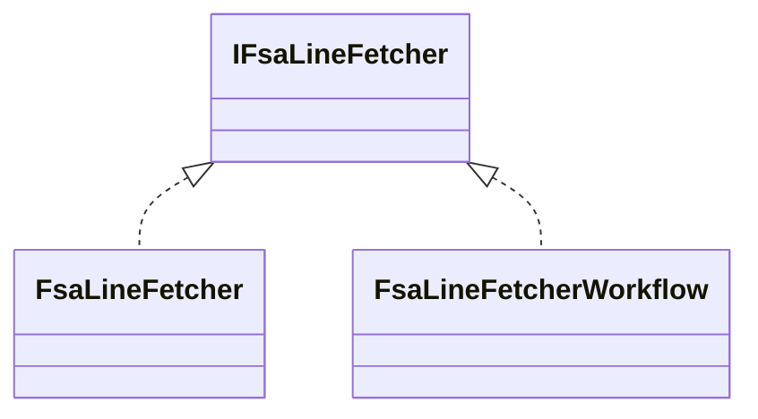

# IFsaLineFetcher Interface Documentation

## Overview

The **IFsaLineFetcher** interface defines a core abstraction for retrieving Field Service (FSA) work order data from the FSCM (Financial Supply Chain Management) system. It provides methods to:

- Fetch open work orders based on configurable filters
- Retrieve specific work orders by ID
- Obtain associated product and service lines
- Perform lightweight presence checks for products or services
- Fetch product metadata

By decoupling application logic from HTTP/OData implementations, it enables clean dependency injection and promotes testability across the orchestrator’s application layer.

## Architecture Overview



## Interface Definition

```csharp
using Rpc.AIS.Accrual.Orchestrator.Core.Domain;
using System;
using System.Collections.Generic;
using System.Text.Json;
using System.Threading;
using System.Threading.Tasks;

namespace Rpc.AIS.Accrual.Orchestrator.Core.Abstractions
{
    /// <summary>
    /// Defines FSA line fetcher behavior.
    /// </summary>
    public interface IFsaLineFetcher
    {
        Task<JsonDocument> GetOpenWorkOrdersAsync(RunContext context, CancellationToken ct);
        Task<JsonDocument> GetWorkOrdersAsync(RunContext context, List<string> workOrderIds, CancellationToken ct);
        Task<JsonDocument> GetWorkOrderProductsAsync(RunContext context, List<string> workOrderIds, CancellationToken ct);
        Task<JsonDocument> GetWorkOrderServicesAsync(RunContext context, List<string> workOrderIds, CancellationToken ct);

        /// <summary>
        /// Lightweight presence query: returns WorkOrderIds that have at least one product line.
        /// This must not fetch full product lines.
        /// </summary>
        Task<HashSet<string>> GetWorkOrderIdsWithProductsAsync(RunContext context, List<string> workOrderIds, CancellationToken ct);

        /// <summary>
        /// Lightweight presence query: returns WorkOrderIds that have at least one service line.
        /// This must not fetch full service lines.
        /// </summary>
        Task<HashSet<string>> GetWorkOrderIdsWithServicesAsync(RunContext context, List<string> workOrderIds, CancellationToken ct);

        Task<JsonDocument> GetProductsAsync(RunContext context, IReadOnlyList<Guid> productIds, CancellationToken ct);
    }
}
```

## Methods Reference 📋

| Method | Parameters | Description | Returns |
| --- | --- | --- | --- |
| **GetOpenWorkOrdersAsync** | `RunContext context`<br>`CancellationToken ct` | Fetches all open work orders using a configured filter. | `Task<JsonDocument>` |
| **GetWorkOrdersAsync** | `RunContext context`<br>`List<string> workOrderIds`<br>`CancellationToken ct` | Retrieves specified work orders by their string IDs. | `Task<JsonDocument>` |
| **GetWorkOrderProductsAsync** | `RunContext context`<br>`List<string> workOrderIds`<br>`CancellationToken ct` | Retrieves product lines for the given work orders. | `Task<JsonDocument>` |
| **GetWorkOrderServicesAsync** | `RunContext context`<br>`List<string> workOrderIds`<br>`CancellationToken ct` | Retrieves service lines for the given work orders. | `Task<JsonDocument>` |
| **GetWorkOrderIdsWithProductsAsync** | `RunContext context`<br>`List<string> workOrderIds`<br>`CancellationToken ct` | Returns IDs of work orders that have at least one product line (no full details fetched). | `Task<HashSet<string>>` |
| **GetWorkOrderIdsWithServicesAsync** | `RunContext context`<br>`List<string> workOrderIds`<br>`CancellationToken ct` | Returns IDs of work orders that have at least one service line (no full details fetched). | `Task<HashSet<string>>` |
| **GetProductsAsync** | `RunContext context`<br>`IReadOnlyList<Guid> productIds`<br>`CancellationToken ct` | Fetches product metadata for specified product GUIDs. | `Task<JsonDocument>` |


## Implementations

- **FsaLineFetcher**

📂 `src/Rpc.AIS.Accrual.Orchestrator.Infrastructure/Adapters/Fscm/Clients/FsaLineFetcher.Facade.cs`

A thin facade that delegates all calls to the workflow implementation while preserving existing DI and single-responsibility.

- **FsaLineFetcherWorkflow**

📂 `src/Rpc.AIS.Accrual.Orchestrator.Infrastructure/Adapters/Fscm/Clients/FsaLineFetcherWorkflow.cs`

Contains the full HTTP/OData logic: builds queries via `IFsaODataQueryBuilder`, pages through results with `IODataPagedReader`, flattens rows, and enriches warehouse/site data.

## Usage Example

```csharp
public class AccrualProcessor
{
    private readonly IFsaLineFetcher _lineFetcher;

    public AccrualProcessor(IFsaLineFetcher lineFetcher)
    {
        _lineFetcher = lineFetcher;
    }

    public async Task RunAsync(RunContext context, CancellationToken ct)
    {
        // 🔍 Fetch open work orders
        var openOrdersDoc = await _lineFetcher.GetOpenWorkOrdersAsync(context, ct);
        // ➡️ Process JsonDocument…
    }
}
```

## Integration Points

- **RunContext** (from `Rpc.AIS.Accrual.Orchestrator.Core.Domain`) carries metadata like correlation IDs and timing info.
- Consumed by orchestrator application services for accrual calculations and job scheduling.
- Underlying implementation relies on Dataverse REST/OData via `HttpClient` and related abstractions (`IFsaODataQueryBuilder`, `IODataPagedReader`).

```card
{
    "title": "Presence Queries",
    "content": "GetWorkOrderIdsWithProductsAsync and GetWorkOrderIdsWithServicesAsync perform lightweight checks without fetching full line details."
}
```

## Key Class Reference

| Class | Location | Responsibility |
| --- | --- | --- |
| **IFsaLineFetcher** | `src/Rpc.AIS.Accrual.Orchestrator.Core.Abstractions/IFsaLineFetcher.cs` | Defines the contract for fetching FSA work order lines. |
| FsaLineFetcher | `Infrastructure/Adapters/Fscm/Clients/FsaLineFetcher.Facade.cs` | Delegates interface calls to workflow implementation. |
| FsaLineFetcherWorkflow | `Infrastructure/Adapters/Fscm/Clients/FsaLineFetcherWorkflow.cs` | Implements OData query building, paging, parsing, and enrichment. |
