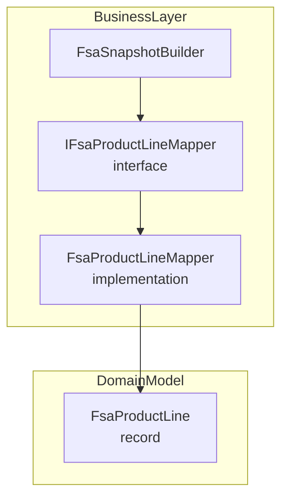

# FSA Product Line Mapping Feature Documentation

## Overview

The **FSA Product Line Mapper** defines how raw Field Service data (from Dataverse JSON payloads) is transformed into strongly typed domain objects (`FsaProductLine`). This mapping isolates JSON parsing and lookup logic, ensuring consistent interpretation of product types, item numbers, pricing, taxability, and other enrichment fields. The resulting `FsaProductLine` instances feed into the snapshot‐building process, where product lines are grouped into inventory vs. non-inventory categories for downstream delta calculation and journal generation.

## Architecture Overview



## Component Structure

### Business Layer

#### IFsaProductLineMapper

**Path:** `src/Rpc.AIS.Accrual.Orchestrator.Application/Ports/Common/Abstractions/IFsaProductLineMapper.cs`

Defines the contract for mapping a single Dataverse work order product JSON row into a domain `FsaProductLine`, along with an inventory flag.

```csharp
public interface IFsaProductLineMapper
{
    /// <summary>
    /// Maps a Dataverse Work Order Product row into a <see cref="FsaProductLine"/>.
    /// Returns the mapped line and a flag indicating whether it should be treated as Inventory.
    /// </summary>
    (FsaProductLine Line, bool IsInventory) Map(
        JsonElement row,
        Guid workOrderId,
        string workOrderNumber,
        Dictionary<Guid, string> productTypeById,
        Dictionary<Guid, string?> itemNumberById);
}
```

- **Map Method**

| Parameter | Type | Description |
| --- | --- | --- |
| `row` | `JsonElement` | JSON element representing one work order product row |
| `workOrderId` | `Guid` | Identifier of the parent work order |
| `workOrderNumber` | `string` | Human-readable work order number |
| `productTypeById` | `Dictionary<Guid, string>` | Lookup map from product ID to its type (e.g., “Inventory”, “Non-Inventory”) |
| `itemNumberById` | `Dictionary<Guid, string?>` | Lookup map from product ID to its item number (SKU) |


**Returns:**

- `Line` – Mapped `FsaProductLine` domain object
- `IsInventory` – `true` if `ProductType` equals `"Inventory"`, otherwise `false`

### Domain Model

#### FsaProductLine

**Path:** `src/Rpc.AIS.Accrual.Orchestrator.Core.Domain/FsaDeltaDtos.cs`

Immutable record carrying all fields of a product line, including pricing, quantities, lookups, and enrichment data.

| Property | Type | Description |
| --- | --- | --- |
| `LineId` | `Guid` | Unique identifier of the work order product line |
| `WorkOrderId` | `Guid` | Identifier of the parent work order |
| `WorkOrderNumber` | `string` | Readable work order number |
| `ProductId` | `Guid?` | Optional product identifier |
| `ItemNumber` | `string?` | SKU or item number |
| `ProductType` | `string` | Category from `productTypeById` (e.g., Inventory, Non-Inventory, Unknown) |
| `Quantity` | `decimal?` | Quantity ordered |
| `UnitCost` | `decimal?` | Cost per unit |
| `FsaUnitPrice` | `decimal?` | Unit price explicitly provided by FSA |
| `UnitAmount` | `decimal?` | Alias of `FsaUnitPrice` |
| `Currency` | `string?` | ISO currency code |
| `Unit` | `string?` | Unit of measure |
| `JournalDescription` | `string?` | Description used in journal entries |
| `DiscountAmount` | `decimal?` | Line-level discount amount |
| `DiscountPercent` | `decimal?` | Line-level discount percent |
| `SurchargeAmount` | `decimal?` | Surcharge amount |
| `SurchargePercent` | `decimal?` | Surcharge percent |
| `CustomerProductReference` | `string?` | Customer’s internal product reference |
| `CalculatedUnitPrice` | `decimal?` | Computed unit price (RPC field) |
| `LineProperty` | `string?` | Custom line property (formatted or ID) |
| `Department` | `string?` | Department allocation (formatted or ID) |
| `ProductLine` | `string?` | Product line allocation (formatted or ID) |
| `Warehouse` | `string?` | Warehouse code or identifier |
| `Site` | `string?` | Operational site ID |
| `Location` | `string?` | Location formatting |
| `IsActive` | `bool?` | Active state flag |
| `DataAreaId` | `string?` | Data area identifier |
| `Printable` | `bool?` | Printable flag |
| `TaxabilityType` | `string?` | Taxability classification |
| `ProjectCategory` | `string?` | FSCM-derived project category |
| `OperationsDateUtc` | `DateTime?` | Date/time of operation in UTC |


## Integration Points

- **FsaProductLineMapper** implements `IFsaProductLineMapper` and is injected into **FsaSnapshotBuilder** to map raw JSON rows into two buckets:- **InventoryProducts**
- **NonInventoryProducts**

- **FsaSnapshotBuilder** then assembles `FsaDeltaSnapshot` objects for each work order, grouping product lines by the inventory flag.

## Dependencies

- **System.Text.Json** for JSON element parsing
- **Rpc.AIS.Accrual.Orchestrator.Core.Domain** for `FsaProductLine`

## Key Classes Reference

| Class | Location | Responsibility |
| --- | --- | --- |
| `IFsaProductLineMapper` | `Application/Ports/Common/Abstractions/IFsaProductLineMapper.cs` | Contract for mapping product JSON rows into `FsaProductLine` |
| `FsaProductLineMapper` | `Core/Services/FsaDeltaPayload/Mappers/FsaProductLineMapper.cs` | Concrete implementation using `FsaDeltaPayloadJsonHelpers` |
| `FsaProductLine` | `Core/Domain/FsaDeltaDtos.cs` | Immutable record representing mapped product line data |
| `FsaSnapshotBuilder` | `Core/Services/FsaDeltaPayload/Mappers/FsaSnapshotBuilder.cs` | Orchestrates mapping of products/services into snapshots |


```card
{
    "title": "Inventory Flag",
    "content": "The Map method returns a boolean indicating if the line should be treated as inventory."
}
```