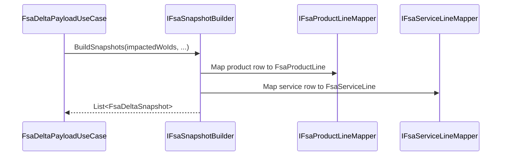

# FSA Snapshot Builder Feature Documentation

## Overview

The **FSA Snapshot Builder** defines how raw FSA (Field Service) product and service data is transformed into canonical domain snapshots for downstream delta payload generation. It centralizes the logic for grouping inventory, non-inventory, and service lines by work order and mapping JSON rows into strongly-typed models. This enables the delta orchestration use case to operate on a consistent, pre-mapped view of FSA data and focus on enrichment, comparison, and payload serialization.

Within the **Accrual Orchestrator**, the snapshot builder sits between the data-fetching layer (which retrieves JSON from Dataverse/OData) and the delta/enrichment pipelines. It ensures that all relevant line items are captured and correctly classified before any business-rule-driven delta calculations occur.

## Architecture Overview

```mermaid
flowchart TB
    subgraph CoreDomain [Core Domain]
        FsaDeltaSnapshot[FsaDeltaSnapshot]
        FsaProductLine[FsaProductLine]
        FsaServiceLine[FsaServiceLine]
    end
    subgraph ApplicationAbstractions [Application Abstractions]
        IFsaSnapshotBuilder[IFsaSnapshotBuilder]
    end
    subgraph ServicesMappers [Services Mappers]
        FsaSnapshotBuilder[FsaSnapshotBuilder]
    end
    subgraph UseCases [Use Cases]
        FsaDeltaPayloadUseCase[FsaDeltaPayloadUseCase]
    end

    IFsaSnapshotBuilder <|-- FsaSnapshotBuilder
    FsaSnapshotBuilder --> FsaProductLine
    FsaSnapshotBuilder --> FsaServiceLine
    FsaSnapshotBuilder --> FsaDeltaSnapshot
    FsaDeltaPayloadUseCase --> IFsaSnapshotBuilder
```

## Component Structure

### 2. Business Layer

#### **IFsaSnapshotBuilder** ✨

**Path:** `src/Rpc.AIS.Accrual.Orchestrator.Application/Ports/Common/Abstractions/IFsaSnapshotBuilder.cs`

Defines the contract for building domain snapshots from raw JSON payloads .

- **Purpose & Responsibilities**- Accept a list of impacted work order IDs, header mappings, raw product/service JSON, and enrichment maps.
- Return a collection of `FsaDeltaSnapshot` models ready for delta processing.

- **Key Method**

| Method | Description | Returns |
| --- | --- | --- |
| BuildSnapshots | Generate snapshots grouping inventory, non-inventory, and service lines by work order | `IReadOnlyList<FsaDeltaSnapshot>` |


```csharp
IReadOnlyList<FsaDeltaSnapshot> BuildSnapshots(
    IReadOnlyList<Guid> impactedWoIds,
    Dictionary<Guid, string> woNumberById,
    JsonDocument woProducts,
    JsonDocument woServices,
    Dictionary<Guid, string> productTypeById,
    Dictionary<Guid, string?> itemNumberById);
```

#### **FsaSnapshotBuilder**

**Path:** `src/Rpc.AIS.Accrual.Orchestrator.Application/Features/Delta/FsaDeltaPayload/Services/Mappers/FsaSnapshotBuilder.cs`

Concrete implementation of `IFsaSnapshotBuilder` that leverages product and service mappers to populate domain snapshots .

- **Responsibilities**- Initialize empty lists per work order.
- Parse the `value` arrays in `woProducts` and `woServices`.
- For each product row:- Extract `workorder` GUID.
- Invoke `IFsaProductLineMapper.Map(...)`.
- Classify into inventory or non-inventory.
- For each service row:- Extract `workorder` GUID.
- Invoke `IFsaServiceLineMapper.Map(...)`.
- Add to service lines.
- Construct and return a list of `FsaDeltaSnapshot` records.

- **Dependencies**- **IFsaProductLineMapper**: maps JSON product rows to `FsaProductLine`.
- **IFsaServiceLineMapper**: maps JSON service rows to `FsaServiceLine`.

---

### 3. Data Models

#### **FsaDeltaSnapshot** 🔍

Defined in `src/Rpc.AIS.Accrual.Orchestrator.Domain/Domain/FsaDeltaDtos.cs`, this record captures all line-level data for a work order .

| Property | Type | Description |
| --- | --- | --- |
| WorkOrderNumber | string | External name/number of the work order |
| WorkOrderId | Guid | Unique identifier of the work order |
| InventoryProducts | IReadOnlyList\<FsaProductLine\> | Lines treated as inventory journals |
| NonInventoryProducts | IReadOnlyList\<FsaProductLine\> | Lines treated as non-inventory (expense) journals |
| ServiceLines | IReadOnlyList\<FsaServiceLine\> | Service line entries |
| Header | WoHeaderMappingFields? | Optional header fields injected post-snapshot |


#### **FsaProductLine** & **FsaServiceLine**

Contain detailed line item attributes (quantity, pricing, description, discount, location, etc.) and are produced by the respective mappers .

---

## Feature Flow

### 1. Snapshot Building Flow



---

## Integration Points

- **FsaDeltaPayloadUseCase**

Injects `IFsaSnapshotBuilder` to generate snapshots before running enrichment and delta comparison .

- **DeltaPayloadBuilder**

Serializes `FsaDeltaSnapshot` instances into the outbound JSON contract for downstream FSCM processing.

---

## Key Classes Reference

| Class | Location | Responsibility |
| --- | --- | --- |
| IFsaSnapshotBuilder | `src/.../Ports/Common/Abstractions/IFsaSnapshotBuilder.cs` | Defines build contract for FSA snapshots |
| FsaSnapshotBuilder | `src/.../Features/Delta/FsaDeltaPayload/Services/Mappers/FsaSnapshotBuilder.cs` | Implements snapshot mapping logic |
| FsaDeltaSnapshot | `src/.../Domain/Domain/FsaDeltaDtos.cs` | Domain record for per-work order snapshot used in delta flows |


---

## Dependencies

- **System.Text.Json** – JSON parsing via `JsonDocument` and `JsonElement`.
- **IFsaProductLineMapper** & **IFsaServiceLineMapper** – mapping abstractions for product and service rows.
- **Rpc.AIS.Accrual.Orchestrator.Core.Domain** – domain models (`FsaDeltaSnapshot`, `FsaProductLine`, `FsaServiceLine`).