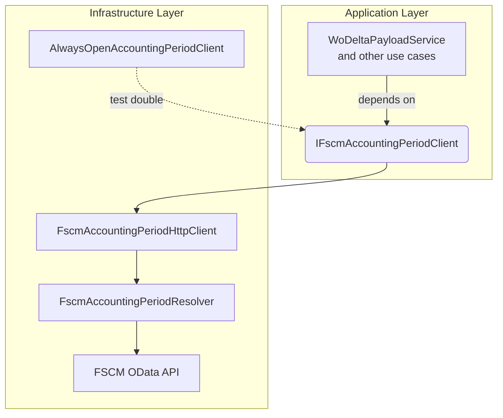

# FSCM Accounting Period Client Feature Documentation

## Overview

The **FSCM Accounting Period Client** abstraction defines a contract for fetching an accounting period snapshot used in delta and reversal logic. This snapshot encapsulates the current open period, window bounds, and functions to classify dates as open or closed and to resolve effective transaction dates. By decoupling the application logic from the underlying HTTP/OData details, the interface enables:

- Consistent period resolution across features.
- Swappable implementations for testing or alternative endpoints.
- Safe classification of closed-period activities for reversal planning.

## Architecture Overview

## Component Structure

### Application Layer Port

#### IFscmAccountingPeriodClient (src/Rpc.AIS.Accrual.Orchestrator.Application/Ports/Common/Abstractions/IFscmAccountingPeriodClient.cs)

- Purpose: Define FSCM accounting-period client behavior for use cases and services.
- Key Method:

| Method | Description | Returns |
| --- | --- | --- |
| GetSnapshotAsync | Retrieves an `AccountingPeriodSnapshot` given a `RunContext` and token | `Task<AccountingPeriodSnapshot>` |

### Data Access Layer

#### FscmAccountingPeriodHttpClient (src/Rpc.AIS.Accrual.Orchestrator.Infrastructure/Adapters/Fscm/Clients/FscmAccountingPeriodHttpClient.cs)

- Purpose: Thin facade implementing `IFscmAccountingPeriodClient`, delegating all logic to `FscmAccountingPeriodResolver`.
- Responsibilities:- Validate constructor arguments.
- Instantiate `FscmAccountingPeriodResolver`.
- Forward `GetSnapshotAsync` calls.

#### AlwaysOpenAccountingPeriodClient (tests/Rpc.AIS.Accrual.Orchestrator.Tests/TestDoubles/AlwaysOpenAccountingPeriodClient.cs)

- Purpose: Test double that returns an “always open” snapshot.
- Behavior:- `CurrentOpenPeriodStartDate` is today.
- All dates are treated as open.
- Snapshot window spans ±1 year.

## Data Models

### AccountingPeriodSnapshot

Represents the resolved period context for delta/reversal logic.

| Property | Type | Description |
| --- | --- | --- |
| CurrentOpenPeriodStartDate | `DateTime` | Start of the current open period. |
| ClosedReversalDateStrategy | `string` | Name of the strategy used when reversing closed-period transactions. |
| SnapshotMinDate | `DateTime` | Lower bound of the period snapshot window. |
| SnapshotMaxDate | `DateTime` | Upper bound of the period snapshot window. |
| IsDateInClosedPeriodAsync | `Func<DateTime, CancellationToken, ValueTask<bool>>` | Async check: is a given date in a closed period? |
| ResolveTransactionDateUtcAsync | `Func<DateTime, CancellationToken, ValueTask<DateTime>>` | Async resolver: maps an ops date to the effective transaction date. |

#### Helper Methods

- `IsDateInClosedPeriod(DateTime)` – synchronous wrapper.
- `ResolveTransactionDateUtc(DateTime)` – synchronous wrapper. fileciteturn5file?

## Integration Points

- **WoDeltaPayloadService**, **PayloadPostingDateAdjuster**, and other services inject `IFscmAccountingPeriodClient` to classify and adjust journal lines based on FSCM period status.
- In DI setup, `FscmAccountingPeriodHttpClient` is registered for `IFscmAccountingPeriodClient`.

## Key Classes Reference

| Class | Location | Responsibility |
| --- | --- | --- |
| IFscmAccountingPeriodClient | src/Rpc.AIS.Accrual.Orchestrator.Application/Ports/Common/Abstractions/IFscmAccountingPeriodClient.cs | Port for fetching period snapshots |
| FscmAccountingPeriodHttpClient | src/Rpc.AIS.Accrual.Orchestrator.Infrastructure/Adapters/Fscm/Clients/FscmAccountingPeriodHttpClient.cs | HTTP client facade implementing the port |
| FscmAccountingPeriodResolver | src/Rpc.AIS.Accrual.Orchestrator.Infrastructure/Adapters/Fscm/Clients/FscmAccountingPeriodResolver.cs | Core logic for OData query building, parsing, caching |
| AlwaysOpenAccountingPeriodClient | tests/Rpc.AIS.Accrual.Orchestrator.Tests/TestDoubles/AlwaysOpenAccountingPeriodClient.cs | Test double that treats all periods as open |
| AccountingPeriodSnapshot | src/Rpc.AIS.Accrual.Orchestrator.Core/Domain/Delta/AccountingPeriodSnapshot.cs | Data model carrying period context and delegates |
