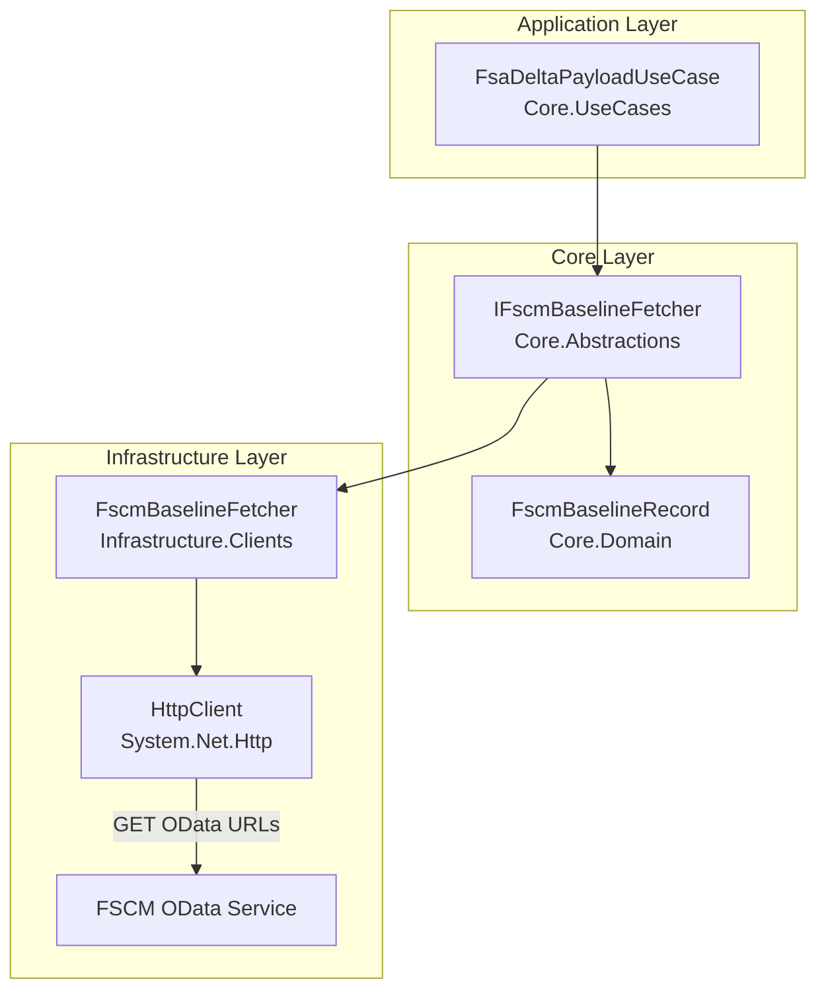
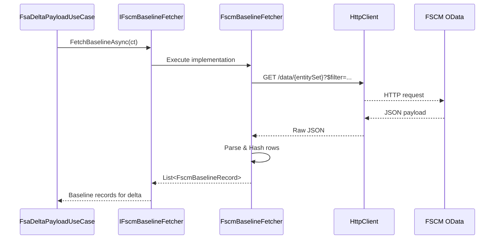

# Baseline Fetch Feature Documentation

## Overview

The Baseline Fetch feature retrieves a **snapshot of existing FSCM records** to establish a starting point (“baseline”) for delta calculations. This baseline consists of work‐order line records (items, expenses, hours) fetched from one or more OData entity sets.

By hashing raw JSON rows and tracking journal types, the system can later compare incoming Field Service (FSA) data against this baseline to identify additions, changes, or reversals.

This abstraction decouples delta logic from HTTP details, allowing the `FsaDeltaPayloadUseCase` to focus solely on comparison and payload construction.

## Architecture Overview



## Component Structure

### 1. Core.Abstractions

#### **IFscmBaselineFetcher**

`src/Rpc.AIS.Accrual.Orchestrator.Core.Abstractions/IFscmBaselineFetcher.cs`

Defines the contract for fetching FSCM baseline records.

| Method | Description | Returns |
| --- | --- | --- |
| FetchBaselineAsync(ct) | Fetches baseline records from configured OData entity sets. | `Task<IReadOnlyList<FscmBaselineRecord>>` |


### 2. Core.Domain

#### **FscmBaselineRecord**

Represents a single baseline line from FSCM.

| Property | Type | Description |
| --- | --- | --- |
| WorkOrderNumber | string | The work order identifier from FSCM (e.g., “WO12345”). |
| JournalType | string | Derived journal type: “Item”, “Expense”, or “Hour”. |
| LineKey | string | Unique key combining entity set name and hash prefix (first 12 characters). |
| Hash | string | Full SHA256 hex digest of the raw JSON row. |


### 3. Infrastructure.Clients

#### **FscmBaselineFetcher**  🎯

`src/Rpc.AIS.Accrual.Orchestrator.Infrastructure.Clients/FscmBaselineFetcher.cs`

Implements `IFscmBaselineFetcher` using `HttpClient` to call FSCM OData endpoints.

**Dependencies**

- `HttpClient _http`
- `IOptions<FscmOptions> _opt`
- `ILogger<FscmBaselineFetcher> _log`

**Behavior**

1. **Check feature toggle**- If `BaselineEnabled` is `false`, logs and returns an empty list.
2. **Validate configuration**- Throws if `BaselineODataBaseUrl` is missing or empty.
3. **Fetch per entity set**- For each name in `BaselineEntitySets`, constructs URL:

```csharp
     var url = $"{baseUrl}{set}" +
               (!string.IsNullOrWhiteSpace(filter)
                   ? $"?$filter={Uri.EscapeDataString(filter)}"
                   : "");
```

- Logs start, performs `GET`, logs response status and size.
- Parses JSON; for each element with `"WorkOrderId"`, extracts the work order number.
- Computes SHA256 hex of the raw JSON and creates a `FscmBaselineRecord`.

**Key Helpers**

- `JournalTypeFromSet(string set)`

```csharp
  set.ToLowerInvariant().Contains("hour")   ? "Hour" :
  set.ToLowerInvariant().Contains("expense")? "Expense" : "Item";
```

- `Sha256Hex(string s)`

```csharp
  using var sha = SHA256.Create();
  var bytes = sha.ComputeHash(Encoding.UTF8.GetBytes(s));
  return Convert.ToHexString(bytes).ToLowerInvariant();
```

```csharp
public async Task<IReadOnlyList<FscmBaselineRecord>> FetchBaselineAsync(CancellationToken ct)
{
    var o = _opt.Value;
    if (!o.BaselineEnabled)
    {
        _log.LogInformation("FSCM baseline fetch disabled.");
        return Array.Empty<FscmBaselineRecord>();
    }
    // ...details omitted for brevity...
    return results;
}
```

## Integration Points

- **Consumption**: Injected into `FsaDeltaPayloadUseCase` to supply historic data before delta comparison.
- **Configuration**: Properties `BaselineEnabled`, `BaselineODataBaseUrl`, `BaselineEntitySets`, and `BaselineInProgressFilter` are sourced from `FscmOptions`.

```csharp
public sealed class FsaDeltaPayloadUseCase : IFsaDeltaPayloadUseCase
{
    private readonly IFscmBaselineFetcher _baseline;
    public FsaDeltaPayloadUseCase(..., IFscmBaselineFetcher baseline, ...) 
    { _baseline = baseline; }
    // ...
}
```

## Usage Flow



## Important Notes

```card
{
    "title": "Baseline Toggle",
    "content": "If BaselineEnabled is false, FetchBaselineAsync returns an empty list and logs 'FSCM baseline fetch disabled.'"
}
```

```card
{
    "title": "Hash Key Format",
    "content": "LineKey uses the entity set name and the first 12 characters of the SHA256 hex of the raw JSON row."
}
```

## Key Classes Reference

| Class | Location | Responsibility |
| --- | --- | --- |
| IFscmBaselineFetcher | Core.Abstractions/IFscmBaselineFetcher.cs | Abstraction for fetching FSCM baseline records |
| FscmBaselineRecord | Core/Domain (sealed record) | Data model for a single baseline journal line |
| FscmBaselineFetcher | Infrastructure.Clients/FscmBaselineFetcher.cs | HttpClient‐based implementation of baseline retrieval |
