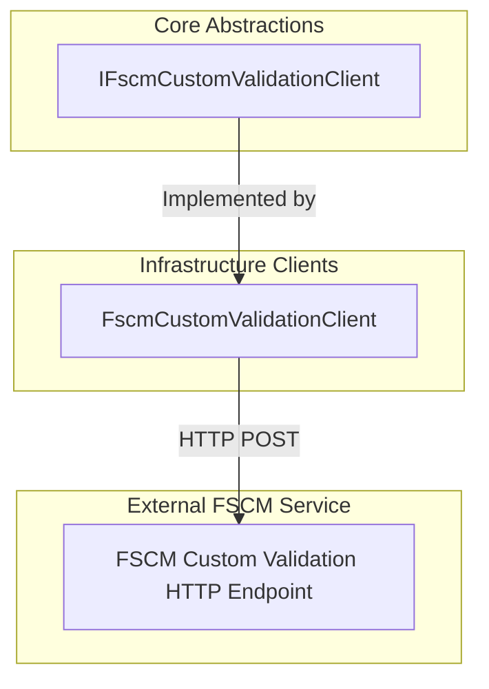

# FSCM Custom Validation Client Feature Documentation

## Overview 🔍

The **FSCM Custom Validation Client** defines a contract for invoking a remote FSCM service to validate AIS work order payloads. It runs  local contract checks and returns structured validation failures. This ensures that any business-specific rules enforced by FSCM are applied before processing work orders.

## Architecture Overview 🏛️



## Component Structure

### Abstraction Interface

#### **IFscmCustomValidationClient**

**Location:** `src/Rpc.AIS.Accrual.Orchestrator.Application/Ports/Common/Abstractions/IFscmCustomValidationClient.cs`

- **Doc Summary:**

```csharp
  /// Calls the FSCM custom validation endpoint for an AIS Work Order payload.
  /// This is a remote validation step that runs AFTER AIS local contract checks.
```

- **Purpose:**

Defines a reusable abstraction for performing remote validation of AIS work order JSON against FSCM-specific rules.

- **Dependencies:**- `RunContext`
- `JournalType`
- `WoPayloadValidationFailure`
- `ValidationDisposition`
- `System.Threading`, `System.Threading.Tasks`, `System.Collections.Generic`

#### Methods

| Method | Description | Returns |
| --- | --- | --- |
| `ValidateAsync(RunContext context, JournalType journalType, string company, string woPayloadJson, CancellationToken ct)` | Sends the work order payload JSON to the FSCM custom validation endpoint and returns any validation failures. | `Task<IReadOnlyList<WoPayloadValidationFailure>>` |


##### Method Signature

```csharp
Task<IReadOnlyList<WoPayloadValidationFailure>> ValidateAsync(
    RunContext context,
    JournalType journalType,
    string company,
    string woPayloadJson,
    CancellationToken ct);
```

### Implementation Reference

- **Class:** `FscmCustomValidationClient`
- **Location:** `src/Rpc.AIS.Accrual.Orchestrator.Infrastructure/Adapters/Fscm/Clients/FscmCustomValidationClient.cs`
- **Role:**- Injects `HttpClient`, logging, and validation policy options.
- Constructs an HTTP POST to the configured endpoint path (e.g. `/api/services/AIS/Validate`).
- Parses response JSON for common failure shapes or returns appropriate dispositions on transport errors.

## Key Classes Reference

| Class | Location | Responsibility |
| --- | --- | --- |
| `IFscmCustomValidationClient` | `Application/Ports/Common/Abstractions/IFscmCustomValidationClient.cs` | Defines the contract for remote FSCM custom validation. |
| `FscmCustomValidationClient` | `Infrastructure/Adapters/Fscm/Clients/FscmCustomValidationClient.cs` | Implements the interface; executes HTTP calls and parses validation result. |


## Integration Points

- **Validation Pipeline:**

The interface is consumed by `FscmReferenceValidator` to apply remote failures within the work order validation pipeline.

- **Dependency Injection:**

Registered in `Functions/Program.cs` via:

```csharp
  services.AddHttpClient<FscmCustomValidationClient>(...)
          .AddHttpMessageHandler<FscmAuthHandler>();
  services.AddSingleton<IFscmCustomValidationClient>(
      sp => sp.GetRequiredService<FscmCustomValidationClient>());
```

## Error Handling ⚠️

- **Transport failures** (non-2xx HTTP or exceptions) must  throw; they should surface as `WoPayloadValidationFailure` entries.
- The returned failures carry a **ValidationDisposition**:- **Retryable**: for transient issues when `FailClosedOnFscmCustomValidationError` is `false`.
- **FailFast**: when policy mandates closing on validation errors.
- Implementers reserve throwing only for true programmer errors (e.g., null arguments).

## Dependencies

- Rpc.AIS.Accrual.Orchestrator.Core.Domain
- Rpc.AIS.Accrual.Orchestrator.Core.Domain.Validation
- Microsoft.Extensions.Logging
- Microsoft.Extensions.Options
- System.Collections.Generic
- System.Threading
- System.Threading.Tasks