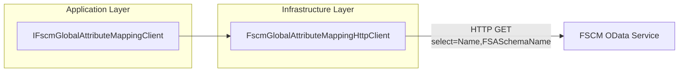

# Global Attribute Mapping Feature Documentation

## Overview 🌐

The **Global Attribute Mapping** feature provides a runtime dictionary that translates FSA attribute keys into the corresponding FSCM attribute names.  It enables the orchestrator to dynamically map attributes from the Dataverse (FSA) payload to the correct fields in FSCM during invoice attribute synchronization and delta calculations.  By sourcing definitions from the `AttributeTypeGlobalAttributes` OData entity set, this component centralizes mapping logic and removes hard-coded field names from business services.

## Architecture Overview



## Component Structure

### 1. Application Layer Abstraction

#### IFscmGlobalAttributeMappingClient

Location: `src/Rpc.AIS.Accrual.Orchestrator.Core.Abstractions/IFscmGlobalAttributeMappingClient.cs`

Defines the contract for retrieving an in-memory mapping between FSA schema names and FSCM attribute names.

```csharp
public interface IFscmGlobalAttributeMappingClient
{
    /// Returns a dictionary where:
    /// - Key:   FSA attribute key (AttributeTypeGlobalAttributes.FSA)
    /// - Value: FSCM attribute name (AttributeTypeGlobalAttributes.Name)
    Task<IReadOnlyDictionary<string, string>> GetFsToFscmNameMapAsync(
        RunContext ctx,
        CancellationToken ct);
}
```

| Method | Description | Returns |
| --- | --- | --- |
| GetFsToFscmNameMapAsync(RunContext, ct) | Fetches and caches the mapping from FSCM OData; key=FSA, value=FSCM. | `IReadOnlyDictionary<string, string>` |


### 2. Infrastructure Layer Implementation

#### FscmGlobalAttributeMappingHttpClient

Location: `src/Rpc.AIS.Accrual.Orchestrator.Infrastructure/Clients/FscmGlobalAttributeMappingHttpClient.cs`

Implements the abstraction by calling FSCM’s OData API and parsing the JSON payload into an in-memory dictionary.

- **Dependencies**- `HttpClient` for HTTP transport
- `FscmOptions` for endpoint configuration
- `IResilientHttpExecutor` for retry and resilience policies
- `ILogger<FscmGlobalAttributeMappingHttpClient>` for telemetry

- **Key Responsibilities**- Build the OData URL (entity set configurable via options)
- Log request start/end, including elapsed time
- Execute HTTP GET with resilience
- Parse the response body for `value` array
- Extract `FSASchemaName` and `Name` from each record
- Return a case-insensitive dictionary mapping FSA→FSCM

```csharp
public async Task<IReadOnlyDictionary<string, string>> GetFsToFscmNameMapAsync(
    RunContext ctx,
    CancellationToken ct)
{
    ct.ThrowIfCancellationRequested();
    var baseUrl = FscmUrlBuilder.ResolveFscmBaseUrl(_opt, null, "FscmBaseUrl");
    var entity = string.IsNullOrWhiteSpace(_opt.AttributeTypeGlobalAttributesEntitySet)
        ? "AttributeTypeGlobalAttributes"
        : _opt.AttributeTypeGlobalAttributesEntitySet;
    var fullUrl = $"{FscmUrlBuilder.BuildUrl(baseUrl, $"/data/{entity}")}?$select=Name,FSASchemaName";

    _logger.LogInformation(
        "FSCM fetch: GET {Url} (runId={RunId}, corrId={CorrId})",
        fullUrl, ctx.RunId, ctx.CorrelationId);

    var resp = await _executor.SendAsync(
        _http,
        () => new HttpRequestMessage(HttpMethod.Get, fullUrl),
        ctx,
        operationName: "FSCM_ATTRIBUTE_TYPE_GLOBAL_ATTRIBUTES",
        ct).ConfigureAwait(false);

    var body = await resp.Content.ReadAsStringAsync(ct).ConfigureAwait(false);
    if (!resp.IsSuccessStatusCode)
        return new Dictionary<string, string>(StringComparer.OrdinalIgnoreCase);

    var map = new Dictionary<string, string>(StringComparer.OrdinalIgnoreCase);
    using var doc = JsonDocument.Parse(body);
    if (doc.RootElement.TryGetProperty("value", out var arr) && arr.ValueKind == JsonValueKind.Array)
    {
        foreach (var row in arr.EnumerateArray())
        {
            if (row.TryGetProperty("FSASchemaName", out var fsaEl) &&
                row.TryGetProperty("Name", out var nameEl) &&
                fsaEl.ValueKind == JsonValueKind.String &&
                nameEl.ValueKind == JsonValueKind.String)
            {
                var fsaKey   = fsaEl.GetString()!.Trim();
                var fscmName = nameEl.GetString()!.Trim();
                if (fsaKey.Length > 0 && fscmName.Length > 0)
                    map[fsaKey] = fscmName;
            }
        }
    }

    _logger.LogInformation(
        "Loaded mapping: count={Count} elapsedMs={ElapsedMs}",
        map.Count, /* elapsed from Stopwatch */);

    return map;
}
```

## Dependencies & Relationships

| Component | Interface/Class | Purpose |
| --- | --- | --- |
| Application Layer Abstraction | `IFscmGlobalAttributeMappingClient` | Defines mapping contract |
| Infrastructure Layer Implementation | `FscmGlobalAttributeMappingHttpClient` | Fetches and parses mapping from FSCM OData |
| Configuration | `FscmOptions` | Holds base URLs and entity set names |
| Resilience | `IResilientHttpExecutor` | Applies retry, timeout, and circuit-breaker logic |
| Logging | `ILogger<T>` | Records diagnostic and performance metrics |


## Important Notes 🗺️

```card
{
    "title": "Runtime Caching",
    "content": "Once fetched, the mapping is held in memory for the duration of the run to avoid repeated OData calls."
}
```

- The client returns an **empty** dictionary on non-success status codes, allowing callers to fallback to any static or configuration-based mapping.
- Entity set name is configurable via `FscmOptions.AttributeTypeGlobalAttributesEntitySet`; defaults to `"AttributeTypeGlobalAttributes"` if unspecified.
- Key comparison is **case-insensitive**, ensuring robust lookups across varying naming conventions.

## Summary

The `IFscmGlobalAttributeMappingClient` abstraction and its HTTP implementation decouple mapping logic from business workflows.  By centralizing attribute name resolution, the orchestrator maintains flexibility across different FSCM deployments and schema variations, while keeping business services focused on core domain logic.