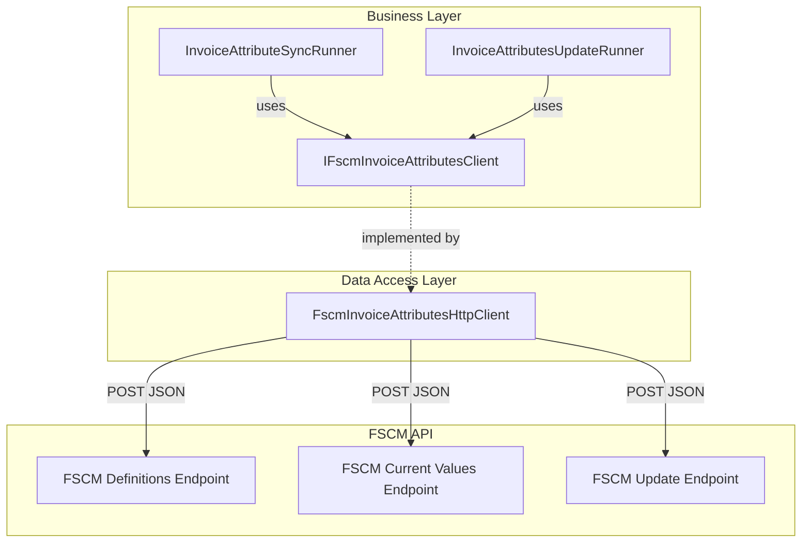

# IFscmInvoiceAttributesClient Feature Documentation

## Overview

The **IFscmInvoiceAttributesClient** abstraction centralizes interactions with custom FSCM invoice attribute endpoints. It supports three core operations:

- **Definitions**: Retrieves the schema of available invoice attributes for a given company and sub-project.
- **Current Values**: Fetches a snapshot of attribute values currently set in FSCM.
- **Updates**: Submits changes to one or more invoice attributes on a specific work order.

By defining a clear contract, this interface decouples business logic (e.g., sync runners) from HTTP or transport details, enabling easy substitution or testing. It underpins the orchestration of invoice-attribute syncing in the accrual pipeline .

## Architecture Overview

## Component Structure

### 1. Business Layer

#### IFscmInvoiceAttributesClient (src/Rpc.AIS.Accrual.Orchestrator.Application/Ports/Common/Abstractions/IFscmInvoiceAttributesClient.cs)

- **Purpose**: Defines the contract for fetching and updating invoice attributes in FSCM.
- **Methods**:

| Method | Description | Returns |
| --- | --- | --- |
| GetDefinitionsAsync | Retrieve attribute definitions for a sub-project. | `IReadOnlyList<InvoiceAttributeDefinition>` |
| GetCurrentValuesAsync | Fetch current values for specified attribute names. | `IReadOnlyList<InvoiceAttributePair>` |
| UpdateAsync | Submit updates to invoice attributes on a work order. | `FscmInvoiceAttributesUpdateResult` |

All methods require a `RunContext`, `company` and `subProjectId` identifiers, and observe cancellation via `CancellationToken` .

### 2. Data Access Layer

#### FscmInvoiceAttributesHttpClient (src/Rpc.AIS.Accrual.Orchestrator.Infrastructure/Adapters/Fscm/Clients/FscmInvoiceAttributesHttpClient.cs)

- **Implements**: `IFscmInvoiceAttributesClient` using `HttpClient`.
- **Dependencies**:- `FscmOptions` for base URL and path configuration
- `IAisLogger` & `IAisDiagnosticsOptions` for structured payload logging
- `ILogger<FscmInvoiceAttributesHttpClient>` for standard tracing

| Method | API Operation | Description | Logging & Error Handling |
| --- | --- | --- | --- |
| GetDefinitionsAsync | POST to `{BaseUrl}/{DefinitionsPath}` | Fetch attribute definitions | Logs request/response; returns empty list on non-success or parse failure |
| GetCurrentValuesAsync | POST to `{BaseUrl}/{ValuesPath}` | Fetch attribute values snapshot | Parses array or object responses; warns and returns empty on failure |
| UpdateAsync | POST to `{BaseUrl}/{UpdatePath}` | Apply updates for a specific work order | Logs envelope and outcome; throws on auth/transport errors |

## Data Models

#### InvoiceAttributeDefinition

Represents a minimal schema entry from the FSCM “attribute table.”

| Property | Type | Description |
| --- | --- | --- |
| AttributeName | string | Logical name of the attribute in FSCM. |
| Type | string? | Optional data type or metadata hint. |
| Active | bool | Indicates if the attribute is enabled. |

#### InvoiceAttributePair

Encapsulates a name/value pair for FSCM endpoints.

| Property | Type | Description |
| --- | --- | --- |
| AttributeName | string | FSCM attribute name (schema field). |
| AttributeValue | string? | The current or new attribute value. |

#### FscmInvoiceAttributesUpdateResult

Summarizes the result of an update operation.

| Property | Type | Description |
| --- | --- | --- |
| IsSuccess | bool | `true` if HTTP status code was 2xx. |
| HttpStatus | int | The HTTP response status code from FSCM. |
| Body | string? | Raw response body for diagnostics or error detail. |

## Key Classes Reference

| Class | Location | Responsibility |
| --- | --- | --- |
| IFscmInvoiceAttributesClient | src/Rpc.AIS.Accrual.Orchestrator.Application/Ports/Common/Abstractions/IFscmInvoiceAttributesClient.cs | Defines invoice attribute operations contract. |
| FscmInvoiceAttributesHttpClient | src/Rpc.AIS.Accrual.Orchestrator.Infrastructure/Adapters/Fscm/Clients/FscmInvoiceAttributesHttpClient.cs | Concrete HTTP implementation of the interface. |
| InvoiceAttributeDefinition | src/Rpc.AIS.Accrual.Orchestrator.Core.Domain/InvoiceAttributes/InvoiceAttributeDefinition.cs | Domain model for attribute definitions. |
| InvoiceAttributePair | src/Rpc.AIS.Accrual.Orchestrator.Core.Domain/InvoiceAttributes/InvoiceAttributePair.cs | Domain model for name/value attribute pairs. |
| RuntimeInvoiceAttributeMapper | src/Rpc.AIS.Accrual.Orchestrator.Core.Services/InvoiceAttributes/RuntimeInvoiceAttributeMapper.cs | Builds FS→FSCM key mappings at runtime. |

## Error Handling

- **Argument Validation**: All methods validate inputs and throw `ArgumentNullException` or `ArgumentException` for missing context or identifiers.
- **HTTP Failures**:- 4xx responses log warnings and return empty results (definitions/values).
- 401/403 produce `UnauthorizedAccessException`.
- 429 or 5xx produce `HttpRequestException` for transient retries.
- 5xx also trigger error logs capturing the response body for diagnostics.

## Dependencies

- **Microsoft.Extensions.Logging**: Structured logging of operations and metrics.
- **System.Text.Json**: JSON serialization/deserialization of request/response payloads.
- **FscmOptions**: Holds base URLs and endpoint paths, configured via DI.
- **IAisLogger / IAisDiagnosticsOptions**: App-Insights integration for large payloads.

## Testing Considerations

Integration tests (`FscmInvoiceAttributesHttpClientContractTests`) assert that `UpdateAsync` constructs the correct JSON envelope and targets the configured path, ensuring contract fidelity with FSCM . Tests should also cover:

- Handling of empty or missing endpoint configuration (skipping logic).
- Parsing of both array and object responses in `GetCurrentValuesAsync`.
- Retry and exception pathways for transient errors.

---

This documentation covers all elements defined in **IFscmInvoiceAttributesClient** and its related domain models, implementations, and integration points within the FSCM invoice attribute feature.