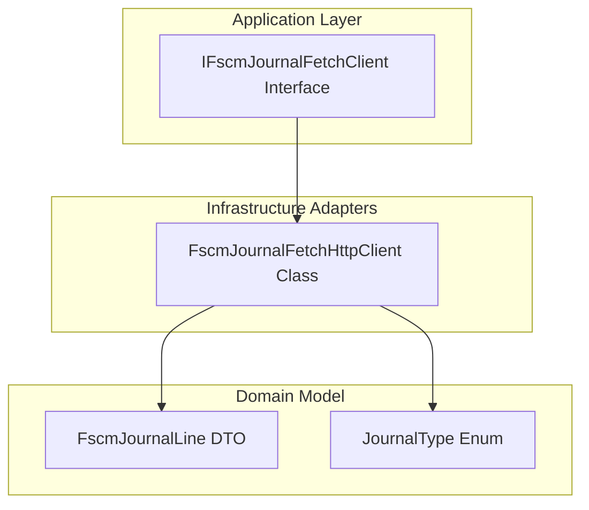

# 🎯 FSCM Journal Fetch Client Feature Documentation

## Overview

The **FSCM Journal Fetch Client** defines a contract for retrieving journal lines from the FSCM OData service based on Work Order GUIDs. It enables the Accrual Orchestrator to fetch normalized `FscmJournalLine` data for delta calculations, grouping by WorkOrderLineId.

This abstraction decouples business logic from HTTP details and enforces chunking to avoid OData URL‐length limits .

## Architecture Overview



## Component Structure

### Interface: IFscmJournalFetchClient

**Location:** `src/Rpc.AIS.Accrual.Orchestrator.Core.Abstractions/IFscmJournalFetchClient.cs`

Defines a port for fetching FSCM journal lines by Work Order GUIDs. Implementations must handle batching (chunking) of GUID lists to prevent OData URL‐length or parsing errors .

#### Method Reference

| Method | Parameters | Returns | Description |
| --- | --- | --- | --- |
| FetchByWorkOrdersAsync | • `RunContext context` <br> • `JournalType journalType` <br> • `IReadOnlyCollection<Guid> workOrderIds` <br> • `CancellationToken ct` | `Task<IReadOnlyList<FscmJournalLine>>` | Retrieves journal lines for the specified work orders and journal type, using OR-filter batching. |


```csharp
Task<IReadOnlyList<FscmJournalLine>> FetchByWorkOrdersAsync(
    RunContext context,
    JournalType journalType,
    IReadOnlyCollection<Guid> workOrderIds,
    CancellationToken ct
);
```

### Implementation Snapshot

- **FscmJournalFetchHttpClient**

Implements `IFscmJournalFetchClient` using `HttpClient`, OData queries, and type-specific fetch policies. It:

- Builds batched OData URLs.
- Applies retry and fallback on missing‐field errors.
- Maps JSON rows into `FscmJournalLine` instances .

## Usage Scenario 🛠️

- The Orchestrator’s **Delta Payload Service** calls `FetchByWorkOrdersAsync` per journal type (Item, Expense, Hour).
- Fetch client returns all matching lines, grouped later by `WorkOrderLineId`.
- Delta engine computes reversals or creations based on historical vs. current quantities.

## Dependencies

- **RunContext**: Carries execution metadata (`RunId`, `CorrelationId`).
- **JournalType**: Enum indicating the type of journal (Item/Expense/Hour).
- **FscmJournalLine**: Domain DTO representing a normalized FSCM journal entry.

## Important Note

```card
{
    "title": "Chunking Requirement",
    "content": "Implementations MUST batch workOrderIds to avoid OData URL-length and parsing limits."
}
```

## See Also

| Component | Description |
| --- | --- |
| FscmJournalFetchHttpClient | HTTP-based adapter for `IFscmJournalFetchClient` |
| IFscmJournalFetchPolicy | Defines per-type select lists and mapping rules |
| FscmJournalFetchPolicyResolver | Resolves the correct policy for a given `JournalType` |
