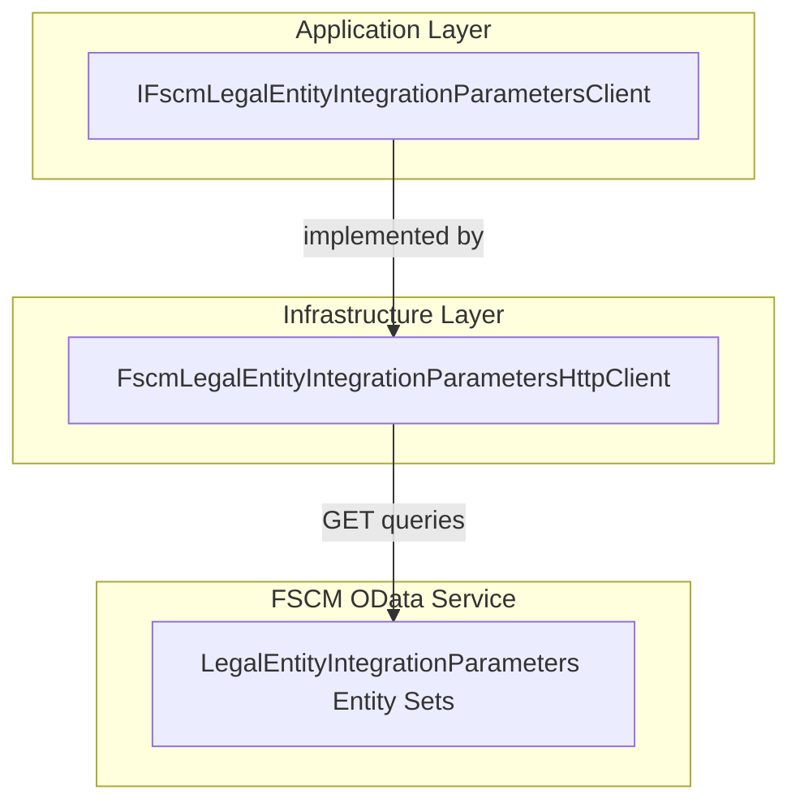

# FSCM Legal Entity Integration Parameters Feature Documentation

## Overview

🎯 The **FSCM Legal Entity Integration Parameters** feature enables the orchestration layer to retrieve journal name identifiers configured per legal entity (DataAreaId) from the FSCM system. This allows downstream processes—such as payload enrichment and journal posting—to inject the correct journal names into outbound work order JSON.

By abstracting access behind an interface, the application layer remains decoupled from transport details and can use resilient HTTP policies in the infrastructure layer. This improves maintainability and testability while ensuring consistent error handling and retry behavior.

## Architecture Overview



## Component Structure

### 3. Data Access Layer

#### **IFscmLegalEntityIntegrationParametersClient** (`src/Rpc.AIS.Accrual.Orchestrator.Application/Ports/Common/Abstractions/IFscmLegalEntityIntegrationParametersClient.cs`)

- **Purpose**: Defines a contract for fetching journal name identifiers for a given legal entity (DataAreaId).
- **Key Method**:

```csharp
Task<LegalEntityJournalNames> GetJournalNamesAsync(
    RunContext ctx,
    string dataAreaId,
    CancellationToken ct);
```

#### **FscmLegalEntityIntegrationParametersHttpClient** (`src/Rpc.AIS.Accrual.Orchestrator.Infrastructure/Adapters/Fscm/Clients/FscmLegalEntityIntegrationParametersHttpClient.cs`)

- **Implements**: `IFscmLegalEntityIntegrationParametersClient`
- **Responsibilities**:- Builds OData URLs based on configured entity sets.
- Executes resilient HTTP GET calls with logging and retry policies.
- Parses JSON payloads, handling variations in column and entity set names.
- Returns a `LegalEntityJournalNames` instance or a default if no records are found.
- **Implementation Highlights**:- Tries preferred entity set `RPCLegalEntityIntegrationParametersBaseIntParams`, falls back to legacy `LegalEntityIntegrationParametersBaseIntParamTables`.
- Selects both old and new column names and coalesces at mapping time.

## Data Models

### LegalEntityJournalNames

| Property | Type | Description |
| --- | --- | --- |
| ExpenseJournalNameId | string? | Identifier for the expense journal. |
| HourJournalNameId | string? | Identifier for the hour journal. |
| InventJournalNameId | string? | Identifier for the inventory journal. |


### RunContext

| Property | Type | Description |
| --- | --- | --- |
| RunId | string | Unique identifier for this run. |
| StartedAtUtc | DateTimeOffset | Timestamp when the run began. |
| TriggeredBy | string? | Optional source of the trigger (e.g., scheduler, HTTP request). |
| CorrelationId | string | Correlation identifier for distributed tracing. |
| SourceSystem | string? | Optional source system name. |
| DataAreaId | string? | Optional default legal entity context. |


## Integration Points

- **FSA Delta Payload Use Case**

The interface is injected into `FsaDeltaPayloadUseCase` to enrich outbound JSON with journal names before posting to FSCM .

- **Enrichment Pipeline**

An enrichment step (`JournalNamesEnrichmentStep`) calls `GetJournalNamesAsync` to map each work order’s `Company` to its FSCM journal names.

## Key Classes Reference

| Class | Location | Responsibility |
| --- | --- | --- |
| IFscmLegalEntityIntegrationParametersClient | src/Rpc.AIS.Accrual.Orchestrator.Application/Ports/Common/Abstractions/IFscmLegalEntityIntegrationParametersClient.cs | Contract for fetching legal-entity journal names. |
| FscmLegalEntityIntegrationParametersHttpClient | src/Rpc.AIS.Accrual.Orchestrator.Infrastructure/Adapters/Fscm/Clients/FscmLegalEntityIntegrationParametersHttpClient.cs | HTTP client implementing the above interface with OData queries. |
| LegalEntityJournalNames | src/Rpc.AIS.Accrual.Orchestrator.Core.Domain/LegalEntityJournalNames.cs | Data model holding journal name identifiers per legal entity. |
| RunContext | src/Rpc.AIS.Accrual.Orchestrator.Core.Domain/RunContext.cs | Contextual metadata for each orchestration run. |


## Dependencies

- **Core Domain**:- `LegalEntityJournalNames`
- `RunContext`
- **Infrastructure**:- `HttpClient`
- `IResilientHttpExecutor` for retry/resilience
- `FscmOptions` for base URLs and paths
- `ILogger<T>` for structured logging

## Testing Considerations

- **Mocking**:

Unit tests can mock `IFscmLegalEntityIntegrationParametersClient` to simulate various journal-name scenarios without HTTP calls.

- **Error Scenarios**:- Invalid `dataAreaId` (null/empty) should throw `ArgumentException`.
- Null `RunContext` should throw `ArgumentNullException`.
- **Integration Tests**:

Use a stubbed HTTP server to validate OData query construction and JSON parsing logic in `FscmLegalEntityIntegrationParametersHttpClient`.