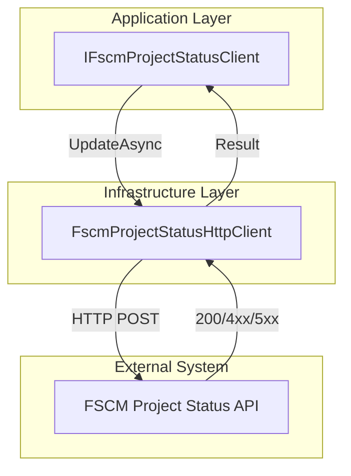
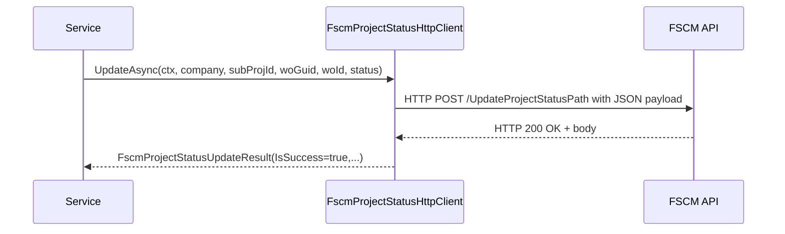

# FSCM Project Status Update Feature Documentation 🚀

## Overview

This feature provides a standardized way to update the status or stage of a project or subproject within the FSCM system. It defines an abstraction (`IFscmProjectStatusClient`) for triggering status updates and a concrete HTTP client (`FscmProjectStatusHttpClient`) to call the FSCM endpoint. Business components can depend on the interface without knowing HTTP details, ensuring loose coupling and testability.

## Architecture Overview



## Component Structure

### 1. Application Layer

#### **IFscmProjectStatusClient** (`src/Rpc.AIS.Accrual.Orchestrator.Application/Ports/Common/Abstractions/IFscmProjectStatusClient.cs`)

- **Purpose:** Defines the contract for updating FSCM project or subproject status.
- **Responsibilities:**- Expose preferred and legacy overloads for status updates.
- Return a `FscmProjectStatusUpdateResult` capturing success, HTTP code, and raw body.

| Method Signature | Description | Returns |
| --- | --- | --- |
| `Task<FscmProjectStatusUpdateResult> UpdateAsync(RunContext ctx, string company, string subProjectId, Guid workOrderGuid, string workOrderId, int status, CancellationToken ct)` | Preferred contract: update a specific work order within a subproject. | Update result |
| `Task<FscmProjectStatusUpdateResult> UpdateAsync(RunContext ctx, Guid subprojectId, string newStatus, CancellationToken ct)` | Legacy overload mapping GUID-only subproject IDs. | Update result |
| `Task<FscmProjectStatusUpdateResult> UpdateAsync(RunContext ctx, string company, string subProjectId, string newStatus, CancellationToken ct)` | Legacy overload for textual statuses like “Posted” or “Cancelled.” | Update result |


### 2. Infrastructure Layer

#### **FscmProjectStatusHttpClient** (`src/Rpc.AIS.Accrual.Orchestrator.Infrastructure/Adapters/Fscm/Clients/FscmProjectStatusHttpClient.cs`)

- **Purpose:** Implements `IFscmProjectStatusClient` by sending HTTP requests to the FSCM API.
- **Key Behaviors:**- Builds JSON payload under `_request.WOList` per FSCM contract.
- Adds headers (`x-run-id`, `x-correlation-id`).
- Logs request start/end with payload size and timing.
- Handles non-transient 4xx by wrapping in result; treats 401/403 as fatal; retries on 429/5xx via exception.

##### Constructor Parameters

| Parameter | Type | Description |
| --- | --- | --- |
| `http` | `HttpClient` | Base HTTP client with `BaseAddress` set to FSCM host. |
| `opt` | `IOptions<FscmOptions>` | Configuration containing `BaseUrl` and endpoint paths. |
| `log` | `ILogger<FscmProjectStatusHttpClient>` | Logs diagnostics and payload metadata. |


##### Methods

1. **Preferred Overload**

```csharp
   Task<FscmProjectStatusUpdateResult> UpdateAsync(
       RunContext ctx,
       string company,
       string subProjectId,
       Guid workOrderGuid,
       string workOrderId,
       int status,
       CancellationToken ct);
```

- Validates all parameters (throws `ArgumentException` on missing/invalid).
- Skips call and returns success if `UpdateProjectStatusPath` is not configured.
- Serializes:

```json
     {
       "_request": {
         "WOList": [
           {
             "Company": "<company>",
             "SubProjectId": "<subProjectId>",
             "WorkOrderGUID": "{<workOrderGuid>}",
             "WorkOrderID": "<workOrderId>",
             "Status": <status>
           }
         ]
       }
     }
```

- Sends HTTP POST to `BaseUrl/UpdateProjectStatusPath`.

1. **Legacy GUID Overload**

```csharp
   Task<FscmProjectStatusUpdateResult> UpdateAsync(RunContext ctx, Guid subprojectId, string newStatus, CancellationToken ct);
```

- Delegates to numeric overload with `company = ""`, `workOrderGuid = Guid.Empty`, `workOrderId = "UNKNOWN"`.

1. **Legacy Textual Status Overload**

```csharp
   Task<FscmProjectStatusUpdateResult> UpdateAsync(RunContext ctx, string company, string subProjectId, string newStatus, CancellationToken ct);
```

- Maps known strings to numeric codes (`Posted => 5`, `Cancelled/Canceled => 6`).
- Throws on unsupported text values.

## Domain Models

### FscmProjectStatusUpdateResult

Represents the outcome of a status update call.

| Property | Type | Description |
| --- | --- | --- |
| IsSuccess | bool | True if HTTP status 2xx or skip-path enabled |
| HttpStatus | int | Raw HTTP status code |
| Body | string? | Response body text or null |


```csharp
public sealed record FscmProjectStatusUpdateResult(bool IsSuccess, int HttpStatus, string? Body);
```

## Integration Points

- **Dependency Injection:** Registered in `Functions/Program.cs`:

```csharp
  services.AddHttpClient<FscmProjectStatusHttpClient>((sp, http) =>
  {
      var opt = sp.GetRequiredService<IOptions<FscmOptions>>().Value;
      http.BaseAddress = new Uri(opt.BaseUrl!, UriKind.Absolute);
  })
  .AddHttpMessageHandler<FscmAuthHandler>();
  services.AddSingleton<IFscmProjectStatusClient>(sp => sp.GetRequiredService<FscmProjectStatusHttpClient>());
```

- **Configuration (****`FscmOptions`****):**- `BaseUrl` (e.g. `https://fscm.example.com`)
- `UpdateProjectStatusPath` (e.g. `api/project/status/update`)

## Error Handling

- **400–499 (non-transient):**- Returned as `IsSuccess = false` with error information in `Body`.
- **401/403:**- Throws `UnauthorizedAccessException`.
- **429 or ≥500:**- Throws `HttpRequestException` to trigger retry policies.

## Configuration

#### FscmOptions

```json
{
  "BaseUrl": "https://<fscm-host>",
  "UpdateProjectStatusPath": "<relative-path>",
  "...": "other FSCM endpoints"
}
```

## Dependencies

- System.Net.Http
- Microsoft.Extensions.Logging
- Microsoft.Extensions.Options
- Rpc.AIS.Accrual.Orchestrator.Core.Domain (for `RunContext`)
- CancellationToken (for async control)

## Usage Example

```csharp
public class ProjectStageService
{
    private readonly IFscmProjectStatusClient _statusClient;

    public ProjectStageService(IFscmProjectStatusClient statusClient)
    {
        _statusClient = statusClient;
    }

    public async Task MarkPostedAsync(RunContext ctx, string company, string subProjId, Guid woGuid, string woId)
    {
        var result = await _statusClient.UpdateAsync(
            ctx,
            company,
            subProjId,
            woGuid,
            woId,
            status: 5, // 5 = Posted
            CancellationToken.None);

        if (!result.IsSuccess)
        {
            // handle failure...
        }
    }
}
```

## Sequence Diagram

