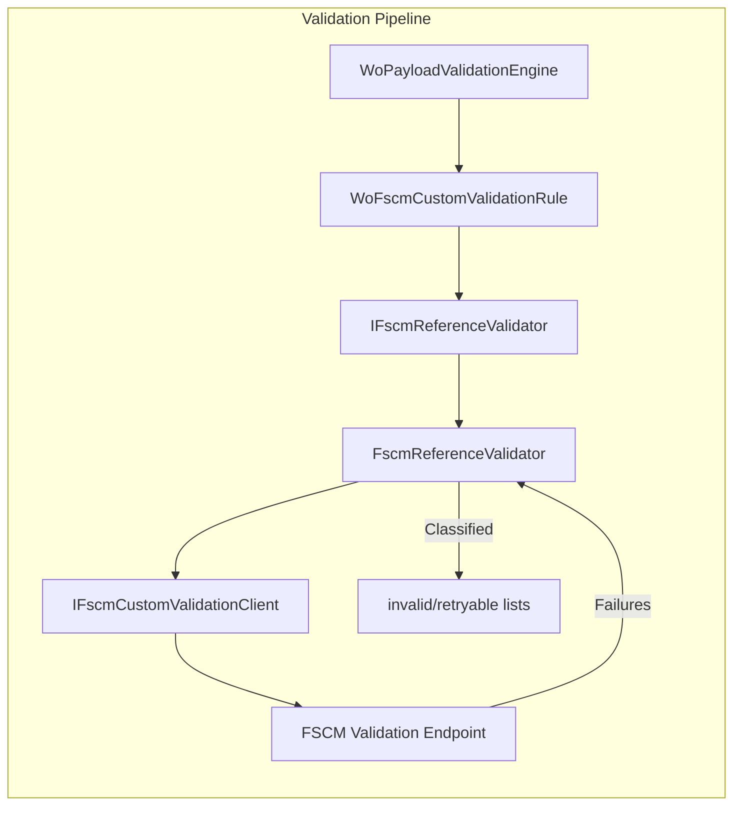

# FSCM Reference Validator Interface Documentation

## Overview

The **IFscmReferenceValidator** interface defines a contract for optional, FSCM-backed reference validation within the Work Order payload validation pipeline. After AIS-side local checks, implementations of this interface can call a remote FSCM validation endpoint to further verify work-order data. Failures returned by FSCM may mark individual lines or entire work orders as invalid or retryable, influencing the final payload sent downstream .

This mechanism enables organizations to leverage FSCM’s business rules without embedding them in the AIS orchestrator. When enabled via configuration, valid work orders are grouped by company, sent to FSCM, and responses are classified into:

- **Invalid**: data errors that should drop lines or whole WOs
- **Retryable**: transient issues that warrant a retry
- **FailFast**: critical errors halting the run

## Architecture Overview



## Component Structure

### 1. Core Abstractions

#### **IFscmReferenceValidator**

Defines the asynchronous method for applying FSCM custom validation to filtered work orders:

```csharp
Task ApplyFscmCustomValidationAsync(
    RunContext context,
    JournalType journalType,
    List<WoPayloadValidationFailure> invalidFailures,
    List<WoPayloadValidationFailure> retryableFailures,
    List<FilteredWorkOrder> validWorkOrders,
    List<FilteredWorkOrder> retryableWorkOrders,
    Stopwatch stopwatch,
    CancellationToken ct);
```

- **RunContext**: metadata for the current execution
- **JournalType**: one of Item, Expense, Hour
- **invalidFailures**: accumulates non-retryable errors
- **retryableFailures**: accumulates transient errors
- **validWorkOrders** / **retryableWorkOrders**: work orders that remain post-validation
- **stopwatch**: measures elapsed time
- **ct**: cancellation token

### 2. Implementation

#### **FscmReferenceValidator**

Concrete validator that orchestrates remote calls and failure classification:

- **Dependencies**- `ILogger<FscmReferenceValidator>` for telemetry
- `PayloadValidationOptions` to enable/disable FSCM validation
- `IFscmCustomValidationClient?` optional remote client

- **Key Methods**1. `ApplyFscmCustomValidationAsync(…)`- Guards execution via `ShouldRunFscmCustomValidation`
- Groups valid work orders by company
- Executes `ExecuteRemoteCompanyValidationsAsync`
- Early returns if no failures
- Calls `ClassifyRemoteFailures` to split failures into invalid/retryable lists
- On any **FailFast**, invokes `HandleFailFast` to clear pending orders
- Otherwise, applies `ApplyRemoteWorkOrderFiltering` to move filtered WOs

1. `ShouldRunFscmCustomValidation(List<FilteredWorkOrder>)`- Checks that validation is enabled, client is present, and there are work orders

1. `GroupValidWorkOrdersByCompany(List<FilteredWorkOrder>)`- Extracts the `"Company"` field from each work-order JSON
- Groups orders case-insensitively

1. `ExecuteRemoteCompanyValidationsAsync(...)`- Iterates each company group
- Builds a filtered payload JSON per company
- Invokes `_fscmCustomValidator.ValidateAsync(...)`
- Aggregates returned failures

1. `ClassifyRemoteFailures(...)`- Splits failures based on `ValidationDisposition` into invalid or retryable buckets

1. `ContainsFailFast(...)` & `HandleFailFast(...)`- Detects any fail-fast disposition
- Clears pending work orders and logs a warning

1. `ApplyRemoteWorkOrderFiltering(...)`- Removes filtered orders from `validWorkOrders` into `retryableWorkOrders` as needed

#### **WoFscmCustomValidationRule**

Async pipeline rule that delegates to the reference validator:

```csharp
public sealed class WoFscmCustomValidationRule : IWoPayloadRule
{
    private readonly IFscmReferenceValidator _validator;
    public WoFscmCustomValidationRule(IFscmReferenceValidator validator)
        => _validator = validator;

    public async Task ApplyAsync(WoPayloadRuleContext ctx, CancellationToken ct)
    {
        await _validator.ApplyFscmCustomValidationAsync(
            ctx.RunContext,
            ctx.JournalType,
            ctx.InvalidFailures,
            ctx.RetryableFailures,
            ctx.ValidWorkOrders,
            ctx.RetryableWorkOrders,
            ctx.Stopwatch,
            ct).ConfigureAwait(false);
    }
}
```

This rule is registered in the pipeline after local AIS validations .

## Integration Points

- **Payload Validation Engine**

Registered in DI alongside other `IWoPayloadRule` implementations:

- `WoEnvelopeParseRule`
- `WoLocalValidationRule`
- `WoFscmCustomValidationRule`
- `WoBuildResultRule`

The engine invokes these sequentially, allowing FSCM validation to occur at the third step .

- **IFscmCustomValidationClient**

The remote client interface used by `FscmReferenceValidator` to call FSCM’s validation API. Implementations handle HTTP transport, parsing JSON shapes, and mapping to `WoPayloadValidationFailure` objects.

## Key Classes Reference

| Class | Location | Responsibility |
| --- | --- | --- |
| IFscmReferenceValidator | src/Rpc.AIS.Accrual.Orchestrator.Core.Abstractions/IFscmReferenceValidator.cs | Defines contract for FSCM-backed reference validation |
| FscmReferenceValidator | src/Rpc.AIS.Accrual.Orchestrator.Application/Features/Validation/Services/WoPayloadValidationPipeline/FscmReferenceValidator.cs | Implements remote validation orchestration and failure classification |
| WoFscmCustomValidationRule | src/Rpc.AIS.Accrual.Orchestrator.Application/Features/Validation/Services/WoPayloadValidationRules/WoFscmCustomValidationRule.cs | Wraps the reference validator into the async rule pipeline |
| IFscmCustomValidationClient | src/Rpc.AIS.Accrual.Orchestrator.Core.Abstractions/IFscmCustomValidationClient.cs | Client interface for FSCM custom validation endpoint |
| WoPayloadValidationEngine | src/Rpc.AIS.Accrual.Orchestrator.Application/Features/Validation/Services/WoPayloadValidationPipeline/WoPayloadValidationEngine.cs | Orchestrates full validation pipeline including FSCM |


## Dependencies

- **Microsoft.Extensions.Logging** for structured logging
- **Microsoft.Extensions.Options** for validation feature toggles (`PayloadValidationOptions`)
- **System.Text.Json** for JSON payload manipulation
- **System.Diagnostics.Stopwatch** for timing metrics
- **CancellationToken** for cooperative cancellation

## Testing Considerations

When unit‐testing implementations of `IFscmReferenceValidator`, consider scenarios including:

- **Validation disabled**: `_options.EnableFscmCustomEndpointValidation = false` should skip calls
- **Null custom client**: Safety when `_fscmCustomValidator` is `null`
- **Empty validWorkOrders**: Early exit without remote calls
- **Grouped by company**: Mixed companies produce separate payloads
- **Remote failures**: Ensure invalid, retryable, and fail-fast dispositions are handled correctly

Use mocks for `IFscmCustomValidationClient` to simulate HTTP responses and verify that `invalidFailures`, `retryableFailures`, `validWorkOrders`, and `retryableWorkOrders` collections are updated as expected.