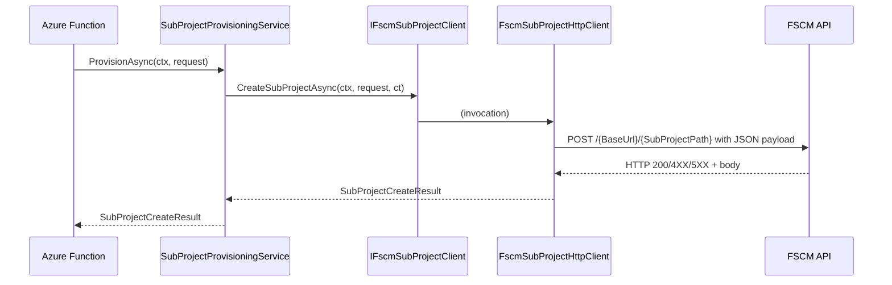

# FSCM SubProject Client Feature Documentation

## Overview

The **FSCM SubProject Client** defines the contract for creating subprojects in the FSCM (Field Service-Customer Management) system.

- It abstracts the mechanics of HTTP calls, token acquisition, error handling, and JSON serialization from the core business logic.
- Downstream services, such as the **SubProjectProvisioningService**, depend on this interface to initiate subproject creation without coupling to HTTP or authentication details.
- By centralizing this behavior, the application achieves **separation of concerns**, easier testing, and consistent error handling.

## Architecture Overview

```mermaid
flowchart TB
    subgraph BusinessLayer
        Provision[SubProjectProvisioningService]
    end
    subgraph DataAccessLayer
        ClientIF[IFscmSubProjectClient]
        HttpImpl[FscmSubProjectHttpClient]
    end
    subgraph ExternalSystem
        FSCM[FSCM SubProject API]
    end

    Provision -->|uses| ClientIF
    ClientIF -->|implemented by| HttpImpl
    HttpImpl -->|POST /{SubProjectPath}| FSCM
```

## Component Structure

### 2. Business Layer

#### **SubProjectProvisioningService** (`src/Rpc.AIS.Accrual.Orchestrator.Core.Services/SubProjectProvisioningService.cs`)

- **Purpose**: Orchestrates validation and logging around subproject creation requests.
- **Interaction**: Calls `IFscmSubProjectClient.CreateSubProjectAsync` to perform the actual provision.

### 3. Data Access Layer

#### **IFscmSubProjectClient** (`src/Rpc.AIS.Accrual.Orchestrator.Application/Ports/Common/Abstractions/IFscmSubProjectClient.cs`)

- **Purpose**: Abstracts FSCM subproject creation behavior for dependency inversion and testability .
- **Methods**:

| Method | Description | Returns |
| --- | --- | --- |
| CreateSubProjectAsync | Sends a request to FSCM to create a subproject. | `Task<SubProjectCreateResult>` |


### 4. Data Models

#### **SubProjectCreateRequest**

Canonical model for the FSCM subproject create payload. Represents the inner `{ "_request": { ... } }` envelope .

| Property | Type | Description |
| --- | --- | --- |
| DataAreaId | string | Legal Entity or FSCM company code (required). |
| ParentProjectId | string | Identifier of the parent project (required). |
| ProjectName | string | Name of the new subproject (required). |
| CustomerReference | string? | Optional customer reference. |
| InvoiceNotes | string? | Optional invoice notes. |
| ActualStartDate | string? | Optional ISO date when project begins. |
| ActualEndDate | string? | Optional ISO date when project ends. |
| AddressName | string? | Optional address display name. |
| Street | string? | Optional street address. |
| City | string? | Optional city. |
| State | string? | Optional state/province. |
| County | string? | Optional county. |
| CountryRegionId | string? | Optional country/region code. |
| WellLocale | string? | Optional locale for well. |
| WellName | string? | Optional well name. |
| WellNumber | string? | Optional well number. |
| ProjectStatus | int? | Optional status code; defaults to FSCM’s initial stage when absent. |
| WorkOrderGuid | string? (init-only) | Optional FS work order GUID serialized as `WorkOrderGUID`. |
| IsFsaProject | int? (init-only) | Optional flag serialized as `IsFSAProject`. |


#### **SubProjectCreateResult**

Carries the outcome of the create call, including any errors .

| Property | Type | Description |
| --- | --- | --- |
| IsSuccess | bool | `true` if creation succeeded. |
| parmSubProjectId | string? | The identifier returned by FSCM, if any. |
| Message | string? | Human-readable message or error summary. |
| Errors | `IReadOnlyList<SubProjectError>` | List of error codes and messages. |


#### **SubProjectError**

Describes a single error in the create result .

| Property | Type | Description |
| --- | --- | --- |
| Code | string | FSCM or client error code. |
| Message | string | Detailed error description. |


## Feature Flows

### 1. SubProject Creation Flow



## Integration Points

- **SubProjectProvisioningService** depends on `IFscmSubProjectClient`.
- **FscmSubProjectHttpClient** implements this interface and is registered in DI within the Functions project.
- **SubProjectFunction** triggers the provisioning flow via HTTP and uses the service to handle requests.

## Key Classes Reference

| Class | Location | Responsibility |
| --- | --- | --- |
| IFscmSubProjectClient | `Application/Ports/Common/Abstractions/IFscmSubProjectClient.cs` | Defines subproject create contract |
| SubProjectCreateRequest | `Core/Domain/SubProjectModels.cs` | Payload model for creating subprojects |
| SubProjectCreateResult | `Core/Domain/SubProjectModels.cs` | Result model capturing success or errors |
| SubProjectError | `Core/Domain/SubProjectModels.cs` | Encapsulates individual error information |


## Error Handling

- **Client errors (4XX)** produce a `SubProjectCreateResult` with `IsSuccess = false` and populated `Errors`.
- **Transient failures (429, 5XX)** throw `HttpRequestException` to trigger retries.
- **Unauthorized (401/403)** throw `UnauthorizedAccessException` to fail fast.

## Dependencies

- **Rpc.AIS.Accrual.Orchestrator.Core.Domain**: Domain models (`RunContext`, `SubProjectCreateRequest`, `SubProjectCreateResult`).
- **Microsoft.Extensions.Logging**, **HttpClient**, **JsonSerializer**, and **Token Provider** for HTTP interactions (implementation).

## Testing Considerations

- Unit tests can mock `IFscmSubProjectClient` to simulate success, client errors, and transient failures.
- Business logic in `SubProjectProvisioningService` should be verified against all result permutations.