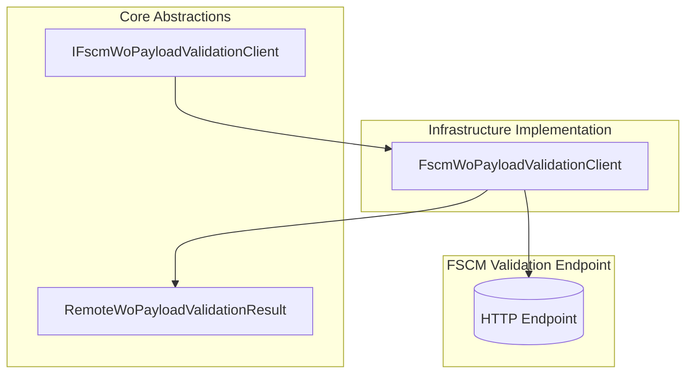

# FSCM WO Payload Validation Feature Documentation

## Overview

This feature defines a **port** in the application core for performing remote validation of Work Order (WO) payloads against a custom FSCM endpoint. It ensures that payloads meet server-side business rules before posting to FSCM, improving data integrity and preventing downstream errors. By abstracting the HTTP call behind an interface, the core remains decoupled from transport concerns, facilitating testability and clear separation of responsibilities.

## Architecture Overview



This diagram shows the hexagonal‐style arrangement where the core defines the **port** (`IFscmWoPayloadValidationClient`) and the infrastructure provides the **adapter** (`FscmWoPayloadValidationClient`) that invokes the actual HTTP endpoint.

## Component Structure

### Core Abstractions

#### **IFscmWoPayloadValidationClient** 🎯

*Location:*

`src/Rpc.AIS.Accrual.Orchestrator.Application/Ports/Common/Abstractions/IFscmWoPayloadValidationClient.cs`

- **Purpose**: Defines the contract for remote validation of normalized WO JSON payloads against FSCM’s custom validation service.
- **Responsibilities**:- Receive execution context (`RunContext`), target journal type, and the normalized payload.
- Return a detailed result object without performing HTTP operations itself.

**Method**

| Method | Description |
| --- | --- |
| ValidateAsync(ctx, journalType, normalizedWoPayloadJson, ct) | Sends the payload for server-side validation and returns the parsed outcome. |


```csharp
Task<RemoteWoPayloadValidationResult> ValidateAsync(
    RunContext ctx,
    JournalType journalType,
    string normalizedWoPayloadJson,
    CancellationToken ct);
```

### Data Models

#### **RemoteWoPayloadValidationResult** 🗒️

*Location:*

`src/Rpc.AIS.Accrual.Orchestrator.Application/Ports/Common/Abstractions/IFscmWoPayloadValidationClient.cs`

Carries all relevant details from the remote validation call, enabling core services to make decisions based on HTTP status, timing, and any validation failures.

| Property | Type | Description |
| --- | --- | --- |
| **IsSuccessStatusCode** | bool | True if the HTTP status code was in the 2xx range. |
| **StatusCode** | int | Numeric HTTP status code returned by the endpoint. |
| **FilteredPayloadJson** | string | JSON payload after any server-side filtering. Defaults to `{}` if payload was empty. |
| **Failures** | IReadOnlyList\<WoPayloadValidationFailure\> | List of per-WO or per-line validation failures. |
| **RawResponse** | string? | Original HTTP response body, useful for diagnostics. |
| **ElapsedMs** | long | Time in milliseconds taken by the HTTP request. |
| **Url** | string | The full request URL invoked, captured for logging and troubleshooting. |


### Integration Points

- **Dependency Injection**

`IFscmWoPayloadValidationClient` is registered in DI and consumed by validation pipelines and orchestration services.

- **Validation Pipelines**

Used by `WoPayloadValidationEngine` and `FscmReferenceValidator` to apply custom server-side checks after local (AIS) validation.

- **Logging & Diagnostics**

Consumers log the `Url`, `StatusCode`, and `ElapsedMs` from `RemoteWoPayloadValidationResult` for observability and troubleshooting.

### Key Classes Reference

| Class | Location | Responsibility |
| --- | --- | --- |
| **IFscmWoPayloadValidationClient** | `src/.../IFscmWoPayloadValidationClient.cs` | Defines the port for remote WO payload validation. |
| **RemoteWoPayloadValidationResult** | `src/.../IFscmWoPayloadValidationClient.cs` | Immutable record summarizing the HTTP validation result. |


## Dependencies

- `System.Collections.Generic`
- `System.Threading`
- `System.Threading.Tasks`
- `Rpc.AIS.Accrual.Orchestrator.Core.Domain` (for `RunContext`, `JournalType`)
- `Rpc.AIS.Accrual.Orchestrator.Core.Domain.Validation` (for `WoPayloadValidationFailure`)

## Error Handling

- **Transport Failures**

Implementations must not throw on HTTP errors. Instead, they return a `RemoteWoPayloadValidationResult` with `IsSuccessStatusCode = false` and appropriate `StatusCode`/`RawResponse`.

- **Schema or Parsing Issues**

Unrecognized or invalid response schemas are treated as failures or “fail-closed” scenarios, conveyed through empty `Failures` and a non-success status.

## Testing Considerations

- **Contract Tests** verify that the client:- Skips remote calls when validation path is empty.
- Posts to the correct URL when configured.
- Returns correct `IsSuccessStatusCode` and `Url`.
- **Edge Cases** to cover:- Empty or whitespace payload should return a no-op success result.
- HTTP non-2xx responses.
- Malformed JSON in response.

---

*This documentation covers the core abstraction for remote FSCM validation of work order payloads. All HTTP specifics, resilience policies, and message-factory logic reside in the infrastructure implementation.*