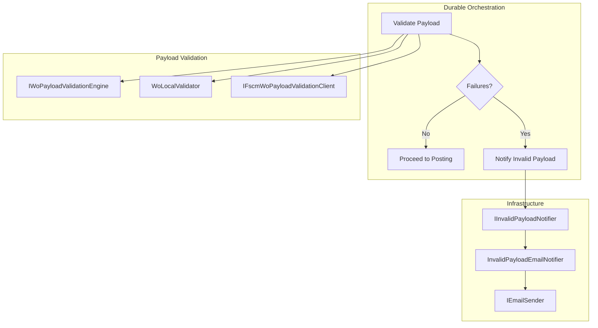
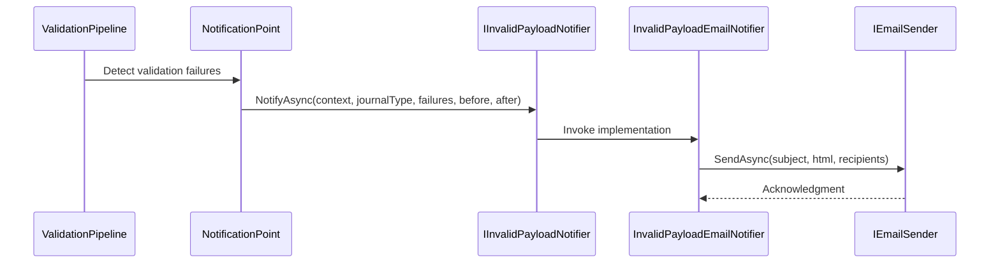

# Invalid Payload Notification Feature Documentation

## Overview

The Invalid Payload Notification feature alerts stakeholders when AIS-side work order payload validation detects invalid records. It prevents invalid data from being posted to FSCM by sending a detailed HTML email to a configured distribution list. This early warning helps operational teams correct source data before any posting attempts occur, reducing downstream errors and manual troubleshooting.

This feature fits into the orchestration pipeline after local and (optional) remote payload validation. When any work orders or lines fail validation, the orchestrator invokes the notification abstraction, decoupling notification logic from validation and posting workflows.

## Architecture Overview



## Component Structure

### 1. Core Abstractions

#### **IInvalidPayloadNotifier** (`src/Rpc.AIS.Accrual.Orchestrator.Application/Ports/Common/Abstractions/IInvalidPayloadNotifier.cs`)

- Defines a contract for notifying about invalid work orders or lines detected during AIS-side validation.
- Implementations must be side-effect free except for notification side-effects (e.g., sending email).

| Method | Description |
| --- | --- |
| NotifyAsync | Sends a notification given validation failures and work-order counts. |


**Parameters**

| Parameter | Type | Description |
| --- | --- | --- |
| context | RunContext | Identifies the orchestration run. |
| journalType | JournalType | Specifies the journal category (Item/Expense/Hour). |
| failures | IReadOnlyList\<WoPayloadValidationFailure\> | Details of each invalid record. |
| workOrdersBefore | int | Count before filtering. |
| workOrdersAfter | int | Count after filtering. |
| ct | CancellationToken | Propagates cancellation. |


### 2. Infrastructure Implementation

#### **InvalidPayloadEmailNotifier** 📧

(`src/Rpc.AIS.Accrual.Orchestrator.Infrastructure/Notifications/InvalidPayloadEmailNotifier.cs`)

Sends an HTML email summarizing invalid payload failures to a configured distribution list. This notifier runs before any posting attempt, ensuring invalid records never reach FSCM.

- **Dependencies**- `IEmailSender` – abstracts email delivery.
- `NotificationOptions` – provides distribution list configuration.
- `ILogger<InvalidPayloadEmailNotifier>` – logs notification activity.

- **Key Methods**

```csharp
  Task NotifyAsync(
      RunContext context,
      JournalType journalType,
      IReadOnlyList<WoPayloadValidationFailure> failures,
      int workOrdersBefore,
      int workOrdersAfter,
      CancellationToken ct);
```

- Validates inputs and early-exits if no failures or no recipients.
- Builds subject line: `"AIS | INVALID Delta Payload | {journalType} | RunId={context.RunId}"`.
- Generates HTML body via `BuildHtmlBody(...)` and calls `_email.SendAsync(...)`.

```csharp
  private static string BuildHtmlBody(
      RunContext context,
      JournalType journalType,
      IReadOnlyList<WoPayloadValidationFailure> failures,
      int workOrdersBefore,
      int workOrdersAfter)
```

- Encodes values with `WebUtility.HtmlEncode`.
- Groups failures by `WorkOrderGuid` and renders an HTML table of failures.

### 3. Data Models

| Model | Location | Description |
| --- | --- | --- |
| RunContext | `src/Rpc.AIS.Accrual.Orchestrator.Core.Domain/RunContext.cs` | Holds run identifiers and timestamps. |
| WoPayloadValidationFailure | `src/Rpc.AIS.Accrual.Orchestrator.Core.Domain.Validation/WoPayloadValidationFailure.cs` | Represents one invalid record detected. |
| JournalType (enum) | `src/Rpc.AIS.Accrual.Orchestrator.Core.Domain/JournalType.cs` | Categorizes journal lines (Item, Expense, Hour). |


## Feature Flows

### 1. Notification Flow



## Integration Points

- **WoPostingPreparationPipeline** invokes `IInvalidPayloadNotifier.NotifyAsync(...)` when local validation reports failures.
- Relies on **NotificationOptions** to resolve distribution lists.

## Key Classes Reference

| Class | Location | Responsibility |
| --- | --- | --- |
| IInvalidPayloadNotifier | `.../Abstractions/IInvalidPayloadNotifier.cs` | Defines notification contract for invalid payloads. |
| InvalidPayloadEmailNotifier | `.../Infrastructure/Notifications/InvalidPayloadEmailNotifier.cs` | Sends validation failure details via HTML email. |
| NotificationOptions | `.../Options/NotificationOptions.cs` | Configures distribution lists and resolves recipients. |
| WoPayloadValidationFailure | `.../Core.Domain.Validation/WoPayloadValidationFailure.cs` | Represents a single validation failure record. |
| RunContext | `.../Core.Domain/RunContext.cs` | Carries orchestration identifiers and metadata. |


## Error Handling

- **Null Checks**: `NotifyAsync` throws `ArgumentNullException` if `context` is null.
- **Empty Failures**: Returns immediately if `failures` is null or empty.
- **No Recipients**: Logs a warning and aborts if no distribution list is configured.
- **Email Errors**: Exceptions in `_email.SendAsync` propagate, allowing orchestration error handling.

## Dependencies

- `Microsoft.Extensions.Logging` – for structured logging.
- `Rpc.AIS.Accrual.Orchestrator.Core.Domain` – for `RunContext`, `JournalType`.
- `Rpc.AIS.Accrual.Orchestrator.Core.Domain.Validation` – for `WoPayloadValidationFailure`.
- `Rpc.AIS.Accrual.Orchestrator.Infrastructure.Options` – for `NotificationOptions`.
- `IEmailSender` abstraction – to decouple email transport.

## Testing Considerations

- **No Failures**: Ensure `NotifyAsync` does not send email or log warnings when `failures.Count == 0`.
- **No Recipients**: Verify warning log and no email is sent if distribution list is empty.
- **Email Content**: Validate that `BuildHtmlBody` escapes content and lists every failure correctly.
- **Error Path**: Simulate `IEmailSender` failures to confirm exceptions bubble as expected.