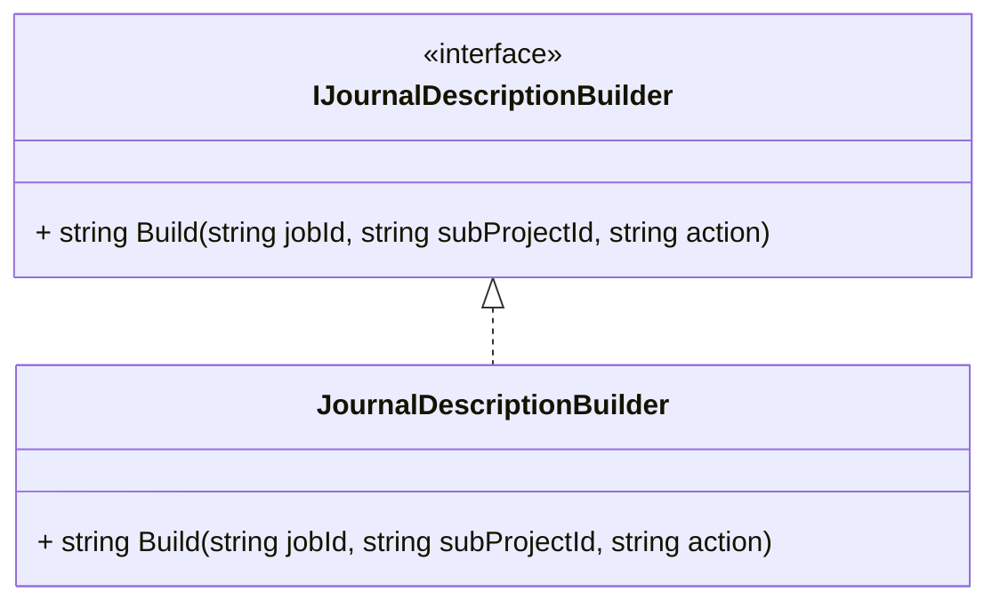

# Journal Description Builder Interface Documentation

## Overview

The **IJournalDescriptionBuilder** interface defines a contract for constructing consistent, human-readable journal descriptions within the accrual orchestrator. It centralizes the formatting logic for combining identifiers such as **Job ID**, **Sub-Project ID**, and an **Action** suffix into a single string.

By abstracting this behavior, different parts of the application can rely on a shared definition of how journal descriptions are formed, ensuring uniformity across payload builders, logs, and downstream services. Implementations may handle null or empty inputs gracefully, defaulting missing values to empty strings to prevent runtime errors.

## Architecture Diagram



This class diagram illustrates:

- **IJournalDescriptionBuilder**: The interface residing in the Application layer.
- **JournalDescriptionBuilder**: A concrete adapter implementing the interface.

## Component Structure

### IJournalDescriptionBuilder (Interface)

**Path:** `src/Rpc.AIS.Accrual.Orchestrator.Application/Ports/Common/Abstractions/IJournalDescriptionBuilder.cs`

Defines a single method for building a journal description string. This port abstraction enables loose coupling between application services and their formatting logic.

| Method | Parameters | Return Type | Description |
| --- | --- | --- | --- |
| Build | string jobId<br/>string subProjectId<br/>string action | string | Combines inputs into a standardized description |


#### Code Snippet

```csharp
namespace Rpc.AIS.Accrual.Orchestrator.Core.Abstractions;

public interface IJournalDescriptionBuilder
{
    string Build(string jobId, string subProjectId, string action);
}
```

### JournalDescriptionBuilder 🔧 (Default Implementation)

**Path:** `src/Rpc.AIS.Accrual.Orchestrator.Application/Deprecated/Services/JournalDescriptionBuilder.cs`

Implements `IJournalDescriptionBuilder` by concatenating the three inputs with hyphens.

Null or empty inputs are replaced with empty strings to avoid null reference issues.

#### Behavior

- **Null Safety:**

Substitutes `null` for `jobId`, `subProjectId`, or `action` with `string.Empty`.

- **Formatting:**

Returns `"{jobId} - {subProjectId} - {action}"`

#### Code Snippet

```csharp
public sealed class JournalDescriptionBuilder : IJournalDescriptionBuilder
{
    public string Build(string jobId, string subProjectId, string action)
    {
        jobId ??= string.Empty;
        subProjectId ??= string.Empty;
        action ??= string.Empty;

        return $"{jobId} - {subProjectId} - {action}";
    }
}
```

## Key Classes Reference

| Class | Location | Responsibility |
| --- | --- | --- |
| IJournalDescriptionBuilder | src/Rpc.AIS.Accrual.Orchestrator.Application/Ports/Common/Abstractions/IJournalDescriptionBuilder.cs | Defines the contract for building journal description strings |
| JournalDescriptionBuilder | src/Rpc.AIS.Accrual.Orchestrator.Application/Deprecated/Services/JournalDescriptionBuilder.cs | Default adapter implementing the formatting logic |


## Dependencies

- This interface has **no external dependencies**.
- Implementations must reference only core .NET types and the interface itself.

## Testing Considerations

- Verify that **Build** returns the expected format when:- All inputs are non-null and non-empty.
- Any of the inputs is `null`.
- Any of the inputs is an empty string.
- Ensure no exceptions are thrown for `null` parameters.

```card
{
    "title": "Null Safety",
    "content": "The default implementation replaces null inputs with empty strings to prevent null-reference errors."
}
```