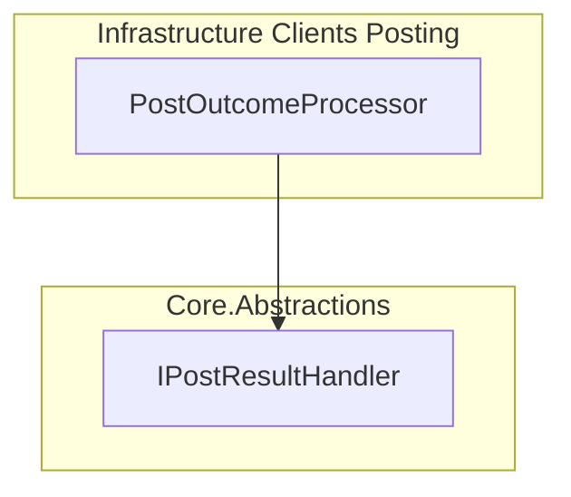
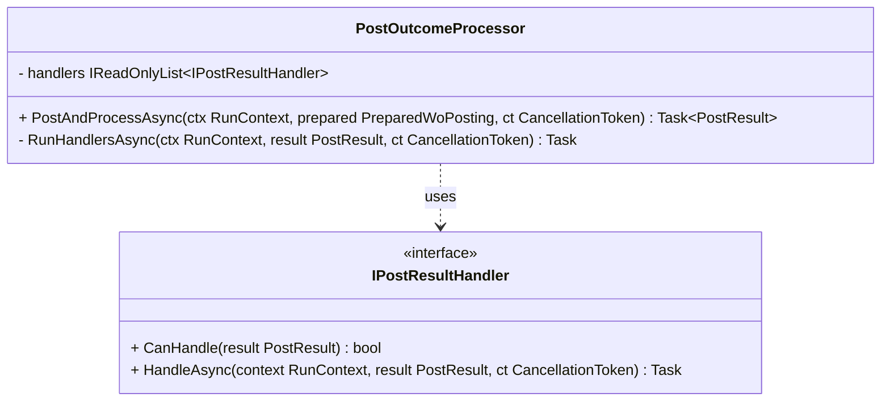

# IPostResultHandler Feature Documentation

## Overview

The **IPostResultHandler** interface defines an extensibility point in the accrual orchestrator pipeline. After a journal posting attempt, implementations of this interface can perform follow-up actions—such as sending notifications, triggering compensations, or scheduling retries—without altering the core posting logic . This design upholds the **Open/Closed Principle**, allowing the system to remain stable even as new post-processing behaviors are introduced.

Handlers receive the final `PostResult` and a `RunContext` that carries metadata about the posting run. They decide whether to act based on the result and then execute their asynchronous logic within a cancellation-aware context.

## Architecture Overview



## Component Structure

### Business Layer

#### **IPostResultHandler** (`src/Rpc.AIS.Accrual.Orchestrator.Application/Ports/Common/Abstractions/IPostResultHandler.cs`)

- **Purpose:** Define points of extension for post-posting actions (notifications, retries, etc.)
- **Methods:**- **CanHandle**

```csharp
    bool CanHandle(PostResult result);
```

Returns `true` if the handler should process the given result.

- **HandleAsync**

```csharp
    Task HandleAsync(RunContext context, PostResult result, CancellationToken ct);
```

Executes handler logic in an async, cancellable fashion.

#### **PostOutcomeProcessor** (`src/Rpc.AIS.Accrual.Orchestrator.Infrastructure/Adapters/Fscm/Clients/Posting/PostOutcomeProcessor.cs`)

- **Responsibility:**1. Sends HTTP POST to FSCM journals.
2. Aggregates errors and parses responses.
3. Constructs a `PostResult`.
4. Invokes all registered `IPostResultHandler` implementations.
- **Handler Invocation:**

Iterates `_handlers`, calls `CanHandle`, then `HandleAsync`, logging any handler failures without interrupting the pipeline .

## Data Models

### PostResult

| Property | Type | Description |
| --- | --- | --- |
| `JournalType` | `JournalType` | Type of journal posted (Item, Expense, Hour). |
| `IsSuccess` | `bool` | Indicates whether posting succeeded. |
| `JournalId` | `string?` | FSCM-assigned journal identifier on success. |
| `SuccessMessage` | `string?` | Descriptive message when posting succeeds. |
| `Errors` | `IReadOnlyList<PostError>` | List of errors encountered during posting. |
| `WorkOrdersBefore` | `int` | Count of work orders before filtering/validation. |
| `WorkOrdersPosted` | `int` | Number of work orders successfully posted. |
| `WorkOrdersFiltered` | `int` | Number of work orders removed due to missing/empty sections. |
| `ValidationResponseRaw` | `string?` | Raw JSON from remote validation step. |
| `RetryableWorkOrders` | `int` | Count of work orders marked for retry. |
| `RetryableLines` | `int` | Count of lines within work orders marked retryable. |
| `RetryablePayloadJson` | `string?` | Payload JSON to re-post retryable work orders. |


*Source definition:*

### RunContext

| Property | Type | Description |
| --- | --- | --- |
| `RunId` | `string` | Unique identifier for this posting run. |
| `StartedAtUtc` | `DateTimeOffset` | Timestamp when the run began. |
| `TriggeredBy` | `string?` | Origin of the trigger (e.g., Http, Timer). |
| `CorrelationId` | `string` | Correlation identifier for tracing across components. |
| `SourceSystem` | `string?` | Upstream system name. |
| `DataAreaId` | `string?` | Company or data area context. |


*Source definition:*

## Component Interactions

### Class Diagram



## Key Classes Reference

| Class | Location | Responsibility |
| --- | --- | --- |
| **IPostResultHandler** | `src/Rpc.AIS.Accrual.Orchestrator.Application/Ports/Common/Abstractions/IPostResultHandler.cs` | Defines post-posting extension points. |
| **PostOutcomeProcessor** | `src/Rpc.AIS.Accrual.Orchestrator.Infrastructure/Adapters/Fscm/Clients/Posting/PostOutcomeProcessor.cs` | Orchestrates HTTP posting and invokes handlers. |
| **PostResult** | `src/Rpc.AIS.Accrual.Orchestrator.Domain/Domain/PostResult.cs` | Domain model capturing posting outcome details. |
| **RunContext** | `src/Rpc.AIS.Accrual.Orchestrator.Domain/Domain/RunContext.cs` | Encapsulates metadata for a posting run. |


## Error Handling

- **Handler resilience:** Each `HandleAsync` call is wrapped in a `try/catch`. Failures in one handler are logged, but do not prevent subsequent handlers from executing .

## Dependencies

- **Core.Domain**- `PostResult`
- `RunContext`
- **System.Threading** and **System.Threading.Tasks** for async processing.

## Testing Considerations

- **CanHandle logic** should be unit-tested for each handler implementation to ensure correct filtering based on `PostResult`.
- **HandleAsync** flows should be tested in integration with a dummy `IPostResultHandler` registered in `PostOutcomeProcessor` to verify invocation order and exception handling.