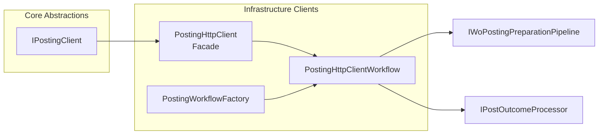

# Posting Client Feature Documentation

## Overview

The **IPostingClient** interface defines a contract for submitting validated accrual data to FSCM journals. It decouples core orchestration logic from HTTP-specific implementations and enables flexible posting strategies. Implementations can post staging references or raw work-order payloads, apply local and remote validation, and handle large batches efficiently .

By centralizing posting behavior behind this abstraction, the system supports:

- **Multiple posting contracts** (staging refs, raw payload, pre-validated batches, full-payload once-and-post-all).
- **Scalable batch handling**, avoiding timeouts and throttling.
- **Extensibility** via post-result handlers without modifying client code.

This interface sits in the Core Abstractions layer and is implemented in Infrastructure by typed HttpClient facades and orchestrated workflows.

## Architecture Overview



## Component Structure

### Core Abstractions

#### **IPostingClient** (`src/Rpc.AIS.Accrual.Orchestrator.Application/Ports/Common/Abstractions/IPostingClient.cs`)

- **Purpose:** Defines posting operations for accrual workflows.
- **Responsibilities:**- Submit staging references by journal type.
- Submit raw work-order payloads with built-in validation.
- Submit pre-validated payload batches.
- Validate once and post all journal types.
- **Interface Definition:**

```csharp
public interface IPostingClient
{
    Task<PostResult> PostAsync(
        RunContext context,
        JournalType journalType,
        IReadOnlyList<AccrualStagingRef> records,
        CancellationToken ct);

    Task<PostResult> PostFromWoPayloadAsync(
        RunContext context,
        JournalType journalType,
        string woPayloadJson,
        CancellationToken ct);

    Task<PostResult> PostValidatedWoPayloadAsync(
        RunContext context,
        JournalType journalType,
        string woPayloadJson,
        IReadOnlyList<PostError> preErrors,
        string? validationResponseRaw,
        CancellationToken ct);

    Task<List<PostResult>> ValidateOnceAndPostAllJournalTypesAsync(
        RunContext context,
        string woPayloadJson,
        CancellationToken ct);
}
```

##### Methods

| Method | Description | Returns |
| --- | --- | --- |
| PostAsync | Post staging references grouped by journal type. | `PostResult` |
| PostFromWoPayloadAsync | Validate and post raw FSA work-order payload JSON, filtering failed orders. | `PostResult` |
| PostValidatedWoPayloadAsync | Post a batch already validated externally; carries forward pre-errors. | `PostResult` |
| ValidateOnceAndPostAllJournalTypesAsync | Validate full WO payload once, then post each detected journal type using the same validation response. | `List<PostResult>` |


### Infrastructure Clients

#### **PostingHttpClient** (`src/Rpc.AIS.Accrual.Orchestrator.Infrastructure/Adapters/Fscm/Clients/PostingHttpClient.Facade.cs`)

- **Role:** Typed HttpClient facade that keeps DI surface small.
- **Behavior:** Delegates to an `IPostingClient` created by `PostingWorkflowFactory`.

#### **PostingHttpClientWorkflow** (`src/Rpc.AIS.Accrual.Orchestrator.Infrastructure/Adapters/Fscm/Clients/PostingHttpClient.cs`)

- **Role:** Orchestrates WO payload preparation and posting outcome processing.
- **Collaborators:**- `IWoPostingPreparationPipeline` for normalization, shaping, validation, projection.
- `IPostOutcomeProcessor` for HTTP execution, error aggregation, and handlers.
- **Refactor Goal:** Maintain SRP by focusing on orchestration and relying on injected pipelines.

#### **PostingWorkflowFactory** (`src/Rpc.AIS.Accrual.Orchestrator.Infrastructure/Adapters/Fscm/Clients/PostingWorkflowFactory.cs`)

- **Role:** Builds cohesive posting workflows for each `HttpClient` instance.
- **Injected Dependencies:** Validation engine, payload notifier, normalizer, shape guard, projector, response parser, error aggregator, date adjuster, diagnostics, loggers, etc.

## Data Models

### PostResult

Result of posting one journal group.

| Property | Type | Description |
| --- | --- | --- |
| JournalType | `JournalType` | Journal category (Item, Expense, Hour). |
| IsSuccess | `bool` | Indicates if posting succeeded. |
| JournalId | `string?` | FSCM journal identifier on success. |
| SuccessMessage | `string?` | Success response message. |
| Errors | `IReadOnlyList<PostError>` | Collection of post errors. |
| WorkOrdersBefore | `int` | Orders before filtering. |
| WorkOrdersPosted | `int` | Orders successfully posted. |
| WorkOrdersFiltered | `int` | Orders pruned due to missing section. |
| ValidationResponseRaw | `string?` | Raw validation payload (if any). |
| RetryableWorkOrders | `int` | Count of retryable orders. |
| RetryableLines | `int` | Count of retryable lines. |
| RetryablePayloadJson | `string?` | JSON for retryable subset. |


### PostError

Carries a single posting error.

| Property | Type | Description |
| --- | --- | --- |
| Code | `string` | Error code identifier. |
| Message | `string` | Human-readable error message. |
| StagingId | `string?` | Related staging record ID. |
| JournalId | `string?` | Related FSCM journal ID. |
| JournalDeleted | `bool` | Whether the journal was deleted. |
| DeleteMessage | `string?` | Message on journal deletion. |


### AccrualStagingRef

Reference to a staging record for accrual posting.

| Property | Type | Description |
| --- | --- | --- |
| StagingId | `string` | Unique staging record identifier. |
| JournalType | `JournalType` | Target journal category. |
| SourceKey | `string` | Source system key reference. |


### RunContext

Contextual metadata for a posting run.

| Property | Type | Description |
| --- | --- | --- |
| RunId | `string` | Unique run identifier. |
| StartedAtUtc | `DateTimeOffset` | Run start timestamp (UTC). |
| TriggeredBy | `string?` | Origin trigger name (e.g. “PostJob”). |
| CorrelationId | `string` | Correlation identifier for tracing. |
| SourceSystem | `string?` | Optional source system name. |
| DataAreaId | `string?` | Optional FSCM data area identifier. |


### JournalType

Enumerates FSCM journal categories.

| Value | Underlying | Description |
| --- | --- | --- |
| Item | 1 | Item journal. |
| Expense | 2 | Expense journal. |
| Hour | 3 | Hour journal. |


## Dependencies

- **Core.Domain**: Provides `PostResult`, `PostError`, `RunContext`, `AccrualStagingRef`, `JournalType`.
- **Core.Abstractions**: Interfaces for validation engine, payload pipelines, error aggregation, result handlers.
- **Infrastructure.Options**: FSCM endpoint and resilience configuration.
- **Microsoft.Extensions.Logging**: Structured logging support.
- **System.Text.Json**: JSON serialization for payloads and responses.

## Key Classes Reference

| Class | Location | Responsibility |
| --- | --- | --- |
| IPostingClient | Application/Ports/Common/Abstractions/IPostingClient.cs | Defines posting operations contract. |
| PostingHttpClient | Infrastructure/Adapters/Fscm/Clients/PostingHttpClient.Facade.cs | Facade for typed HttpClient posting client. |
| PostingHttpClientWorkflow | Infrastructure/Adapters/Fscm/Clients/PostingHttpClient.cs | Orchestrates payload preparation and outcome processing. |
| PostingWorkflowFactory | Infrastructure/Adapters/Fscm/Clients/PostingWorkflowFactory.cs | Builds posting workflows with injected collaborators. |
