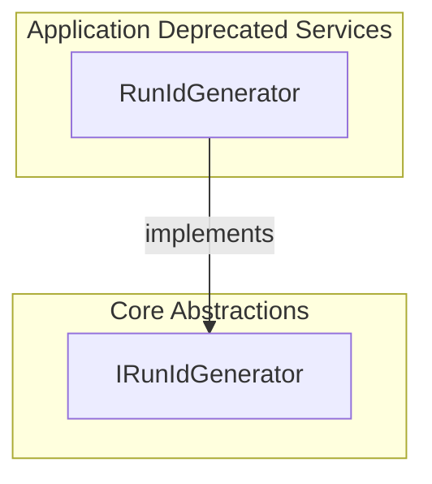

# Run ID Generation Feature Documentation

## Overview

The Run ID Generation feature provides unique identifiers for orchestration runs and correlates operations across components. It ensures consistent tracking of workflow executions and aids in logging, monitoring, and debugging across distributed services.

This feature decouples ID generation logic via an abstraction, allowing easy substitution or customization of generation strategies.

## Architecture Overview

The following diagram illustrates the relationship between the abstraction and its implementation.



## Interface Definition: IRunIdGenerator

The **IRunIdGenerator** interface defines two methods for ID generation:

| Method | Description | Return Type |
| --- | --- | --- |
| `NewRunId()` | Generates a new unique run identifier. | string |
| `NewCorrelationId()` | Generates a new unique correlation identifier. | string |


**File path:**

`src/Rpc.AIS.Accrual.Orchestrator.Application/Ports/Common/Abstractions/IRunIdGenerator.cs`

```csharp
namespace Rpc.AIS.Accrual.Orchestrator.Core.Abstractions
{
    /// <summary>
    /// Defines run ID generator behavior.
    /// </summary>
    public interface IRunIdGenerator
    {
        string NewRunId();
        string NewCorrelationId();
    }
}
```

## Default Implementation ☑️

The **RunIdGenerator** class provides a compact GUID-based implementation. It prefixes IDs with `RUN-` or `CORR-`, followed by a hyphen-free GUID.

**File path:**

`src/Rpc.AIS.Accrual.Orchestrator.Application/Deprecated/Services/RunIdGenerator.cs`

```csharp
public sealed class RunIdGenerator : IRunIdGenerator
{
    public string NewRunId() => $"RUN-{Guid.NewGuid():N}";
    public string NewCorrelationId() => $"CORR-{Guid.NewGuid():N}";
}
```

- **NewRunId:** Returns `RUN-` + 32-character GUID
- **NewCorrelationId:** Returns `CORR-` + 32-character GUID

```card
{
    "title": "Compact GUID",
    "content": "IDs omit hyphens to reduce string length."
}
```

## Integration and Usage

Typical usage involves registering the generator for dependency injection and requesting it in services:

- **Register implementation** in the IoC container:

```csharp
  services.AddSingleton<IRunIdGenerator, RunIdGenerator>();
```

- **Inject** `IRunIdGenerator` into orchestrators or services.
- **Generate IDs** for logging, tracing, and correlation.

## Code Examples

The examples below demonstrate direct and DI-based usage of the generator.

```csharp
// Direct instantiation
var generator = new RunIdGenerator();
Console.WriteLine(generator.NewRunId());         // e.g. RUN-a1b2c3d4...
Console.WriteLine(generator.NewCorrelationId()); // e.g. CORR-e5f6g7h8...

// Dependency injection
public class ProcessingOrchestrator
{
    private readonly IRunIdGenerator _idGenerator;

    public ProcessingOrchestrator(IRunIdGenerator idGenerator)
    {
        _idGenerator = idGenerator;
    }

    public void StartProcess()
    {
        string runId = _idGenerator.NewRunId();
        string correlationId = _idGenerator.NewCorrelationId();
        // Use IDs for logging and tracking...
    }
}
```

## Key Classes Reference

The table below summarizes key classes and their roles.

| Class | Location | Responsibility |
| --- | --- | --- |
| **IRunIdGenerator** | `src/Rpc.AIS.Accrual.Orchestrator.Application/Ports/Common/Abstractions/IRunIdGenerator.cs` | Abstraction for run and correlation ID generation. |
| **RunIdGenerator** | `src/Rpc.AIS.Accrual.Orchestrator.Application/Deprecated/Services/RunIdGenerator.cs` | Default implementation using compact GUIDs with prefixes. |


## Testing Considerations

Consider the following test scenarios:

- **Uniqueness:** Verify that consecutive `NewRunId()` calls return distinct values.
- **Prefix Validation:** Check that IDs start with `RUN-` and `CORR-`.
- **Format Validation:** Ensure the GUID portion is 32 hexadecimal characters.
- **Non-null Return:** Confirm methods never return `null` or empty strings.

## Dependencies

- Relies on `System.Guid` for generating unique identifiers.
- No external packages are required beyond the base class library.