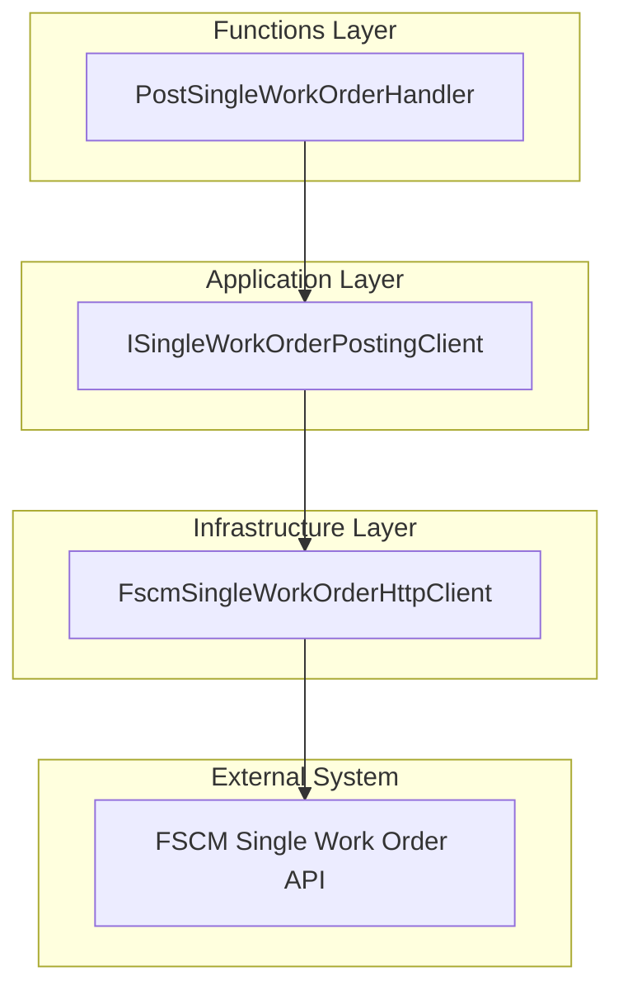
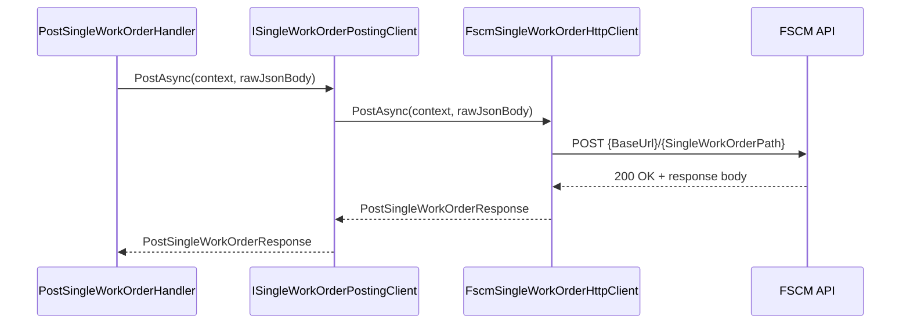

# Single Work Order Posting Feature Documentation

## Overview

The **Single Work Order Posting** feature defines a contract and data model for sending an individual work-order payload from the Orchestrator to the FSCM system. It ensures that each work-order JSON is delivered reliably, with correlation identifiers for tracing and standardized response handling.

In the broader application, this abstraction decouples the durable-function orchestration logic (`PostSingleWorkOrderHandler`) from the HTTP implementation (`FscmSingleWorkOrderHttpClient`). This separation supports testing, multiple transport implementations, and consistent error reporting.

## Architecture Overview



## Component Structure

### ISingleWorkOrderPostingClient (src/Rpc.AIS.Accrual.Orchestrator.Application/Ports/Common/Abstractions/ISingleWorkOrderPostingClient.cs)

- **Purpose**

Defines the boundary for posting a single work-order JSON payload to FSCM.

- **Methods**

| Method Signature | Description |
| --- | --- |
| `Task<PostSingleWorkOrderResponse> PostAsync(string rawJsonBody, CancellationToken ct);` | Back-compat overload; no context propagation. |
| `Task<PostSingleWorkOrderResponse> PostAsync(RunContext context, string rawJsonBody, CancellationToken ct);` | Preferred overload; carries correlation and run IDs. |


```csharp
using Rpc.AIS.Accrual.Orchestrator.Core.Domain;

namespace Rpc.AIS.Accrual.Orchestrator.Core.Abstractions;

/// <summary>
/// Defines single work order posting client behavior.
/// </summary>
public interface ISingleWorkOrderPostingClient
{
    Task<PostSingleWorkOrderResponse> PostAsync(string rawJsonBody, CancellationToken ct);
    // NEW (preferred)
    Task<PostSingleWorkOrderResponse> PostAsync(RunContext context, string rawJsonBody, CancellationToken ct);
}

/// <summary>
/// Carries post single work order response data.
/// </summary>
public sealed record PostSingleWorkOrderResponse(bool IsSuccess, int StatusCode, string? ResponseBody);
```

**

### PostSingleWorkOrderResponse

- **Purpose**

Encapsulates the outcome of posting a single work order.

- **Properties**

| Property | Type | Description |
| --- | --- | --- |
| **IsSuccess** | bool | True if HTTP status is 2xx |
| **StatusCode** | int | Numeric HTTP status code returned |
| **ResponseBody** | string? | Raw JSON or error message from FSCM |


## Sequence Diagram

### Single Work Order Posting Flow



## FSCM Single Work Order Posting Endpoint

```api
{
    "title": "Post Single Work Order",
    "description": "Sends a single work order payload to the configured FSCM endpoint.",
    "method": "POST",
    "baseUrl": "<Fscm:BaseUrl>",
    "endpoint": "/{SingleWorkOrderPath}",
    "headers": [
        {
            "key": "Accept",
            "value": "application/json",
            "required": true
        },
        {
            "key": "Content-Type",
            "value": "application/json",
            "required": true
        },
        {
            "key": "x-run-id",
            "value": "RunContext.RunId",
            "required": false
        },
        {
            "key": "x-correlation-id",
            "value": "RunContext.CorrelationId",
            "required": false
        }
    ],
    "queryParams": [],
    "pathParams": [],
    "bodyType": "raw",
    "requestBody": "{ ... raw work order JSON ... }",
    "formData": [],
    "rawBody": "",
    "responses": {
        "200": {
            "description": "Success",
            "body": "{ ... FSCM response body ... }"
        },
        "4xx": {
            "description": "Client error",
            "body": "{ \"error\": \"...\" }"
        },
        "5xx": {
            "description": "Server error",
            "body": "{ \"error\": \"...\" }"
        }
    }
}
```

## Error Handling

- **401/403** → throws `UnauthorizedAccessException` to fail fast.
- **429 or ≥500** → throws `HttpRequestException` for durable retry.
- **400–499 (other)** → returns `PostSingleWorkOrderResponse(false, status, body)` without exception.

## Integration Points

- **PostSingleWorkOrderHandler** calls `ISingleWorkOrderPostingClient` to execute the HTTP post as part of the durable-function orchestration.
- **FscmSingleWorkOrderHttpClient** implements this interface, reading endpoint configuration from `FscmOptions`.

## Key Classes Reference

| Class | Location | Responsibility |
| --- | --- | --- |
| **ISingleWorkOrderPostingClient** | src/Rpc.AIS.Accrual.Orchestrator.Application/Ports/Common/Abstractions/ISingleWorkOrderPostingClient.cs | Contract for posting single work order payloads. |
| **PostSingleWorkOrderResponse** | same as above | Holds the success flag, HTTP status, and raw response body. |


## Testing Considerations

- **Success path**: FSCM returns 2xx, confirm `IsSuccess == true`.
- **Client errors (4xx)**: verify `IsSuccess == false` and correct `StatusCode`.
- **Transient failures (429/5xx)**: ensure exceptions trigger durable retry policies.
- **Correlation headers**: mock `RunContext` to assert headers `x-run-id` and `x-correlation-id`.