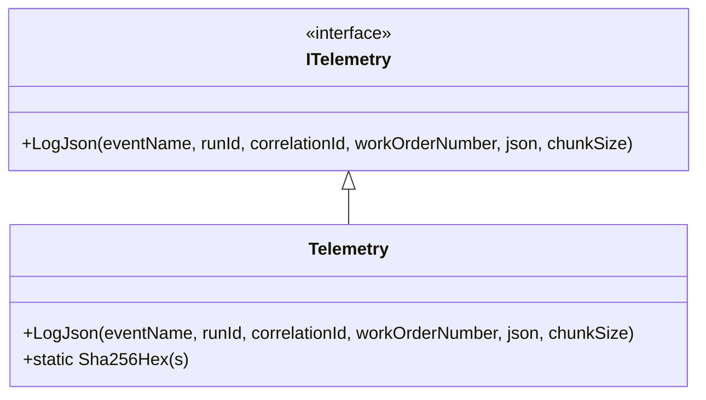

# ITelemetry Interface Documentation

## Overview

The **ITelemetry** interface defines a simple contract for logging JSON payloads with contextual metadata. It enables applications to capture large JSON messages safely by hashing and chunking, ensuring no loss of information due to log size limits. This is essential for tracing payloads in long-running orchestrations and correlating events across distributed components.

## Interface Definition

```csharp
namespace Rpc.AIS.Accrual.Orchestrator.Core.Abstractions;

public interface ITelemetry
{
    void LogJson(
        string eventName,
        string runId,
        string correlationId,
        string? workOrderNumber,
        string json,
        int chunkSize = 7000
    );
}
```

## Method: LogJson

| Parameter | Type | Description |
| --- | --- | --- |
| **eventName** | string | Identifier for this telemetry event (e.g. “Delta.Payload.Outbound”). |
| **runId** | string | Unique identifier for the current orchestration or execution run. |
| **correlationId** | string | Identifier used to correlate related operations across components. |
| **workOrderNumber** | string? | Optional business key (e.g. work order number) to include in logs. |
| **json** | string | The raw JSON payload to log. |
| **chunkSize** | int | Maximum number of characters per log chunk (default is 7000). |


## Implementation Details

The **Telemetry** class in the Infrastructure project provides the concrete behavior:

```csharp
public sealed class Telemetry : ITelemetry
{
    private readonly ILogger<Telemetry> _log;

    public Telemetry(ILogger<Telemetry> log)
    {
        _log = log ?? throw new ArgumentNullException(nameof(log));
    }

    public void LogJson(
        string eventName,
        string runId,
        string correlationId,
        string? workOrderNumber,
        string json,
        int chunkSize = 7000
    )
    {
        var hash   = Sha256Hex(json);
        var total  = json.Length;
        var chunks = (int)Math.Ceiling(total / (double)chunkSize);

        for (int i = 0; i < chunks; i++)
        {
            var part = json.Substring(i * chunkSize, Math.Min(chunkSize, total - i * chunkSize));
            _log.LogInformation(
                "{EventName} JSON_CHUNK RunId={RunId} CorrelationId={CorrelationId} WorkOrderNumber={WorkOrderNumber} JsonHash={JsonHash} ChunkIndex={ChunkIndex} ChunkCount={ChunkCount} Chunk={Chunk}",
                eventName, runId, correlationId, workOrderNumber, hash, i, chunks, part
            );
        }
    }

    public static string Sha256Hex(string s)
    {
        using var sha = SHA256.Create();
        var    b   = sha.ComputeHash(Encoding.UTF8.GetBytes(s));
        return Convert.ToHexString(b).ToLowerInvariant();
    }
}
```

## Class Diagram



## Dependency Injection

The `Telemetry` implementation is registered in the application’s service collection for constructor injection:

```csharp
services.AddSingleton<ITelemetry, Telemetry>();
```

## Usage

- **Injection**: Any component needing JSON payload tracing can accept an `ITelemetry` in its constructor.
- **Invocation**: Call `LogJson` with event name, identifiers, optional business key, and raw JSON.
- **Scenarios**:- Logging outbound payloads to external systems (e.g. Dataverse, FSCM).
- Capturing intermediate JSON in large-scale orchestrations.

```csharp
_telemetry.LogJson(
    "Dataverse.OpenWorkOrders",
    context.RunId,
    context.CorrelationId,
    workOrderNumber: null,
    json: openWoHeaders.RootElement.GetRawText()
);
```

## Key Point

```card
{
    "title": "ITelemetry Summary",
    "content": "Provides chunked and hashed JSON logging with rich contextual metadata for reliable telemetry."
}
```